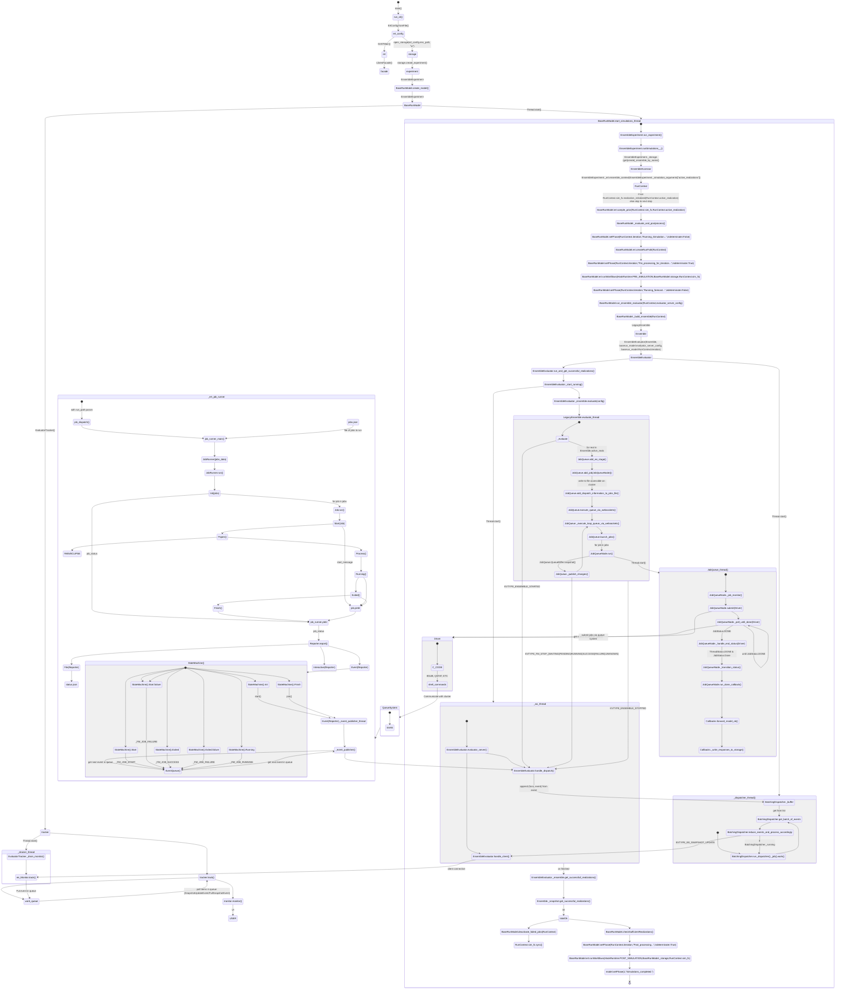

```mermaid
stateDiagram-v2
[*] --> run_cli(): main()

run_cli() --> ert_config: ErtConfig.fromFile()

ert_config --> ert: EnKFMain()
ert_config --> storage: open_storage(ert_config.ens_path, "w")
ert --> facade: LibresFacade()
storage --> experiment: storage.create_experiment()
experiment --> BaseRunModel.create_model(): EnsembleExperiment
BaseRunModel.create_model() --> BaseRunModel: EnsembleExperiment
BaseRunModel --> tracker: EvaluatorTracker()
    tracker --> tracker.track()
        tracker.track() --> work_queue
    tracker --> _drainer_thread: Thread.start()

    work_queue --> tracker.track(): poll items in queue (SnapshotUpdateEvent/FullSnapshotEvent)
    tracker.track() --> monitor.monitor()

    monitor.monitor() --> USER: UI
    

state _drainer_thread {
        EvaluatorTracker._drain_monitor() --> ee_Monitor.track()
    EnsembleEvaluator.handle_client() --> ee_Monitor.track(): client connection 
}
ee_Monitor.track() --> work_queue: Put event in queue


BaseRunModel --> BaseRunModel.start_simulations_thread: Thread.start()

state BaseRunModel.start_simulations_thread {
    [*] -->  EnsembleExperiment.run_experiment()
        EnsembleExperiment.run_experiment() --> EnsembleExperiment.runSimulations__()
        EnsembleExperiment.runSimulations__() --> EnsembleAccessor: EnsembleExperiment._storage.(get|create)_ensemble_by_name()
        EnsembleAccessor --> RunContext: EnsembleExperiment._ert.ensemble_context(EnsembleExperiment._simulation_arguments["active_realizations"])

        RunContext --> BaseRunModel.ert.sample_prior(RunContext.sim_fs,RunContext.active_realization): if not RunContext.sim_fs.realization_initialized(RunContext.active_realization) else skip to next step
        BaseRunModel.ert.sample_prior(RunContext.sim_fs,RunContext.active_realization) --> BaseRunModel._evaluate_and_postprocess()
            BaseRunModel._evaluate_and_postprocess() --> BaseRunModel.setPhase(RunContext.iteration,"Running_Simulation...",indeterminate=False)
            BaseRunModel.setPhase(RunContext.iteration,"Running_Simulation...",indeterminate=False) --> BaseRunModel.ert.createRunPath(RunContext)

            BaseRunModel.ert.createRunPath(RunContext) --> BaseRunModel.setPhase(RunContext.iteration,"Pre_processing_for_iteration...",indeterminate=True)
            BaseRunModel.setPhase(RunContext.iteration,"Pre_processing_for_iteration...",indeterminate=True) --> BaseRunModel.ert.runWorkflows(HookRuntime.PRE_SIMULATION,BaseRunModel.storage,RunContext.sim_fs)

            BaseRunModel.ert.runWorkflows(HookRuntime.PRE_SIMULATION,BaseRunModel.storage,RunContext.sim_fs) --> BaseRunModel.setPhase(RunContext.iteration,"Running_forecast...",indeterminate=False)
            BaseRunModel.setPhase(RunContext.iteration,"Running_forecast...",indeterminate=False) --> BaseRunModel.run_ensemble_evaluator(RunContext,evaluator_server_config)
                BaseRunModel.run_ensemble_evaluator(RunContext,evaluator_server_config) --> BaseRunModel._build_ensemble(RunContext)
                    BaseRunModel._build_ensemble(RunContext) --> Ensemble: LegacyEnsemble
                Ensemble --> EnsembleEvaluator: EnsembleEvaluator(Ensemble, baserun_model.evaluator_server_config, baserun_model.RunContext.iteration)
                EnsembleEvaluator --> _dispatcher_thread(): Thread.start()

 
        EnsembleEvaluator --> EnsembleEvaluator.run_and_get_successful_realizations()
        EnsembleEvaluator.run_and_get_successful_realizations() --> EnsembleEvaluator._start_running()
        EnsembleEvaluator._start_running() --> _ws_thread: Thread.start()
            EnsembleEvaluator._ensemble.evaluate(config) --> LegacyEnsemble.evaluate_thread

                
        EnsembleEvaluator._start_running() --> EnsembleEvaluator._ensemble.evaluate(config)


    EnsembleEvaluator._ensemble.get_successfull_realizations() --> Ensemble._snapshot.get_successful_realizations()
Ensemble._snapshot.get_successful_realizations() --> totalOk: int
totalOk --> BaseRunModel.deactivate_failed_jobs(RunContext)
BaseRunModel.deactivate_failed_jobs(RunContext) --> RunContext.sim_fs.sync()
totalOk --> BaseRunModel.checkSufficientRealizations()
BaseRunModel.checkSufficientRealizations() --> BaseRunModel.setPhase(RunContext.iteration,"Post_processing...",indeterminate=True)
BaseRunModel.setPhase(RunContext.iteration,"Post_processing...",indeterminate=True) --> BaseRunModel.ert.runWorkflows(HookRuntime.POST_SIMULATION,BaseRunModel._storage,RunContext.sim_fs)
BaseRunModel.ert.runWorkflows(HookRuntime.POST_SIMULATION,BaseRunModel._storage,RunContext.sim_fs) --> model.setPhase(1,"Simulations_completed.")
model.setPhase(1,"Simulations_completed.") --> [*]


state _ws_thread {
    [*] --> EnsembleEvaluator.evaluator_server()
    EnsembleEvaluator.evaluator_server() --> EnsembleEvaluator.handle_client()
       
    EnsembleEvaluator.evaluator_server() --> EnsembleEvaluator.handle_dispatch()
    EnsembleEvaluator.handle_dispatch() --> BatchingDispatcher._buffer: append (func, event) from event
}
_ws_thread --> EnsembleEvaluator._ensemble.get_successfull_realizations(): on finished

state _dispatcher_thread() {
    [*] --> BatchingDispatcher.run_dispatcher()._job().work()
    BatchingDispatcher.run_dispatcher()._job().work() --> BatchingDispatcher.get_batch_of_events
    BatchingDispatcher._buffer --> BatchingDispatcher.get_batch_of_events: get from list
    BatchingDispatcher.get_batch_of_events --> BatchingDispatcher.reduce_events_and_process_accordingly
   BatchingDispatcher.reduce_events_and_process_accordingly --> BatchingDispatcher.run_dispatcher()._job().work(): if BatchingDispatcher._running
}

state LegacyEnsemble.evaluate_thread {
    [*] --> _evaluate
    _evaluate --> JobQueue.add_ee_stage(): for real in Ensemble.active_reals
        JobQueue.add_ee_stage() --> JobQueue.add_job(JobQueueNode())     
        
        JobQueue.add_job(JobQueueNode()) --> JobQueue.add_dispatch_information_to_jobs_file(): write to file accessible on cluster
    JobQueue.add_dispatch_information_to_jobs_file() --> JobQueue.execute_queue_via_websockets() 
    JobQueueNode.run() --> JobQueue._publish_changes(): JobQueue.QueueDiffer.snapshot()
        JobQueue._publish_changes() --> JobQueue._execute_loop_queue_via_websockets()
        JobQueue.execute_queue_via_websockets() --> JobQueue._execute_loop_queue_via_websockets()
            JobQueue._execute_loop_queue_via_websockets() --> JobQueue.launch_jobs()
                JobQueue.launch_jobs() --> JobQueueNode.run(): for job in jobs
                JobQueueNode.run() --> JobQueue_thread(): Thread.start()           
}

state JobQueue_thread() {
    [*] --> JobQueueNode._job_monitor()
    JobQueueNode._job_monitor() --> JobQueueNode.submit(Driver)
    JobQueueNode.submit(Driver) --> JobQueueNode._poll_until_done(Driver)
    JobQueueNode._poll_until_done(Driver) --> JobQueueNode._poll_until_done(Driver): until JobStatus.DONE
    JobQueueNode._poll_until_done(Driver) --> JobQueueNode._handle_end_status(Driver): JobStatus.DONE
        JobQueueNode._handle_end_status(Driver) --> JobQueueNode._transition_status(): ThreadStatus.DONE & JobStatus.Done
            JobQueueNode._transition_status() --> JobQueueNode.run_done_callback()
            JobQueueNode.run_done_callback() --> Callbacks.forward_model_ok()
                Callbacks.forward_model_ok() --> Callbacks._write_responses_to_storage()
}

state Driver {
    [*] --> C_CODE
    C_CODE --> shell_commands: BSUB, QSTAT, ETC
}
}
    shell_commands --> QueueSystem: Communicate with cluster
JobQueueNode._poll_until_done(Driver) --> Driver: get status via queue system
LegacyEnsemble.evaluate_thread -->  EnsembleEvaluator.handle_dispatch(): EVTYPE_ENSEMBLE_STOPPED
_evaluate --> EnsembleEvaluator.handle_dispatch(): EVTYPE_ENSEMBLE_STARTED
_event_publisher() --> EnsembleEvaluator.handle_dispatch()
JobQueue._publish_changes() --> EnsembleEvaluator.handle_dispatch(): EVTYPE_FM_STEP_{WAITING|PENDING|RUNNING|SUCCESS|FAILURE|UNKNOWN}
BatchingDispatcher.reduce_events_and_process_accordingly --> EnsembleEvaluator.handle_client(): EVTYPE_EE_SNAPSHOT_UPDATE
JobQueueNode.submit(Driver) --> Driver: submit jobs via queue system


state QueueSystem {
    [*] --> SAAS
}
QueueSystem --> _ert_job_runner

state _ert_job_runner {
    [*] --> job_dispatch(): with run_path param
    job_dispatch() --> job_runner_main()
            jobs.json --> job_runner_main(): file of jobs to run
                File(Reporter) --> status.json
                Event(Reporter) --> StateMachine(): forward events
                Event(Reporter)._event_publisher_thread --> _event_publisher()
                    StateMachine().Init --> Event(Reporter)._event_publisher_thread: start()
    StateMachine().Finish --> Event(Reporter)._event_publisher_thread: join()
                   
                    EventQueue() --> _event_publisher(): get next event in queue
                    _event_publisher() -->  EventQueue(): get next event in queue   
        job_runner_main() --> JobRunner(jobs_data)
        JobRunner(jobs_data) --> JobRunner.run()
            JobRunner.run() --> Init(jobs)
                Init(jobs) --> job_runner.yield: job_status
                    Reporter.report() --> Interactive(Reporter)
                    Reporter.report() --> File(Reporter)
                    Reporter.report() --> Event(Reporter)
             Init(jobs)--> Job.run(): for job in jobs
                Job.run() --> Start(Job)
                Start(Job) --> job.yield: start_message
                Start(Job) --> Popen()
                    Popen() --> RMS/ECLIPSE
                Popen() --> Process()
                Process() --> Running()
                    Running() --> job.yield
                Running() --> Exited()
                Exited() --> Finish()
                    Exited() --> job.yield
                Finish() --> job_runner.yield
                job.yield --> job_runner.yield
                
            job_runner.yield --> Reporter.report(): job_status


state StateMachine() {
    [*] --> StateMachine().Init
    [*] --> StateMachine().Start
    [*] --> StateMachine().Start.failure
    [*] --> StateMachine().Exited
    [*] --> StateMachine().Start.failure
    [*] --> StateMachine().Running
    [*] --> StateMachine().Finish
    [*] --> StateMachine().Exited.failure
    StateMachine().Start --> EventQueue(): _FM_JOB_START
    StateMachine().Start.failure --> EventQueue(): _FM_JOB_FAILURE
    StateMachine().Exited --> EventQueue(): _FM_JOB_SUCCESS
    StateMachine().Exited.failure --> EventQueue(): _FM_JOB_FAILURE
    StateMachine().Running --> EventQueue(): _FM_JOB_RUNNING

}
}
```