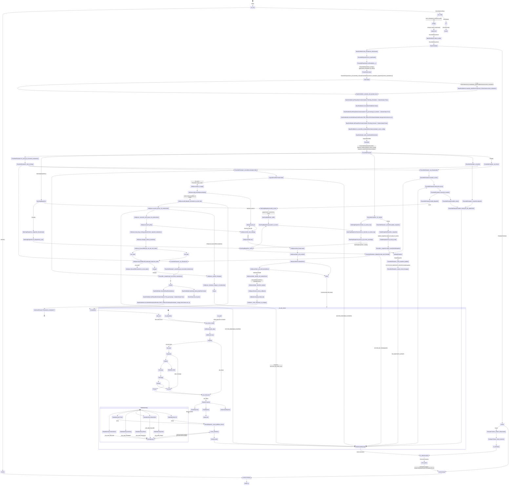

```mermaid
stateDiagram-v2
[*] --> run_cli(): main()

run_cli() --> ert_config: ErtConfig.fromFile()
run_cli() --> monitor: Monitor()

ert_config --> ert: EnKFMain()
ert_config --> storage: open_storage(ert_config.ens_path, "w")
ert --> facade: LibresFacade()
storage --> experiment: storage.create_experiment()
experiment --> BaseRunModel.create_model(): EnsembleExperiment
BaseRunModel.create_model() --> BaseRunModel: EnsembleExperiment
BaseRunModel --> tracker: EvaluatorTracker()
BaseRunModel --> BaseRunModel.start_simulations_thread.start()
    BaseRunModel.start_simulations_thread.start() -->  EnsembleExperiment.run_experiment()
        EnsembleExperiment.run_experiment() --> EnsembleExperiment.runSimulations__()
        EnsembleExperiment.runSimulations__() --> EnsembleAccessor: EnsembleExperiment._storage.(get|create)_ensemble_by_name()
        EnsembleAccessor --> RunContext: EnsembleExperiment._ert.ensemble_context(EnsembleExperiment._simulation_arguments["active_realizations"])

        RunContext --> BaseRunModel.ert.sample_prior(RunContext.sim_fs,RunContext.active_realization): if not RunContext.sim_fs.realization_initialized(RunContext.active_realization)
        RunContext --> BaseRunModel._evaluate_and_postprocess()
        BaseRunModel.ert.sample_prior(RunContext.sim_fs,RunContext.active_realization) --> BaseRunModel._evaluate_and_postprocess()
            BaseRunModel._evaluate_and_postprocess() --> BaseRunModel.setPhase(RunContext.iteration,"Running_Simulation...",indeterminate=False)
            BaseRunModel.setPhase(RunContext.iteration,"Running_Simulation...",indeterminate=False) --> BaseRunModel.ert.createRunPath(RunContext)

            BaseRunModel.ert.createRunPath(RunContext) --> BaseRunModel.setPhase(RunContext.iteration,"Pre_processing_for_iteration...",indeterminate=True)
            BaseRunModel.setPhase(RunContext.iteration,"Pre_processing_for_iteration...",indeterminate=True) --> BaseRunModel.ert.runWorkflows(HookRuntime.PRE_SIMULATION,BaseRunModel.storage,RunContext.sim_fs)

            BaseRunModel.ert.runWorkflows(HookRuntime.PRE_SIMULATION,BaseRunModel.storage,RunContext.sim_fs) --> BaseRunModel.setPhase(RunContext.iteration,"Running_forecast...",indeterminate=False)
            BaseRunModel.setPhase(RunContext.iteration,"Running_forecast...",indeterminate=False) --> BaseRunModel.run_ensemble_evaluator(RunContext,evaluator_server_config)
                BaseRunModel.run_ensemble_evaluator(RunContext,evaluator_server_config) --> BaseRunModel._build_ensemble(RunContext)
                    BaseRunModel._build_ensemble(RunContext) --> Ensemble: LegacyEnsemble
                Ensemble --> EnsembleEvaluator: EnsembleEvaluator(Ensemble, baserun_model.evaluator_server_config, baserun_model.RunContext.iteration)
                    EnsembleEvaluator --> EnsembleEvaluator._ws_thread: Thread()
                    EnsembleEvaluator --> EnsembleEvaluator._ensemble
                    EnsembleEvaluator --> EnsembleEvaluator._fm_handler
                        EnsembleEvaluator._fm_handler --> EnsembleEvaluator._ensemble.update_snapshot(): Events
                            EnsembleEvaluator._ensemble.update_snapshot() --> PartialSnapshot(Ensemble._snapshot)
                            PartialSnapshot(Ensemble._snapshot) --> PartialSnapshot.from_cloud_event(): Update_snapshot_based_on_data_in_events
                            PartialSnapshot.from_cloud_event() --> Ensemble._snapshot.merge_event(PartialSnapshot)
                            Ensemble._snapshot.merge_event(PartialSnapshot) --> UpdatedSnapshot
                            UpdatedSnapshot --> EnsembleEvaluator._send_snapshot_update(): PartialSnapshot
                           EnsembleEvaluator._send_snapshot_update() --> EnsembleEvaluator._create_cloud_message(): EVTYPE_EE_SNAPSHOT_UPDATE,PartialSnapshot
                           EnsembleEvaluator._create_cloud_message() --> WebSocketMessage: EE_SNAPSHOT_UPDATE

                    EnsembleEvaluator --> BatchingDispatcher: BatchingDispatcher()
                        BatchingDispatcher --> BatchingDispatcher.handle_event()
                            BatchingDispatcher.handle_event() --> BatchingDispatcher._buffer: append (func, event) from event

                        BatchingDispatcher --> BatchingDispatcher._dispatcher_thread.start(): Thread()
                            BatchingDispatcher._dispatcher_thread.start() --> BatchingDispatcher.run_dispatcher()._job()
                               BatchingDispatcher.run_dispatcher()._job() --> BatchingDispatcher._work()
                                    BatchingDispatcher._work() --> BatchingDispatcher.get_batch_of_events
                                        BatchingDispatcher._buffer --> BatchingDispatcher.get_batch_of_events
                                        EnsembleEvaluator._fm_handler --> BatchingDispatcher.function_to_events_map
                                        BatchingDispatcher.function_to_events_map --> BatchingDispatcher.find_function_in_function_to_events_map
                                        BatchingDispatcher.get_batch_of_events --> BatchingDispatcher.find_function_in_function_to_events_map
                                        BatchingDispatcher.find_function_in_function_to_events_map --> BatchingDispatcher.process_all_events_accordingly
                                        BatchingDispatcher.process_all_events_accordingly --> BatchingDispatcher._work(): if BatchingDispatcher._running
                                    BatchingDispatcher._work() --> EnsembleEvaluator._dispatcher.wait_until_finished()
        EnsembleEvaluator --> EnsembleEvaluator.run_and_get_successful_realizations()
        EnsembleEvaluator.run_and_get_successful_realizations() --> EnsembleEvaluator._start_running()
        EnsembleEvaluator._start_running() --> EnsembleEvaluator._ws_thread.start()
        EnsembleEvaluator._ensemble --> EnsembleEvaluator._ensemble.evaluate(config)
            EnsembleEvaluator._ensemble.evaluate(config) --> LegacyEnsembleThread.start()
                LegacyEnsembleThread.start() --> WebSocketMessage: EVTYPE_ENSEMBLE_STARTED
                LegacyEnsembleThread.start() --> JobQueue.add_ee_stage(): for real in Ensemble.active_reals
                    JobQueue.add_ee_stage() --> JobQueue.add_job(JobQueueNode())
                    
                    JobQueue.add_job(JobQueueNode()) --> JobQueue.job_list: add job to job list
                    JobQueue.add_job(JobQueueNode()) --> JobQueue.add_dispatch_information_to_jobs_file(): write to file accessible on cluster
                    JobQueue.add_dispatch_information_to_jobs_file() --> ScratchDisk
                JobQueue.add_dispatch_information_to_jobs_file() --> JobQueue.execute_queue_via_websockets() 
                    JobQueue.execute_queue_via_websockets() --> JobQueue._publish_changes(): JobQueue.QueueDiffer.snapshot()
                        JobQueue._publish_changes() --> JobQueue._translate_change_to_cloudevents()
                        JobQueue._translate_change_to_cloudevents() --> Deque
                        Deque --> WebSocketMessage: Dispatch/ EVTYPE_FM_STEP_XYZ
                   JobQueue.execute_queue_via_websockets() --> JobQueue._execution_loop_queue_via_websockets()
                        JobQueue._execution_loop_queue_via_websockets() --> JobQueue.launch_jobs()
                            JobQueue.launch_jobs() --> JobQueue.fetch_next_waiting()
                            JobQueue.job_list --> JobQueue.fetch_next_waiting()
                            JobQueue.fetch_next_waiting() --> JobQueue.job_list: check for new job
                            JobQueue.fetch_next_waiting() --> JobQueueNode.run(): job
                            JobQueueNode.run() --> JobQueueNode_thread.start()
                                JobQueueNode_thread.start() --> JobQueueNode._job_monitor()
                                JobQueueNode._job_monitor() --> JobQueueNode.submit(Driver)
                                    JobQueueNode.submit(Driver) --> Driver
                                    Driver --> _ert_job_runner: Communicate with cluster
                                JobQueueNode.submit(Driver) --> JobQueueNode._poll_until_done(Driver)
                                    JobQueueNode._poll_until_done(Driver) --> Driver
                                JobQueueNode._poll_until_done(Driver) --> JobQueueNode._handle_end_status(Driver): JobStatus.DONE
                                JobQueueNode._handle_end_status(Driver) --> JobQueueNode._transition_status(): ThreadStatus.DONE & JobStatus.Done
                                JobQueueNode._transition_status() --> JobQueueNode.run_done_callback()
                                JobQueueNode.run_done_callback() --> Callbacks.forward_model_ok()
                                Callbacks.forward_model_ok() --> Callbacks._write_responses_to_storage()
                                Callbacks._write_responses_to_storage() --> ScratchDisk


                        JobQueue.launch_jobs() --> JobQueue.stop_long_running_jobs(mimimum_required_realizations)
                            JobQueue.stop_long_running_jobs(mimimum_required_realizations) --> JobQueue.changes_without_transition()
                            JobQueue.changes_without_transition() --> JobQueue.QueueDiffer.get_old_and_new_state()
                                JobQueue.QueueDiffer.get_old_and_new_state() --> old_state
                                JobQueue.QueueDiffer.get_old_and_new_state() --> new_state
                                new_state --> JobQueue.QueueDiffer.diff_states(old_state,new_state)
                                old_state --> JobQueue.QueueDiffer.diff_states(old_state,new_state)
                                JobQueue.QueueDiffer.diff_states(old_state,new_state) --> changes
                        changes --> JobQueue._publish_changes(): changes
                        JobQueue.QueueDiffer.diff_states(old_state,new_state) --> JobQueue.QueueDiffer.transition_to_new_state(): new_state

                JobQueue.execute_queue_via_websockets() -->  WebSocketMessage: EVTYPE_ENSEMBLE_STOPPED
        EnsembleEvaluator._start_running() --> EnsembleEvaluator._ensemble.evaluate(config)
        EnsembleEvaluator._ensemble.evaluate(config) --> Ensemble._snapshot.get_successful_realizations()
        EnsembleEvaluator._ws_thread --> EnsembleEvaluator._ws_thread.start()
    EnsembleEvaluator._ws_thread.start() --> EnsembleEvaluator.evaluator_server()

    EnsembleEvaluator.evaluator_server() --> EnsembleEvaluator.websocket.serve()
        EnsembleEvaluator.websocket.serve() --> EnsembleEvaluator.connection_handle()
            EnsembleEvaluator.connection_handle() --> EnsembleEvaluator.handle_client()
                EnsembleEvaluator.handle_client() --> EnsembleEvaluator.handle_client().EV_EE_SNAPSHOT
                EnsembleEvaluator._ensemble --> EnsembleEvaluator._ensemble.snapshot
                EnsembleEvaluator._ensemble.snapshot --> EnsembleEvaluator.handle_client().EV_EE_SNAPSHOT
                    EnsembleEvaluator.handle_client().EV_EE_SNAPSHOT --> WebSocketMessage

            EnsembleEvaluator.connection_handle() --> EnsembleEvaluator.handle_dispatch()
                EnsembleEvaluator.handle_dispatch() --> BatchingDispatcher.handle_event(): event

    EnsembleEvaluator.evaluator_server() --> EnsembleEvaluator._dispatcher.wait_until_finished()
    EnsembleEvaluator._dispatcher.wait_until_finished() --> WebSocketMessage: EVTYPE_EE_TERMINATED
    EnsembleEvaluator._dispatcher.wait_until_finished() --> EnsembleEvaluator._ws_thread.join()
    EnsembleEvaluator._start_running() --> EnsembleEvaluator._ws_thread.join()
    EnsembleEvaluator._ws_thread.join() --> EnsembleEvaluator._ensemble.get_successfull_realizations()
    EnsembleEvaluator._ensemble.get_successfull_realizations() --> Ensemble._snapshot.get_successful_realizations()
Ensemble._snapshot.get_successful_realizations() --> totalOk: int
totalOk --> BaseRunModel.deactivate_failed_jobs(RunContext)
BaseRunModel.deactivate_failed_jobs(RunContext) --> RunContext.sim_fs.sync()
totalOk --> BaseRunModel.checkSufficientRealizations()
BaseRunModel.checkSufficientRealizations() --> BaseRunModel.setPhase(RunContext.iteration,"Post_processing...",indeterminate=True)
BaseRunModel.setPhase(RunContext.iteration,"Post_processing...",indeterminate=True) --> BaseRunModel.ert.runWorkflows(HookRuntime.POST_SIMULATION,BaseRunModel._storage,RunContext.sim_fs)
BaseRunModel.ert.runWorkflows(HookRuntime.POST_SIMULATION,BaseRunModel._storage,RunContext.sim_fs) --> model.setPhase(1,"Simulations_completed.")
model.setPhase(1,"Simulations_completed.") --> [*]

tracker --> tracker.track()
tracker --> EvaluatorTracker._drainer_thread.start(): thread
EvaluatorTracker._drainer_thread.start() --> EvaluatorTracker._drain_monitor()
    EvaluatorTracker._drain_monitor() --> ee_Monitor()
        ee_Monitor() --> ee_Monitor.track()
        WebSocketMessage --> ee_Monitor.track(): client connection 
    ee_Monitor.track() --> work_queue: Put event in queue

tracker.track() --> monitor.monitor()

monitor --> monitor.monitor()
monitor.monitor() --> WriteLog

work_queue --> tracker.track(): poll items in queue (SnapshotUpdateEvent/FullSnapshotEvent)
WebSocketMessage --> EnsembleEvaluator.websocket.serve()


state _ert_job_runner {
    [*] --> job_dispatch()
    job_dispatch() --> job_runner_main()
            jobs.json --> job_runner_main(): file of jobs to run
            run_path --> job_runner_main(): where jobs.json is located
                File(Reporter) --> status.json
                Event(Reporter) --> StateMachine(): forward events
                Event(Reporter)._event_publisher_thread --> _event_publisher()
                    StateMachine().Init --> Event(Reporter)._event_publisher_thread: start()
    StateMachine().Finish --> Event(Reporter)._event_publisher_thread: join()
                    _event_publisher() --> Client().send()
                        Client().send() --> WebSocketMessage
                    EventQueue() --> _event_publisher(): get next event in queue
                    _event_publisher() -->  EventQueue(): get next event in queue   
        job_runner_main() --> JobRunner(jobs_data)
        JobRunner(jobs_data) --> JobRunner.run()
            JobRunner.run() --> Init(jobs)
                Init(jobs) --> job_runner.yield: job_status
                    Reporter.report() --> Interactive(Reporter)
                    Reporter.report() --> File(Reporter)
                    Reporter.report() --> Event(Reporter)
             Init(jobs)--> Job.run(): for job in jobs
                Job.run() --> Start(Job)
                Start(Job) --> job.yield: start_message
                Start(Job) --> Popen()
                Popen() --> RMS/ECLIPSE
                Popen() --> Process()
                Process() --> Running()
                    Running() --> job.yield
                Running() --> Exited()
                Exited() --> Finish()
                    Exited() --> job.yield
                Finish() --> job_runner.yield
                job.yield --> job_runner.yield
                
            job_runner.yield --> Reporter.report(): job_status

}

ScratchDisk --> jobs.json


state StateMachine() {
    [*] --> StateMachine().Init
    [*] --> StateMachine().Start
    [*] --> StateMachine().Start.failure
    [*] --> StateMachine().Exited
    [*] --> StateMachine().Start.failure
    [*] --> StateMachine().Running
    [*] --> StateMachine().Finish
    [*] --> StateMachine().Exited.failure
    StateMachine().Start --> EventQueue(): _FM_JOB_START
    StateMachine().Start.failure --> EventQueue(): _FM_JOB_FAILURE
    StateMachine().Exited --> EventQueue(): _FM_JOB_SUCCESS
    StateMachine().Exited.failure --> EventQueue(): _FM_JOB_FAILURE
    StateMachine().Running --> EventQueue(): _FM_JOB_RUNNING

}


```