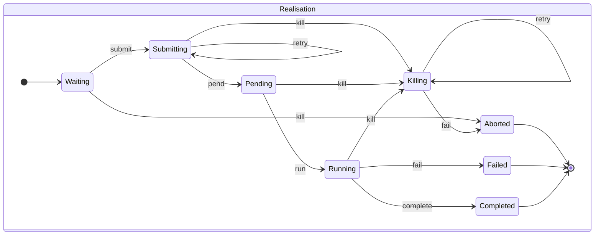
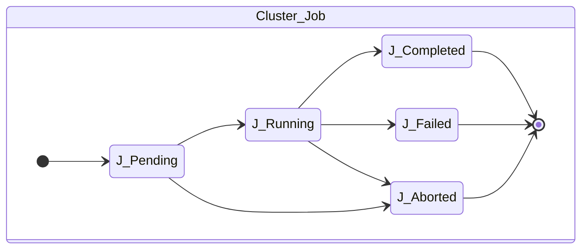
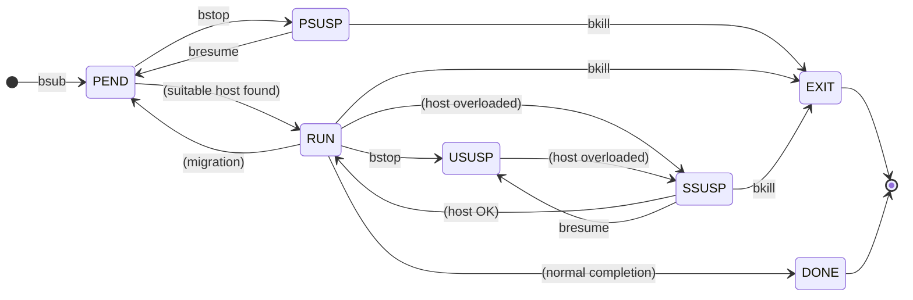

# Scheduler
The scheduler is the part of ERT that manages execution of forward-models and communicates with HPC clusters via LFS, TORQUE (PBS) or SLURM. Additionally, there is a "local" driver which executes the forward-models as subprocesses of the main ERT process.

The main concepts are:
- `Driver`: Adapter for the various job queue systems.
- `RealizationState`: The state of a single realisation's forward-model.
- `Scheduler`: Entrypoint for the rest of ERT. Owns the `Driver` and `RealizationState`s.

## Motivation

Each realisation evaluation has a state machine. Currently it is a mess. The following are the states that currently exist and their meanings:

- `NOT_ACTIVE`: (Initial state.) The queue system knows about this and that's it.
- `WAITING`: Basically the same as `NOT_ACTIVE`.
- `SUBMITTED`: This forward model has been submitted to the cluster. We await confirmation from the cluster.
- `PENDING`: The cluster has received our forward model, but hasn't started yet.
- `RUNNING`: The cluster has begun execution.
- `DONE`: The forward-model has finished successfully, but ERT isn't finished with the realisation just yet. It still needs to internalise results.
- `SUCCESS`: (Final state.) The data has been fully internalised by ERT. We are done.
- `EXIT`: The forward-model has finished unsuccessfully. ERT needs to do some work still.
- `FAILED`: (Final state.) The forward-model has finished unsuccessfully.
- `DO_KILL`: The user has asked to stop the job and we have sent a message to the cluster. Pending cluster.
- `IS_KILLED`: (Final state.) Cluster has said that the job has been killed.
- `DO_KILL_NODE_FAILURE`: (Final state.) Could not kill the job. Maybe the cluster is down.

## State machine
We differentiate between the state machine controlled by ERT and the one that exists on the cluster.

### ERT

This set should be reduced down to:
- `WAITING`: (Initial state.) Nothing has happened yet.
- `SUBMITTING`: We have sent a message to the cluster. Cluster has not responded yet.
- `PENDING`: Cluster has responded, but hasn't started execution yet.
- `RUNNING`: Forward model is running.
- `KILLING`: We have asked the cluster to terminal the job.
- `COMPLETED`: (Final state.) Cluster has completed and we have internalised results.
- `FAILED`: (Final state.) Job has failed or we haven't been able to internalise results.
- `ABORTED`: (Final state.) We have killed the job or there was failure killing the job.

We also need to be able to retry submitting the job as well as killing it. Thus, the `SUBMITTING` and `KILLING` states have a loop.

### Cluster

When running in a cluster, we require to take snapshots of the reality. The driver has to keep track of the following virtual state machine, controlled by 

The end result is the following:

## Drivers
The driver is the part that manages communication with the cluster. The messages are as follows:

- `submit`: Called per `RealizationState`. Submit a realisation to the cluster.
- `terminate`: Called per `RealizationState`. Terminate a running realisation by ID. Returns true if message was successfully sent to the cluster, false if not and we should retry.
- `poll`: Called per `Scheduler`. Returns a list of state transitions for all registered realisations.

### Local
This driver uses subprocesses to manage jobs, which makes it particularly easy for us to handle.

Consider the [subproccess](https://docs.python.org/3/library/subprocess.html) module or its asyncio counterpart, [asyncio.subprocess](https://docs.python.org/3/library/asyncio-subprocess.html).

### IBM LSF

LSF has the following possible job statuses[^1]:
- `PEND`: The job is pending. That is, it has not yet been started.
- `PROV`: The job has been dispatched to a power-saved host that is waking up. Before the job can be sent to the sbatchd, it is in a PROV state.
- `PSUSP`: The job has been suspended, either by its owner or the LSF administrator, while pending.
- `RUN`: The job is currently running.
- `USUSP`: The job has been suspended, either by its owner or the LSF administrator, while running.
- `SSUSP`: The job has been suspended by LSF. The following are examples of why LSF suspended the job:
  1. The load conditions on the execution host or hosts have exceeded a threshold according to the loadStop vector defined for the host or queue.
  2. The run window of the job's queue is closed. See bqueues(1), bhosts(1), and lsb.queues(5).
- `DONE`: The job has terminated with status of 0.
- `EXIT`: The job has terminated with a non-zero status – it may have been aborted due to an error in its execution, or killed by its owner or the LSF administrator. For example, exit code 131 means that the job exceeded a configured resource usage limit and LSF killed the job.
- `UNKWN`: mbatchd has lost contact with the sbatchd on the host on which the job runs.
- `WAIT`: For jobs submitted to a chunk job queue, members of a chunk job that are waiting to run.
- `ZOMBI`: A job becomes ZOMBI if:
  1. A non-rerunnable job is killed by bkill while the sbatchd on the execution host is unreachable and the job is shown as UNKWN
  2. After the execution host becomes available, LSF tries to kill the ZOMBI job. Upon successful termination of the ZOMBI job, the job's status is changed to EXIT. With the LSF multicluster capability, when a job running on a remote execution cluster becomes a ZOMBI job, the execution cluster treats the job the same way as local ZOMBI jobs. In addition, it notifies the submission cluster that the job is in ZOMBI state and the submission cluster requeues the job.

(State diagram adapted from https://www.ibm.com/docs/en/spectrum-lsf/10.1.0?topic=execution-about-job-states#state_transitions_concept__title__1)

[^1]: https://www.ibm.com/docs/en/spectrum-lsf/10.1.0?topic=bjobs-description `JOB STATUS` section

We can simplify this a bit. For example, we are not particularly interested in the distinction between `PEND` (job pending) and `PROV` (job pending, and we are waiting for the server to start). This reduces the number of states to:
- `PEND`, `PROV`, `PSUSP`: Pending
- `RUN`, `USUSP`, `SSUSP`: Running
- `DONE`: Completed
- `EXIT`: Failed

In addition, we special-case the states `UNKWN`, `WAIT` and `ZOMBI` as retry. The LSF driver is to keep the current state and try again later. If the number of retries are exhausted, the driver should `bkill` and set the state to `Aborted`.

### SLURM
The command `squeue` can be used to poll the state of the job. The following list of states is taken from SLURM's documentation (https://slurm.schedmd.com/squeue.html#SECTION_JOB-STATE-CODES).

States, using their full names and, in parantheses, their shortcodes. Notes in square brackets are not from the SLURM documentation:
- `BOOT_FAIL` (`BF`): Job terminated due to launch failure, typically due to a hardware failure (e.g. unable to boot the node or block and the job can not be requeued).
- `CANCELLED` (`CA`): Job was explicitly cancelled by the user or system administrator. The job may or may not have been initiated.
- `COMPLETED` (`CD`): Job has terminated all processes on all nodes with an exit code of zero.
- `CONFIGURING` (`CF`): Job has been allocated resources, but are waiting for them to become ready for use (e.g. booting).
- `COMPLETING` (`CG`): Job is in the process of completing. Some processes on some nodes may still be active. _[Eg. killing subprocesses]_
- `DEADLINE` (`DL`): Job terminated on deadline. _\[Controlled by [sbatch's `--deadline` option](https://slurm.schedmd.com/sbatch.html#OPT_deadline)\]_
- `FAILED` (`F`): Job terminated with non-zero exit code or other failure condition.
- `NODE_FAIL` (`NF`): Job terminated due to failure of one or more allocated nodes.
- `OUT_OF_MEMORY` (`OOM`): Job experienced out of memory error. _\[If [sbatch was run with `--mem` or similar](https://slurm.schedmd.com/sbatch.html#OPT_mem) and SLURM is configured with [`ConstrainRAMSpace`](https://slurm.schedmd.com/cgroup.conf.html#OPT_ConstrainRAMSpace) or [`OverMemoryKill`](https://slurm.schedmd.com/slurm.conf.html#OPT_OverMemoryKill)\]_
- `PENDING` (`PD`): Job is awaiting resource allocation.
- `PREEMPTED` (`PR`): Job terminated due to preemption. _\[If preemption [is enabled in SLURM](https://slurm.schedmd.com/preempt.html), low-priority jobs may be cancelled in favour of high-priority jobs and then restarted\]_
- `RUNNING` (`R`): Job currently has an allocation.
- `RESV_DEL_HOLD` (`RD`): Job is being held after requested reservation was deleted. _\[Occurs when using [reservations](https://slurm.schedmd.com/reservations.html), and [deleting a reservation that has a job attached](https://slurm.schedmd.com/reservations.html#deletion).\]_
- `REQUEUE_FED` (`RF`): Job is being requeued by a federation. _\[When using [federations](https://slurm.schedmd.com/federation.html) only\]_
- `REQUEUE_HOLD` (`RH`): Held job is being requeued.
- `REQUEUED` (`RQ`): Completing job is being requeued.
- `RESIZING` (`RS`): Job is about to change size.
- `REVOKED` (`RV`): Sibling was removed from cluster due to other cluster starting the job.
- `SIGNALING` (`SI`): Job is being signaled. 
- `SPECIAL_EXIT` (`SE`): The job was requeued in a special state. This state can be set by users, typically in EpilogSlurmctld, if the job has terminated with a particular exit value.
- `STAGE_OUT` (`SO`): Job is staging out files.
- `STOPPED` (`ST`): Job has an allocation, but execution has been stopped with SIGSTOP signal. CPUS have been retained by this job.
- `SUSPENDED` (`S`): Job has an allocation, but execution has been suspended and CPUs have been released for other jobs.
- `TIMEOUT` (`TO`): Job terminated upon reaching its time limit.

In ERT, we can reduce this to the following states:
- `CF`, `PD`: Pending
- `CG`, `R`, `SO`: Running
- `CD`: Completed
- `F`, `SE`: Failed
- `BF`, `CA`, `DL`, `NF`, `OOM`, `PR`, `TO`: Aborted

In addition, the states `RD`, `RF`, `RH`, `RQ`, `RS`, `RV`, `SI`, `S` should not modify the state but have the scheduler try again until a limit is reached. If the limit is reached, the state becomes `Aborted` and a kill signal is sent to the cluster.

### TORQUE
TORQUE is a [PBS](https://en.wikipedia.org/wiki/Portable_Batch_System)-like system, which means that it uses the standard POSIX `qstat` command. Documentation can be found at https://docs.adaptivecomputing.com/10-0-1/Torque/torque.htm#topics/torque/appendices/aCommands/qstat.htm

The states are:
- `C`: Job is completed after having run.
- `E`: Job is exiting after having run.
- `H`: Job is held. _\[Paused after calling [`qhold`](https://docs.adaptivecomputing.com/torque/5-0-0/Content/topics/torque/commands/qhold.htm)\]_
- `Q`: Job is queued, eligible to run or routed.
- `R`: Job is running.
- `T`: Job is being moved to new location.
- `W`: Job is waiting for its execution time (-a option) to be reached.
- `S` (Unicos only) Job is suspended. _\[[Unicos](https://en.wikipedia.org/wiki/UNICOS) is an OS based on UNIX or Linux designed for the Cray supercomputers. Not relevant for ERT\]_

These are mapped as:
- `Q`: Pending
- `H`, `R`, `T`, `W`, `S`: Running
- `C`, `E`: Exited*

Note: For `C`, `E`, the driver needs to check the return code. If the return code is 0, then the job is `Completed`, otherwise it is `Failed`.

The `Aborted` state can only occur if `qdel` has been called on the job. The driver must manage this itself.

## Handling driver realisation state transitions

## Notes
### Naming convention
We maintain the following naming conventions for state machines:
- Non-terminal states are written uppercase, and are present participles (ie. end in 'ING')
- Terminal states are written uppercase, and are past participles (ie. end in 'ED')
- State transitions are snake-case, and are verbs describing the next state (ie. the state transition between 'RUNNING' and 'KILLING' is 'kill')
