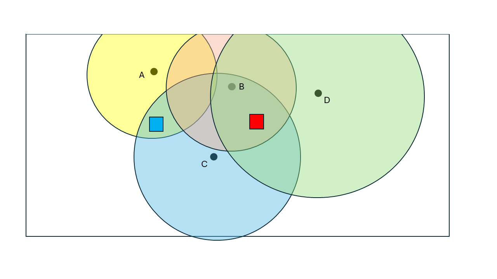

Distance based localization
===========================

Distance based localization restricts parameter updates to a spatial
neighbourhood around each observation. Parameters far from a given
observation are not updated by it, which suppresses
:ref:`spurious correlations <spurious_correlations>` that arise in ensemble
methods when the ensemble size is limited.

For theoretical background, see :ref:`distance_based_localization`.

Briefly how it works
---------------------

In distance-based localization, lateral distance (not including vertical distance)
is measured by Euclidean distance by using the (x, y) coordinates of the
observations and location of field parameters. The implemented method is
based on the publication of Emerick (2016).  A matrix, called RHO,
or localization matrix, has one element RHO(i,j) per pair of observation (index j)
and field parameter value (index i). If the distance between the observation
and the field parameter is 0, the RHO value, which is a scaling weight for
the Kalman Gain matrix, will be 1 and it will decrease with distance to 0
at two times the specified radius of influence of the observation.
The scaling function with normalized distance used here is the Gaspari-Cohn correlation
function. In ERT, each observation with an associated position is associated with an
influence radius in current version. When calculating updated field parameter,
the observations that have the field parameter within its influence range
(two times the specified radius with the Gaspari-Cohn function) will contribute
to the calculation of the updated field parameter.
A figure like the one below illustrates this.
Each of the four wells have their own radius of influence.
The grid cell colored with blue is within the range of observation located
at  A and C, but not within the range of B and D. The grid cell colored
with red is within the range of observation in location B, C and D and
will be influenced by those in the update.

Enabling distance based localization
-------------------------------------

Distance based localization is enabled in two steps:

1. Set the update strategy for the relevant parameter types.
2. Provide location metadata for relevant observations
   see :ref:`configuring_observations_for_ert`.

Setting the update strategy
^^^^^^^^^^^^^^^^^^^^^^^^^^^

Use ``ANALYSIS_SET_VAR PARAMETERS`` to select the ``DISTANCE`` strategy for
spatial parameter types:

.. code-block:: none

    ANALYSIS_SET_VAR PARAMETERS FIELD DISTANCE
    ANALYSIS_SET_VAR PARAMETERS SURFACE DISTANCE

``GEN_KW`` parameters do not have spatial coordinates and cannot use
distance based localization. They can still use ``ADAPTIVE`` or the
default ``GLOBAL`` strategy, see :ref:`parameters_section`

.. code-block:: none

    ANALYSIS_SET_VAR PARAMETERS GEN_KW ADAPTIVE | GLOBAL

Providing observation locations
^^^^^^^^^^^^^^^^^^^^^^^^^^^^^^^

Each observation that should participate in distance based localization
needs location metadata. See the :ref:`LOCALIZATION keyword <localization_keyword>`
reference for how to configure ``EAST``, ``NORTH``, and ``RADIUS`` on
summary, breakthrough, and RFT observations.

.. note::
    When the observation is missing location metadata, it is ignored for distance
    based localization. Nevertheless, such observations are still used for adaptive
    and global update strategies.
    Additionally, ``GENERAL_OBSERVATION`` observations do not have location metadata
    and will be excluded from distance based localization.

Full configuration example
--------------------------

.. code-block:: none

    NUM_REALIZATIONS 100

    GRID case.egrid

    FIELD PORO PARAMETER poro.grdecl INIT_FILES:poro%d.grdecl
    FIELD PERMX PARAMETER permx.grdecl INIT_FILES:permx%d.grdecl

    ANALYSIS_SET_VAR PARAMETERS FIELD DISTANCE

    OBS_CONFIG observations.txt

Where ``observations.txt`` contains observations with ``LOCALIZATION`` blocks
as described in :ref:`LOCALIZATION keyword <localization_keyword>`.

How it works
------------

For each parameter grid cell, the algorithm computes the distance to every
observation location. This distance is normalised by the observation's
radius and passed through the Gaspari-Cohn correlation function, which
produces a scaling factor between 0 and 1:

- At the observation location (distance = 0) the scaling factor is 1
  (full update).
- At a normalised distance of 2 × radius the scaling factor is 0
  (no update).

The scaling factors form a localization matrix (rho) that is applied
element-wise to the Kalman gain during the update step. This means
parameters close to an observation receive a strong update, while
distant parameters are progressively dampened and excluded beyond 2 × radius.

Because only horizontal (lateral) distances are considered, vertical layers
of a 3D grid share the same scaling factor.

The localization rho matrix is computed once at the start of the analysis and reused for all iterations.
The size of the rho matrix is determined by the number of parameters and the number of observations.

Choosing a radius
-----------------

The radius of influence should reflect well's region of interest when updating parameters.
In practice:

- A smaller radius provides weaker update and reduces spurious
  correlations, but may exclude parameters that are influenced by
  the observation.
- A larger radius provides stronger ensemble update but might increase
  spurious correlations.

The default radius is set to 3000 meters.

Configuration file vs GUI
--------------------------

Distance based localization can only be enabled through the configuration
file. The GUI analysis module dialog exposes only adaptive localization
settings.

If distance localization is configured for a parameter type, it is used for
that type even when adaptive localization is enabled in the GUI. The GUI's
adaptive localization settings are used only for parameters whose configured
strategy is ``ADAPTIVE``; they do not replace a configured ``DISTANCE``
strategy.
