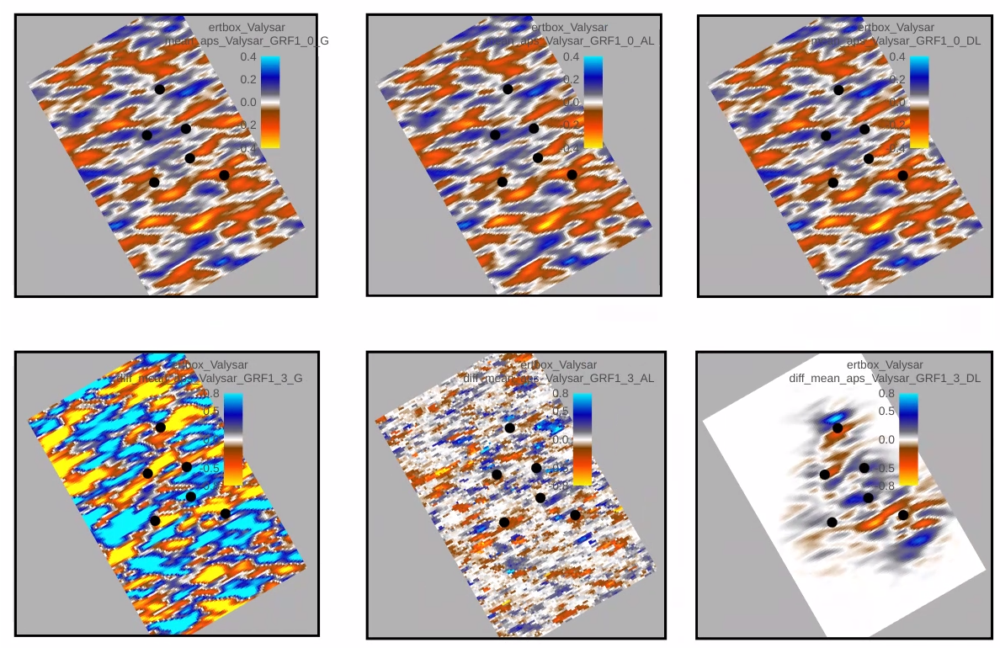
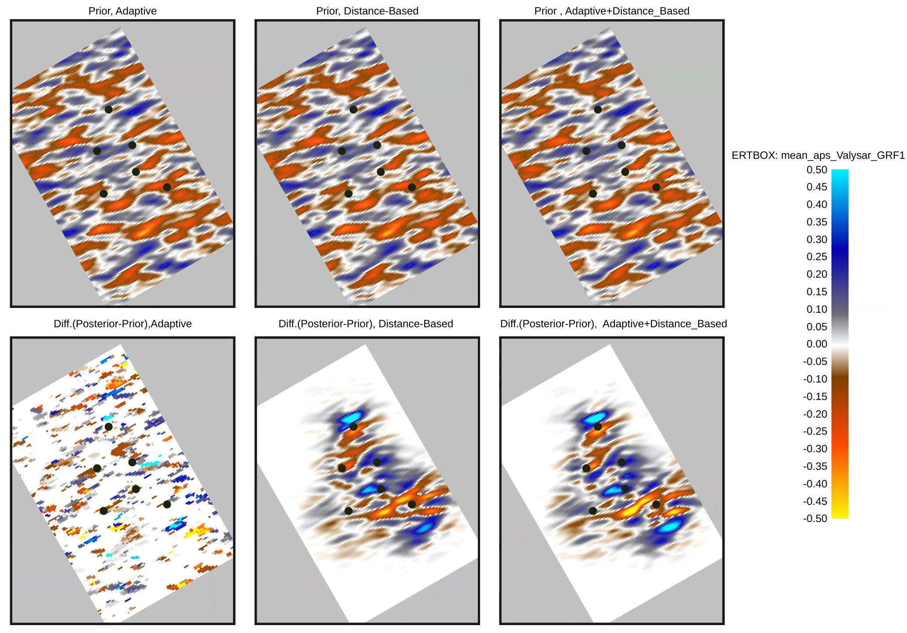
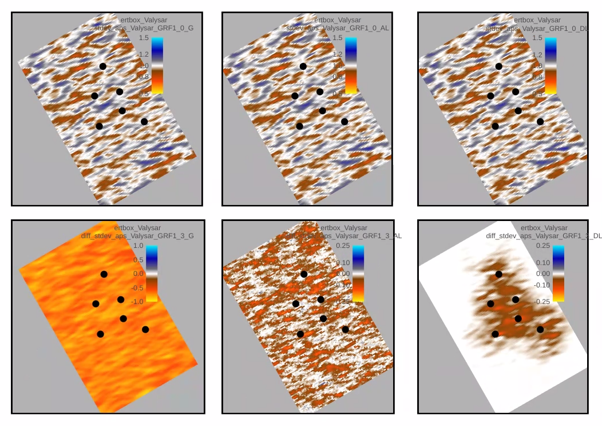
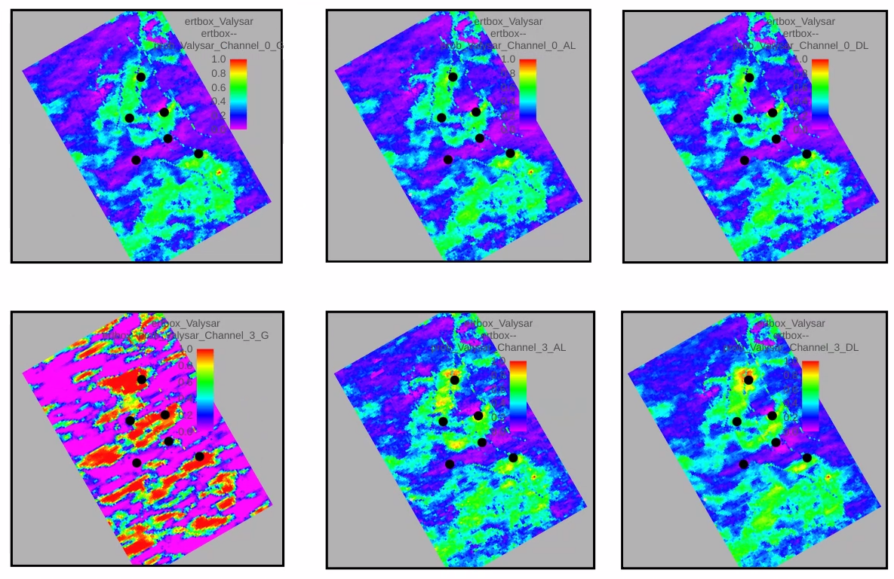
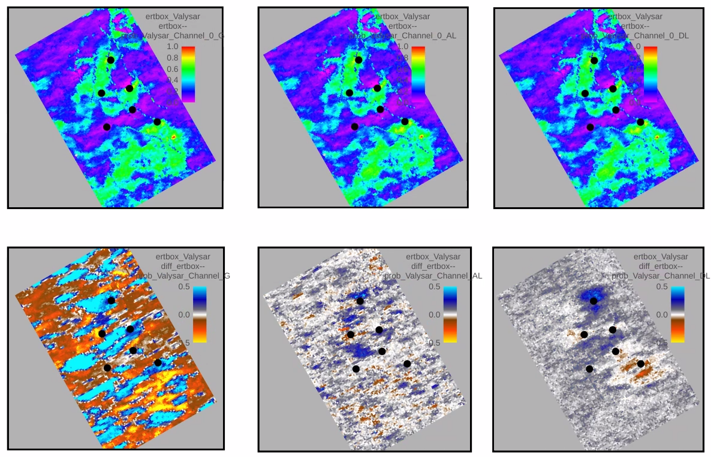
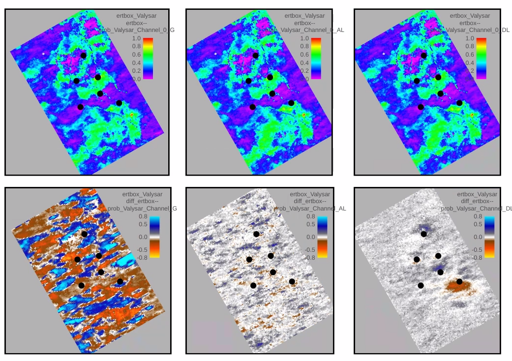
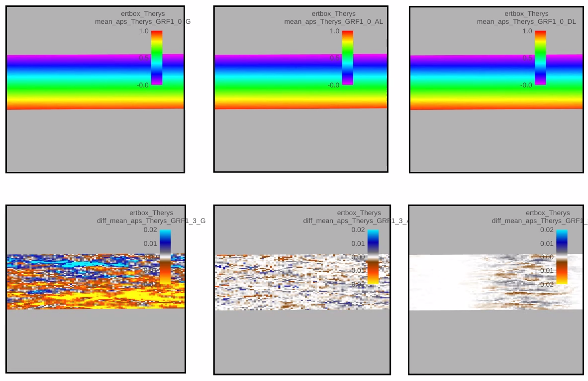

Localization with examples from Drogon
=======================================

Background
-----------

Ensemble-based data assimilation  will use the ensemble of realizations to estimate the
covariance matrices, both between the model parameters and cross-covariance between
model parameters and observations in order to define the Kalman Gain matrix used in
the ensemble smoother algorithm. This means that the matrices involved in the update
are only approximations of the true covariances due to *limited number of realizations*.
The noise in the estimated covariance matrices are called 'spurious correlations' since they
are not physical real correlations, but artifical correlations due to the
randomness of using finite number of realizations.

The effect of the unwanted 'spurious correlations' is unrealistic reduction of uncertainty in
posterior responses like production profiles, and updated model parameter distributions.
In extreme cases one may experience ensemble collapse where the posterior distribution
collapses to almost only one realization for response variables and posterior model parameter distributions.
This means that the posterior ensemble is useless as starting point for prediction of future production.
The tendency to ensemble collapse increases if there are low number of realizations or if the number of
observations increases. It is also more difficult to avoid if number of model parameters (typical field parameters)
is large. Treating observations that are physically correlated as if they are uncorrelated also contributes
to unrealistic reduction of posterior uncertainty in both response variables and model parameters.

In the following, global update means running an update in ERT without any localization. The observations
can influence the update of any model parameters regardless of any physical relation between a model parameter
and an observation due to spurious correlation. Localization is a common phrase for methods that try to mitigate
the unwanted effect of spurious correlation.

What is localization
---------------------

There exists different classes of localization, distance-based localization and adaptive (or covariance based) localization.
All localization methods are 'engineering tricks' to mitigate the unwanted effect of spurious correlations.
In theory, the effect of spurious correlations will vanish if it was possible to increase the ensemble to a very
large number (infinity in the limit). Since practical application of real case studies using ERT, is limited to a few realizations
(100 to 1000 realizations), localization is introduced to improve the practical results from ERT.

Distance-based localization will use information of distance between the location of an observation and the location
of a model parameter to calculate a scaling factor. The scaling factor reduces the effect the observation has on the
update of a model parameter. The larger the distance is between the location of the observation and the model parameter,
the less the observation will contribute to modifying the model parameter.
The Gaspari-Cohn correlation function is used per today in ERT to ensure a smooth decrease of the scaling function with distance.
The distance-based localization method can be used only if there is some associated location for an observation and a model parameter.
This means that distance-based localization is relevant for field parameters, but not scalar parameters that does not have any location.
Observations without any specified location can also not be used and may have global effect.

Adaptive correlation  will calculate the correlations and cross-correlations and apply a cutoff for correlations such that only grid
cells with model parameters having estimated correlation aboce a specified threshold value will be updated.
An observation will not contribute to the update of a model parameter if the estimated correlation is below the threshold.
Adaptive localization is mainly relevant for model parameters that does not have any location. It can be used for field parameters
but it is also influenced by spurious correlations since also spurious correlations can be above the threshold value. It is also
much slower than distance-based localization due to all the necessary covariance calculations needed.

How does the distance based localization works?
-------------------------------------------------

The implemented method in ERT is based on the method published by Emerick (2016) where the Kalmain Gain is modified by multipying
elementwise by a scaling factor. The RHO matrix that contains the scaling factor has of course the same size as the Kalman Gain matrix
and can be a very large matrix for real cases with many observation (e.g. 4D seismic observations). Each element of the RHO matrix
contains the scaling factor for one pair of observation and model parameter (observation, parameter).
The Kalman Gain matrix element for the pair of (observation, parameter) is a weight factor for how much the difference
between the observed value minus the predicted value is contributiong to the update of the parameter.
By multiplying with the scaling value for that pair of observation and parameter, the effect of it is reduced. The method is very flexible
in theory. In practice, how to define the values of the scaling factor for each pair of observation and parameter is simplified by using
the lateral distance between the observation location and the parameter location and decrease the scaling factor as function of the distance.

In ERT the current implementation specify an influence range as a circular disk around each observations location, and specified by a RADIUS value.
The following limitations is used in the current implementation:
- Circular influence area around each observation
- Only lateral distance is used.
- Same influence range from an observation regardless of which field parameter is updated.
- Same influence range from an observation regardless of which geological zone the field parameter belongs to.
- Observation specified with the GENERAL_OBSERVATION keyword is ignored when updated field parameters.
GENERAL_OBSERVATION is used when updating scalar parameters.
- Seismic 4D observations is currently not available in distance-based localization, but will come soon.

Possible future extensions?
----------------------------

Most probable extensions to come will be:
- Include separate keyword for 4D seismic observations and use these observations also to update field parameters
- Include Tracer observations (but need to specify some position for influence area between paris of injectors and producers)
- More flexible definition of influence area around observation, e.g. elliptic shapes or polygon defined shapes.
- Some decision how to handle observations that are not localized.

Possible extensions but nothing decided yet:
- Full user flexibility to specify the RHO matrix.
The user specify the RHO parameter per observation for all field parameter values as input instead of having
ERT to calculate it from distances and scaling functions.

Example from Drogon
--------------------

The plots shown below is based on the latest stable version of ERT (august 2026)
and the latest version of the Drogon synthetic FMU model (August 2026). Three different
runs with ERT using ES-MDA with 3 updates and 100 realizations are used.

The plots show prior mean value of a gaussian field parameter at top and the difference
between the posterior and prior mean value at bottom for the three cases
global update, adaptive localization and distance-based localization using ES-MDA with 3 updates.
The color scale is centered at 0. The global update where no localization is used,
shows that the ensemble mean value changes all over the the areal.
The adaptive localization updates field parameters where the correlation with observations are
above the threshold of 0.3. The distance-based localization updates the field parameter in area
around the wells.

