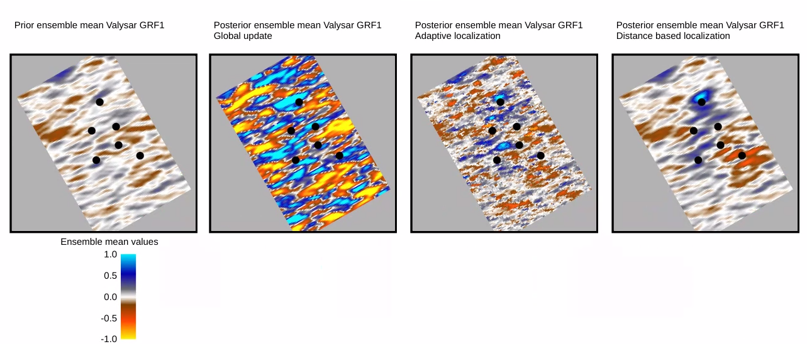
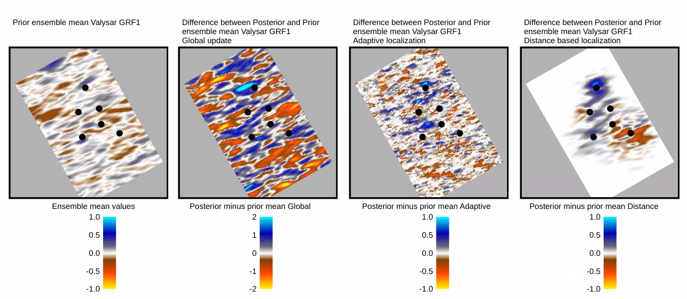
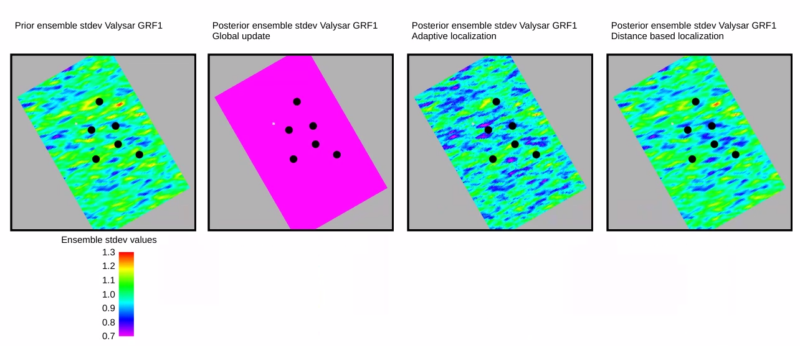
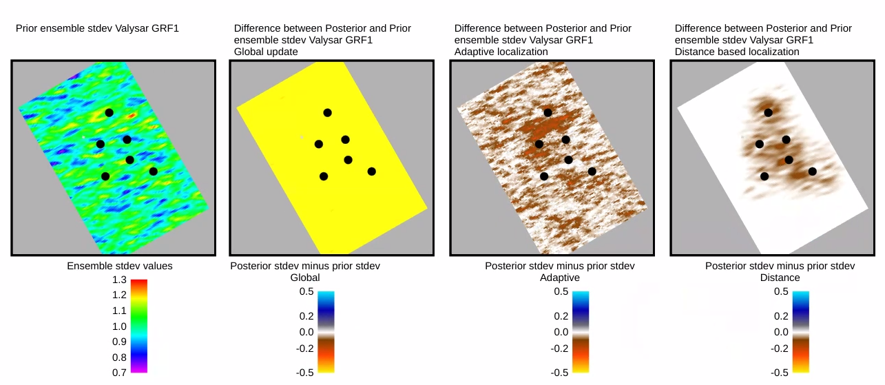

Localization with examples from Drogon
=======================================

The open source synthetic reservoir model, Drogon, is used to illustrate the effect of using global update without localization
adaptive or distance-based localization on updates of gaussian field parameters.
In the following, global update means running an update in ERT without any localization. The observations
can influence the update of any model parameters regardless of any physical relation between a model parameter
and an observation due to spurious correlation. Localization is a common phrase for methods that try to mitigate
the unwanted effect of spurious correlation.

The Drogon case applies the facies model called 'Adaptive Pluri-Gaussian Simulation (APS) since this
method uses Gaussian random fields as updatable parameters in ERT.

Example from Drogon
--------------------

The Drogon case was run with ES-MDA using the august 2026 version of ERT and the Drogon model. Three different
runs with ERT using ES-MDA with 3 updates and 100 realizations are used, one without
localization and with adaptive and distance-based localization. Adaptive localization used default threshold
for correlation. The ensemble mean and standard deviation and the differences between the posterior
and prior mean and standard deviations of one of thw Gaussian fieldso from Drogon is shown for one layer
in one of the zones. The field statistics (mean, stdev) is calculated within
the help grid used for the field parameter (Ertbox help grid).

The first plot show ensemble mean for the prior and the three different update strategies (global, adaptive, distance).

The second plot show the differences between posterior and prior ensemble mean for the three different update strategies.

The third plot show the ensemble standard deviation for the prior and the three different update strategies.

The fourth plot show the differences between posterior and prior ensemble standard deviation for the three different update strategies.

