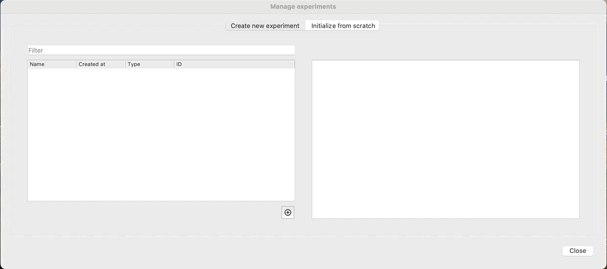
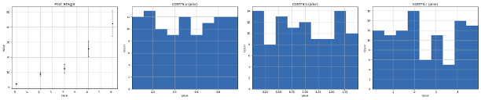
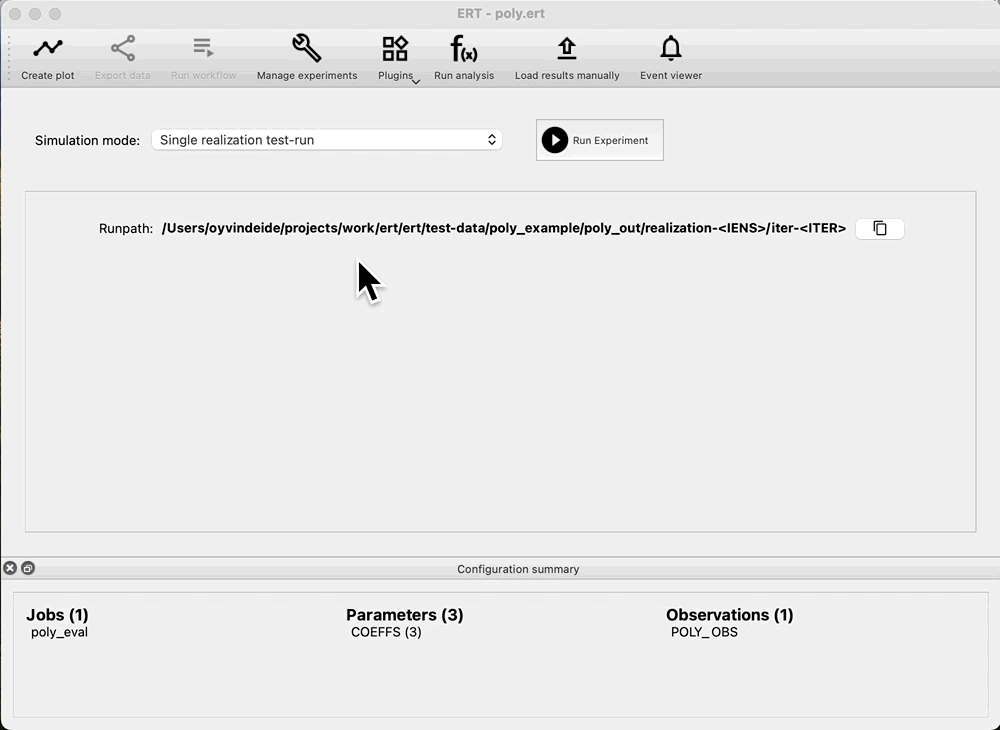
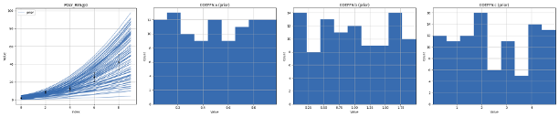

.. _manual-prior-guide:

Sampling prior
==============

The process begins wth parameterization of the model. After that, the next step is to evaluate the coverage of that
prior, i.e., how are the responses of the ensemble compared with the observations. If the prior response is not able
to cover the observations, there might be a problem with the parameterization.

To evaluate this we can first create a new experiment, and sample the prior:

Evaluate prior
==============

At this point, we have sampled parameters for all our realizations, and we can see how the distributions look by clicking:
`Create plot`. We observe that the response (`POLY_RES@0`), is empty, as we have not yet evaluated the prior, just sampled
the parameters. Because we have a rather limited ensemble size (100), we observe that even though the parameters have a uniform
distribution, there is a bias in the prior. Increasing the number of realizations will improve this, but comes at a cost
of increased run time for evaluating the ensemble.

Run forward model
=================

If we are happy with the draw of the prior, we can run the forward model, and get the responses from the prior. Navigate
to: `Evaluate ensemble`, and observe that we can see: `Prior` in the `Ensemble` drop down. Press: `Run Experiment` to
evaluate the prior:

Check coverage
==============

After evaluating the prior, we can look at the result in `Create plot`. We check that there is good coverage in the prior,
with ensembles both inside and outside the observation uncertainty, as well as higher and lower values than the observations.

We also observe that the parameters are unchanged, as in the last step we only ran there forward model, we did not draw
a new prior.

Run data assimilation
=====================

Because we do not have any ensembles with parameters and no responses, the `Ensemble` drop down in `Evaluate ensemble` is
now empty. To start data assimilation, navigate to the `Multiple Data Assimilation` experiment mode, and check: `Restart run`,
then select `prior` in the `Restart from` dropdown and start the experiment. This means that we do not have to rerun the
prior, and we are able to evaluate coverage of the prior without running multiple iterations of ES-MDA first.

.. image:: fig/restart_es_mda.gif

While running, we get reports showing how the observations are matching the responses, their status as well as any scaling
factors used in the update.

.. image:: fig/update_report.png
