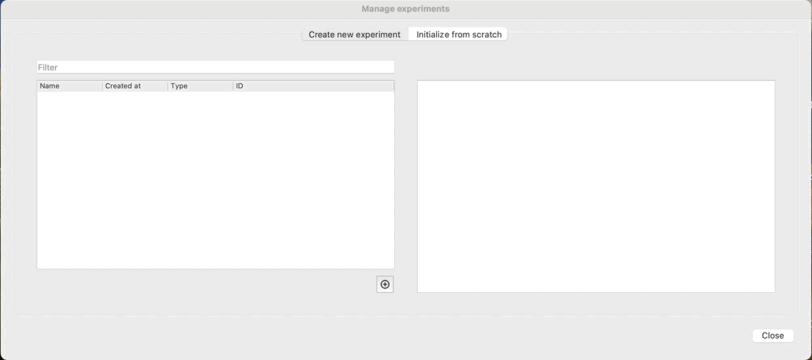
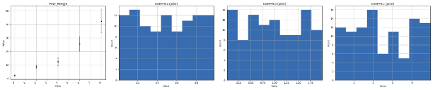
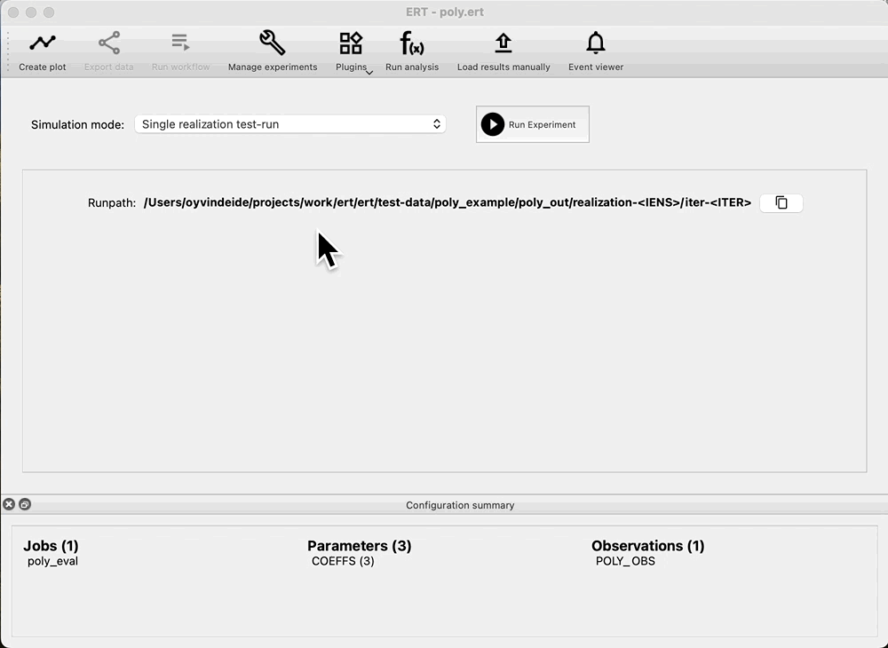
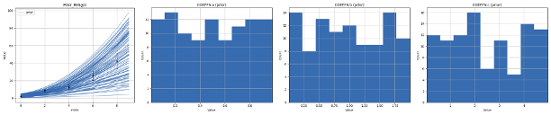
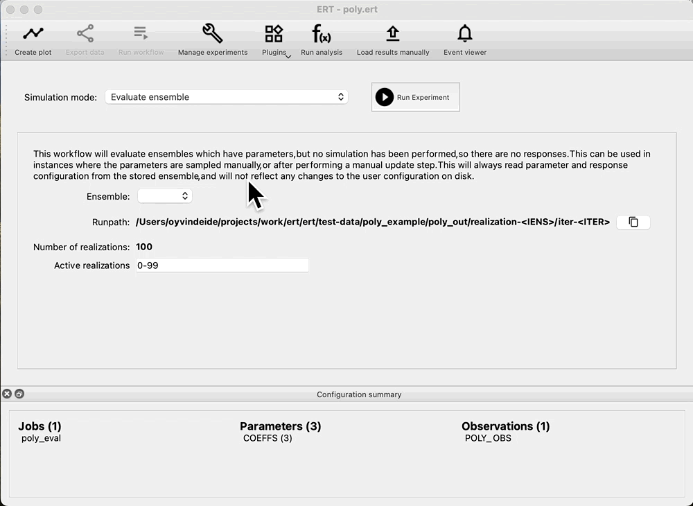
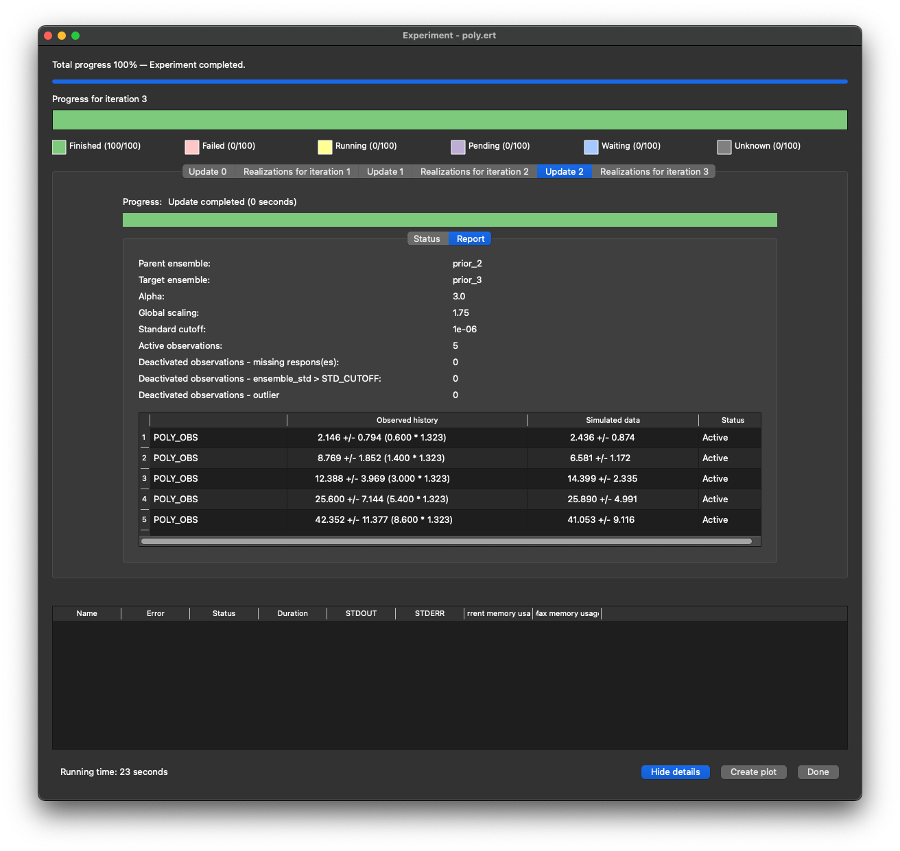

.. _manual-prior-guide:

Sampling prior
==============

The process begins with parameterization of the model. After that, the next step is to evaluate the coverage of that
prior, i.e., how are the responses of the ensemble compared with the observations. If the prior response is not able
to cover the observations, there might be a problem with the parameterization.

To evaluate this we can first create a new experiment, and sample the prior:

Evaluate prior
==============

At this point, we have sampled parameters for all our realizations, and we can see how the distributions look by clicking:
`Create plot`. We observe that the response (`POLY_RES@0`), is empty, as we have not yet evaluated the prior, just sampled
the parameters. Because we have a rather limited ensemble size (100), we observe that even though the parameters have a uniform
distribution, there is a bias in the prior. Increasing the number of realizations will improve this, but comes at a cost
of increased run time for evaluating the ensemble.

Run forward model
=================

If we are happy with the draw of the prior, we can run the forward model, and get the responses from the prior. Navigate
to: `Evaluate ensemble`, and observe that we can see: `Prior` in the `Ensemble` drop down. Press: `Run Experiment` to
evaluate the prior:

Check coverage
==============

After evaluating the prior, we can look at the result in `Create plot`. We check that there is good coverage in the prior,
with ensembles both inside and outside the observation uncertainty, as well as higher and lower values than the observations.

We also observe that the parameters are unchanged, as in the last step we only ran there forward model, we did not draw
a new prior.

Run data assimilation
=====================

Because we do not have any ensembles with parameters and no responses, the `Ensemble` drop down in `Evaluate ensemble` is
now empty. To start data assimilation, navigate to the `Multiple Data Assimilation` experiment mode, and check: `Select prior ensemble`,
then select a prior ensemble in the `Run from prior ensemble` dropdown and start the experiment. This means that we do not have to rerun the
prior ensemble, and we are able to evaluate coverage of the prior ensemble without running multiple iterations of ES-MDA first.

While running, we get reports showing how the observations are matching the responses, their status as well as any scaling
factors used in the update.

Parameter localizations
=======================

The **Parameter Localizations** table in the ES-MDA settings summarizes
parameter configurations by localization strategy and parameter type.
For example, 10 GenKW configurations using adaptive localization appear as:

.. list-table::
   :header-rows: 1

   * - strategy
     - parameter type
     - count
   * - Adaptive
     - GenKW
     - 10

Each Field or Surface counts as one configuration, regardless of its number
of grid cells. Parameters excluded from updating appear as
``Non-updatable``. If there are no parameter configurations, the table
contains only column headers.

By default, the summary reflects the current configuration, including
parameters added or overridden by a design matrix. When you select a prior
ensemble, it instead reflects the parameter configurations stored with
that ensemble's experiment, including localization changes saved for this run.

The table is read-only. It refreshes when you save changes in
**Update settings**, change the prior ensemble selection, or return to
the ES-MDA settings from another experiment type.

Editing and resetting parameter localizations
--------------------------------------------

Parameter localization changes saved in **Update settings** belong to the
current experiment panel.
They do not modify the configuration file, another panel's settings, or an
existing experiment. **Show parameters**, **Parameter Localizations**, and the
parameter section of the bottom summary all reflect the active parameter
configuration. The bottom summary's forward-model and observation sections still
describe the configuration file.

If updatable parameters of one type use different localization methods, the
existing dropdown displays **Mixed**. Saving without choosing a replacement
preserves those individual methods. For example, if two GenKW parameters use
Global and Adaptive, respectively, selecting Adaptive applies Adaptive to both.
Parameters marked non-updatable remain non-updatable.

**Cancel** discards unsaved dialog edits. **Reset parameter changes** restores
both the configured-parameter draft and the selected prior's draft to their
original localizations. It does not reset weights, active realizations, or
general analysis settings.

Configured-parameter edits are retained when selecting and then deselecting a
prior. Prior edits are discarded when selecting a different prior or turning
off **Select prior ensemble**. A storage refresh keeps the selected prior and its
edits while the same source remains available. If it disappears, select an
available prior or turn off prior selection before running.

Saved localizations are used by the run, including parameters provided by a
design matrix. Unlike shared in-memory edits, they do not affect other experiment
panels. No configuration-file migration is required.
