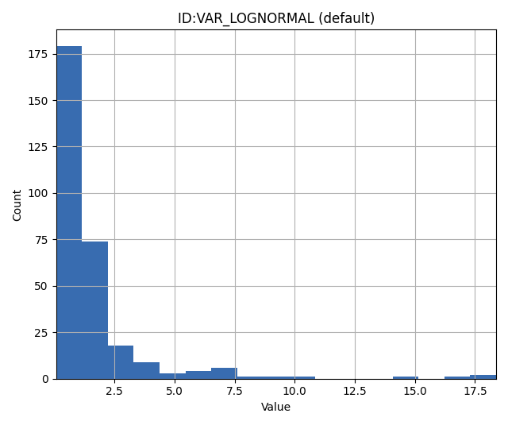
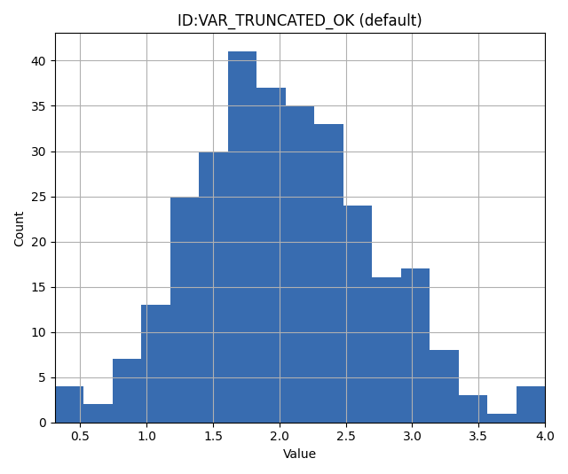
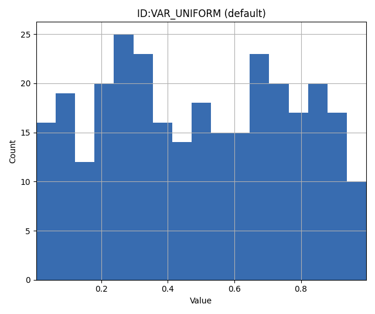
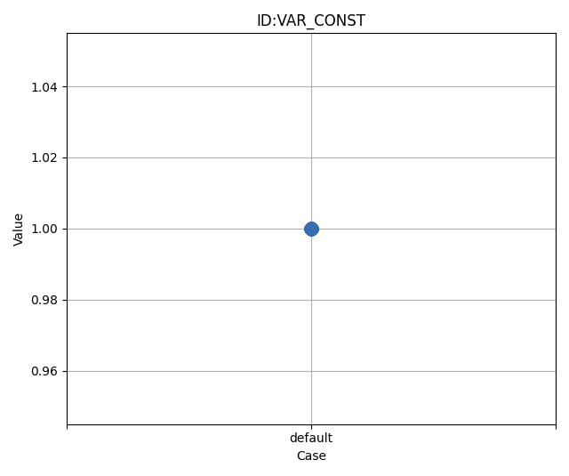
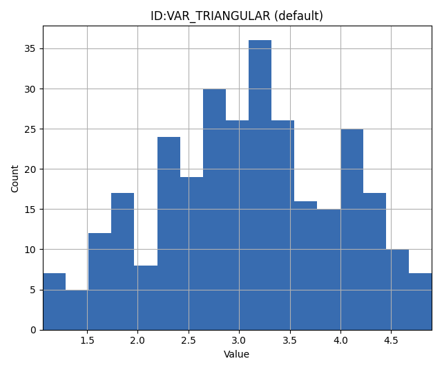

.. _Data_types_available_in_ERT:

Data types
==========

In essence, the purpose of ERT is to pass uncertain parameter values to a forward model
and then store the resulting outputs.
Forward models include all necessary pre-processing and post-processing steps,
as well as the computational model (e.g., a physics simulator like ECLIPSE)
that produces the predictions.
Consequently, ERT must be able to read and write data in a format compatible with the
forward model.

Data managed by ERT are organized into distinct *data types*,
each of which will be detailed in this chapter.
The data types in ERT can be classified based on two main criteria:

1. Dynamic behaviour: whether the data type is a static input to the simulator,
   such as porosity or permeability, or an output of the simulation.
2. Implementation: this includes the type of files it can read
   and write, how it is configured, and so forth.

Note: All data types share a common namespace, meaning that each keyword must
be globally unique.

Scalar parameters with a template: ``GEN_KW``
---------------------------------------------
.. _prior_distributions:

This section describes the distributions built into ERT that can be used as priors.
For detailed description and examples on how to use the ``GEN_KW`` keyword, see :ref:`here <gen_kw>`.

The algorithms used for updating parameters expect normally distributed variables.
ERT supports other types of distributions by transforming normal variables as outlined next.

  1. ERT samples a random variable ``x ~ N(0,1)`` - before outputting to the
     forward model this is *transformed* to ``y ~ F(Y)`` where the
     distribution ``F(Y)`` is the correct prior distribution.

  2. When the prior simulations are complete ERT calculates misfits between
     simulated and observed values and *updates* the parameters; hence the
     variables ``x`` now represent samples from a posterior distribution which
     is Normal with mean and standard deviation *different from (0,1)*.

The transformation prescribed by ``F(y)`` still "works" - but it no longer maps
to a distribution in the same family as initially specified by the prior. A
consequence of this is that the update process can *not* give you a posterior
with updated parameters in the same distribution family as the Prior.

Reproducibility
^^^^^^^^^^^^^^^

When ERT samples values there is a seed for each parameter. This means that
if ERT is started with a fixed :ref:`RANDOM_SEED <random_seed>` each prior
that is sampled will be identical. When running without a random seed ERT
will output which random seed was used, so it is possible to reproduce results
as long as that is kept.

This section only applies if a fixed seed is used:
  * If the ensemble size is increased from N -> N+1 the N first realizations will be identical to before
  * Parameter order is irrelevant
  * Parameter names are case sensitive, PARAM:MY_PARAM != PARAM:myParam

NORMAL: Gaussian Distribution
^^^^^^^^^^^^^^^^^^^^^^^^^^^^^

The ``NORMAL`` keyword allows assigning a Gaussian (or normal) prior to a variable.
It requires two arguments: a mean value and a standard deviation.

Syntax
~~~~~~
::

  VAR NORMAL <mean_value> <standard_deviation>

Parameters
~~~~~~~~~~
- **<mean_value>**: The mean of the normal distribution.
- **<standard_deviation>**: The standard deviation of the normal distribution.

Example
~~~~~~~
For a Gaussian distribution with mean 0 and standard deviation 1 assigned to the variable VAR:
::

   VAR NORMAL 0 1

.. image:: fig/normal.png

Notes
~~~~~
The ``NORMAL`` keyword is integral for scenarios demanding priors that reflect typical real-world data patterns, as the Gaussian distribution is prevalent in many natural phenomena.

LOGNORMAL: Log Normal Distribution
^^^^^^^^^^^^^^^^^^^^^^^^^^^^^^^^^^

The ``LOGNORMAL`` keyword is used to assign a log normal prior to a variable. A variable is considered log normally distributed if the logarithm of that variable follows a normal distribution.
The logarithm in question is the natural logarithm. If :math:`X` is normally distributed, then :math:`Y = e^X` is log normally distributed.

Log normal priors are especially suitable for modeling positive values that exhibit a heavy tail, indicating a tendency for the quantity to occasionally take large values.

Syntax
~~~~~~
::

  VAR LOGNORMAL <log_mean> <log_standard_deviation>

Parameters
~~~~~~~~~~
- **<log_mean>**: The mean of the logarithm of the variable.
- **<log_standard_deviation>**: The standard deviation of the logarithm of the variable.

Example
~~~~~~~
Histogram from values sampled from a lognormal variable specified with log-mean of 0 and log standard deviation 1.
::

   VAR LOGNORMAL 0 1

TRUNCATED_NORMAL: Truncated Normal Distribution
^^^^^^^^^^^^^^^^^^^^^^^^^^^^^^^^^^^^^^^^^^^^^^^

The ``TRUNCATED_NORMAL`` keyword is utilized to assign a truncated normal distribution to a variable.
This distribution works as follows:

   1. Draw a random variable :math:`X \sim N(\mu,\sigma)`.
   2. Clamp :math:`X` to the interval [min, max].

Syntax
~~~~~~
::

  VAR TRUNCATED_NORMAL <mean> <standard_deviation> <min> <max>

Parameters
~~~~~~~~~~
- **<mean>**: The mean of the normal distribution prior to truncation.
- **<standard_deviation>**: The standard deviation of the distribution before truncation.
- **<min>**: The lower truncation limit.
- **<max>**: The upper truncation limit.

Example
~~~~~~~
::

   VAR TRUNCATED_NORMAL 2 0.7 0 4

UNIFORM: Uniform Distribution
^^^^^^^^^^^^^^^^^^^^^^^^^^^^^

The ``UNIFORM`` keyword is used to assign a uniform distribution to a variable.
A variable is considered uniformly distributed when it has a constant probability density over a closed interval.
Thus, the uniform distribution is fully characterized by it's minimum and maximum values.

Syntax
~~~~~~
::

  VAR UNIFORM <min_value> <max_value>

Parameters
~~~~~~~~~~
- **<min_value>**: The lower bound of the uniform distribution.
- **<max_value>**: The upper bound of the uniform distribution.

Example
~~~~~~~
To assign a uniform distribution spanning between 0 and 1 to a variable named ``VAR``:
::

   VAR UNIFORM 0 1

Notes
~~~~~
It can be shown that among all distributions bounded below by :math:`a` and above by :math:`b`,
the uniform distribution with parameters :math:`a` and :math:`b` has the maximal entropy (contains the least information).

LOGUNIF: Log Uniform Distribution
^^^^^^^^^^^^^^^^^^^^^^^^^^^^^^^^^

The ``LOGUNIF`` keyword is used to assign a log uniform distribution to a variable.
A variable is said to be log uniformly distributed when its logarithm displays a uniform distribution over a specified interval, [a, b].

Syntax
~~~~~~
::

  VAR LOGUNIF <min_value> <max_value>

Parameters
~~~~~~~~~~
- **<min_value>**: The lower bound of the log uniform distribution.
- **<max_value>**: The upper bound of the log uniform distribution.

Example
~~~~~~~
To assign a log uniform distribution ranging from 0.00001 to 1 to a variable:
::

   VAR LOGUNIF 0.00001 1

.. image:: fig/loguniform.png

Notes
~~~~~
The log uniform distribution is useful when modeling positive variables that are heavily skewed towards a boundary.

CONST: Dirac Delta Distribution
^^^^^^^^^^^^^^^^^^^^^^^^^^^^^^^

The ``CONST`` keyword ensures that a variable always takes a specific, unchanging value.

Syntax
~~~~~~
::

  VAR CONST <value>

Parameters
~~~~~~~~~~
- **<value>**: The fixed value to be assigned to the variable.

Example
~~~~~~~
To assign a value of 1.0 to a variable:
::

   VAR CONST 1.0

DUNIF: Discrete Uniform Distribution
^^^^^^^^^^^^^^^^^^^^^^^^^^^^^^^^^^^^

The ``DUNIF`` keyword assigns a discrete uniform distribution to a variable over a specified range and number of bins.

Syntax
~~~~~~
::

  VAR DUNIF <nbins> <min_value> <max_value>

Parameters
~~~~~~~~~~
- **<nbins>**: Number of discrete bins or possible values.
- **<min_value>**: The minimum value in the range.
- **<max_value>**: The maximum value in the range.

Example
~~~~~~~
To create a discrete uniform distribution with possible values of 1, 2, 3, 4, and 5:
::

   VAR DUNIF 5 1 5

.. image:: fig/dunif.png

Notes
~~~~~
Values are derived based on the formula:
:math:`\text{min} + i \times (\text{max} - \text{min}) / (\text{nbins} - 1)`
Where :math:`i` ranges from 0 to :math:`\text{nbins} - 1`.

ERRF: Error Function-Based Prior
^^^^^^^^^^^^^^^^^^^^^^^^^^^^^^^^

The ``ERRF`` keyword allows creating prior distributions derived from applying the normal CDF (involving the error function) to a standard normal variable.
Note that the CDF is not necessarily the standard normal, as ``SKEWNESS`` and ``WIDTH`` corresponds to its negative mean and standard deviation respectively.
This allows flexibility in creating distributions of diverse shapes and symmetries.

Syntax
~~~~~~
::

  VAR8 ERRF MIN MAX SKEWNESS WIDTH

Parameters
~~~~~~~~~~
- **MIN**: The minimum value of the transform.
- **MAX**: The maximum value of the transform.
- **SKEWNESS**: The asymmetry of the distribution.

  - ``SKEWNESS < 0``: Shifts the distribution towards the left.
  - ``SKEWNESS = 0``: Results in a symmetric distribution.
  - ``SKEWNESS > 0``: Shifts the distribution towards the right.
- **WIDTH**: The peakedness of the distribution.

  - ``WIDTH = 1``: Generates a uniform distribution.
  - ``WIDTH > 1``: Creates a unimodal, peaked distribution.
  - ``WIDTH < 1``: Forms a bimodal distribution with peaks.

Examples
~~~~~~~~
1. For a symmetric, uniform distribution:
   ::

     VAR ERRF -1 1 0 1

.. image:: fig/errf_symmetric_uniform.png

2. For a right-skewed, unimodal distribution:
   ::

     VAR ERRF -1 1 2 1.5

.. image:: fig/errf_right_skewed_unimodal.png

Notes
~~~~~
Keep in mind the interactions between the parameters, especially when both ``SKEWNESS`` and ``WIDTH`` are adjusted.
Their combination can result in a wide range of distribution shapes.

DERRF: Discrete Error Function-Based Distribution
^^^^^^^^^^^^^^^^^^^^^^^^^^^^^^^^^^^^^^^^^^^^^^^^^

The ``DERRF`` keyword is a discrete version of the ``ERRF`` keyword.
It is designed for creating distributions based on the error function but with discrete output values.
This keyword facilitates sampling from discrete distributions with various shapes and asymmetries.

Syntax
~~~~~~
::

  VAR DERRF NBINS MIN MAX SKEWNESS WIDTH

Parameters
~~~~~~~~~~
- **NBINS**: The number of discrete bins or possible values.
- **MIN**: The minimum value of the distribution.
- **MAX**: The maximum value of the distribution.
- **SKEWNESS**: The asymmetry of the distribution.

  - ``SKEWNESS < 0``: Shifts the distribution towards the left.
  - ``SKEWNESS = 0``: Produces a symmetric distribution.
  - ``SKEWNESS > 0``: Shifts the distribution towards the right.
- **WIDTH**: The shape of the distribution.

  - ``WIDTH close to zero, for example 0.01``: Generates a uniform distribution.
  - ``WIDTH > 1``: Leads to a unimodal, peaked distribution.
  - ``WIDTH < 1``: Forms a bimodal distribution with peaks.

Examples
~~~~~~~~
1. For a discrete symmetric, uniform distribution with five bins:
   ::

     VAR_DERRF1 DERRF 5 -1 1 0 1

.. image:: fig/derrf_symmetric_uniform.png

2. For a discrete right-skewed, unimodal distribution with five bins:
   ::

     VAR_DERRF2 DERRF 5 -1 1 2 1.5

.. image:: fig/derrf_right_skewed.png

TRIANGULAR: Triangular Distribution
^^^^^^^^^^^^^^^^^^^^^^^^^^^^^^^^^^^

The ``TRIANGULAR`` keyword is used to define a triangular distribution, which is shaped as a triangle and is determined by three parameters: minimum, mode (peak), and maximum.

Syntax
~~~~~~
::

    VAR TRIANGULAR MIN MODE MAX

Parameters
~~~~~~~~~~
- **XMIN**: The minimum value of the distribution.
- **XMODE**: The location (value) where the distribution reaches its maximum (or peak).
- **XMAX**: The maximum value of the distribution.

Description
~~~~~~~~~~~
The triangular distribution is a continuous probability distribution with a probability density function
that is zero outside the interval [``XMIN``, ``XMAX``], and is linearly increasing from ``XMIN`` to ``XMODE`` and decreasing from ``XMODE`` to ``XMAX``.

Example
~~~~~~~
To define a triangular distribution with a minimum of 1, mode (peak) of 3, and maximum of 5:

::

    VAR_TRIANGULAR TRIANGULAR 1 3 5

3D field parameters: ``FIELD``
------------------------------

The ``FIELD`` keyword is used to parametrize quantities that span the entire grid,
with porosity and permeability being the most common examples.
For detailed description and examples see :ref:`here <field>`.

2D Surface parameters: ``SURFACE``
----------------------------------

The SURFACE keyword can be used to work with surface from RMS in the irap
format.
For detailed description and examples see :ref:`here <surface>`.

Simulated data
--------------

The datatypes in the *Simulated data* chapter correspond to datatypes which are
used to load results from a forward model simulation and into ERT. In a model
updating workflow instances of these datatypes are compared with observed values
and that is used as basis for the update process. Also post processing tasks
like plotting and QC is typically based on these data types.

Summary: SUMMARY
^^^^^^^^^^^^^^^^

The ``SUMMARY`` keyword is used to configure which summary vectors you want to
load from the (Eclipse) reservoir simulation. In its simplest form, the
``SUMMARY`` keyword just lists the vectors you wish to load. You can have
multiple ``SUMMARY`` keywords in your config file, and each keyword can mention
multiple vectors:

::

   SUMMARY  WWCT:OP_1  WWCT:OP_2  WWCT:OP_3
   SUMMARY  FOPT FOPR  FWPR
   SUMMARY  GGPR:NORTH GOPR:SOUTH

If you in the observation use the ``SUMMARY_OBSERVATION`` to compare simulations and observations for a
particular summary vector you need to add this vector after SUMMARY in the ERT
configuration to have it plotted.

You can use wildcard notation to all summary vectors matching a pattern, i.e. this:

::

   SUMMARY WWCT*:* WGOR*:*
   SUMMARY F*
   SUMMARY G*:NORTH

will load the ``WWCT`` and ``WWCTH``, as well as ``WGOR`` and ``WGORH`` vectors
for all wells, all field related vectors and all group vectors from the ``NORTH``
group.

RFT data
^^^^^^^^

:term:`RFT` data represents measurements or simulated
values of formation properties such as pressure and saturation at specific
locations within wells. These measurements are typically taken at discrete depth
points and specific times during the reservoir's production history.

Understanding RFT files
~~~~~~~~~~~~~~~~~~~~~~~

Reservoir simulators (e.g., ECLIPSE, OPM Flow) can generate RFT files that
contain simulated pressure, saturation, and other formation properties at well
measurement locations. These files are produced alongside summary files and use
the same basename specified by the :ref:`ECLBASE <eclbase>` keyword.

For example, if your configuration specifies::

    ECLBASE MY_FIELD

The simulator should generate files such as:
  - ``MY_FIELD.RFT`` - Binary RFT file
  - ``MY_FIELD.SMSPEC`` - Summary specification file
  - ``MY_FIELD.UNSMRY`` - Summary data file

Ert will expect the ``MY_FIELD.RFT`` to be produced by the reservoir simulator when
either :ref:`rft observations <rft_observation>` or :ref:`rft responses <rft>`
is used. When the :ref:`SUMMARY 
` keyword is used, ert expects ``MY_FIELD.SMSPEC``
and ``MY_FIELD.UNSMRY`` to be produced by the reservoir simulator.

For the OPM simulator, the keywords ``WRFT`` and ``WRFTPLT`` enables output of
the RFT file.

Working with RFT observations
~~~~~~~~~~~~~~~~~~~~~~~~~~~~~~

RFT data is loaded into ERT automatically when you define :ref:`RFT_OBSERVATION <rft_observation>`
entries in your observation configuration file. ERT reads the RFT files generated
by your forward model and extracts the simulated values at the locations
(specified by NORTH, EAST, and :term:`TVD` coordinates) and times (DATE) defined
in your observations.

Each RFT observation specifies:
  - **WELL**: The name of the well where the measurement was taken
  - **DATE**: The date of the measurement in ISO format (YYYY-MM-DD)
  - **PROPERTY**: The property being measured (e.g., PRESSURE, SWAT, SGAS)
  - **VALUE**: The observed value
  - **ERROR**: The measurement uncertainty
  - **TVD**: True vertical depth below sea level
  - **NORTH** and **EAST**: Horizontal coordinates of the measurement location

Example observation configuration::

   RFT_OBSERVATION prod_rft_2015 {
      WELL=PROD_01;
      DATE=2015-06-15;
      PROPERTY=PRESSURE;
      VALUE=3850;
      ERROR=25;
      TVD=2150.5;
      EAST=456789.2;
      NORTH=6789012.3;
   };

For loading multiple RFT observations from a CSV file, see the
:ref:`RFT_OBSERVATION <rft_observation>` documentation.

General data: ``GEN_DATA``
--------------------------

The ``GEN_DATA`` keyword is used to load text files which have been generated
by the forward model.
For detailed description and examples see :ref:`here <gen_data>`.

EnKF heritage
-------------

With regards to the datatypes in ERT this is a part of the application where the
EnKF heritage shows through quite clearly, the datatypes offered by ERT would
probably be different if ERT was made for Ensemble Smoother from the outset.
Pecularites of EnKF heritage include:

1. The `FIELD` implementation can behave both as a dynamic quantity, i.e.
   pressure and saturation, and static property like porosity. In ERT it is
   currently *only used* as a parameter.

2. The parameter types have an internal pseudo time dependence corresponding to
   the "update time" induced by the EnKF scheme. This pseudo time dependence is
   not directly exposed to the user, but it is still part of the implementation
   and e.g. when writing plugins which work with parameter data managed by ERT
   you must relate to it.

3. The time dependence of the `GEN_DATA` implementation. This is just too
   complex, there have been numerous problems with people who configure the
   `GEN_DATA` keywords incorrectly.
