A Gentle Introduction to History Matching
=========================================

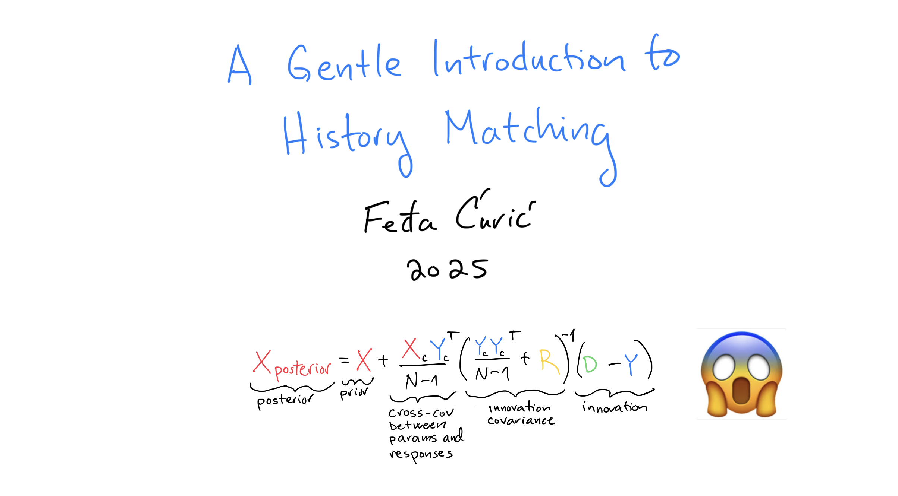

By the end of this, you should have a relatively deep understanding of the scary looking equation which is at the core of history matching.
You'll gain some intuition so that history matching is less of a black-box, and be introduced to typical notation and terminology used in the literature.

A deeper understanding of the terminology and underlying equation is useful for developers of ``ert`` as it makes it easier to understand and debug the code.
It is also useful for users of ``ert`` and ``fmu``, such as reservoir engineers, since it makes it easier to interpret the results of history matching.
Finally, it should also be a reasonable starting point for those looking to be able to read and understand research papers on history matching.

Tiny single-layer reservoir
---------------------------

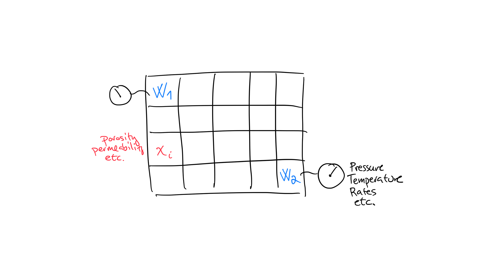

Imagine a tiny reservoir with a single layer (no depth dimension) with two wells, :math:`w_1` and :math:`w_2`.
At both wells we can measure things like pressure, temperature, rates etc. which we call the **observations**.
Sensors are not error-free, so observations include measurement uncertainty.
Data that are only measured at wells are called **production data**.
There are other types of data as well, such as **seismic data** that allows us to measure properties of the reservoir at locations between wells, but let's just focus on production data for now.

We can also sample the actual rock at the well locations and measure properties such as **porosity** and **permeability**.
The rock properties in every other position, or grid-cell :math:`x_i` are uncertain and must be estimated.
We call these the **parameters**.

The main question we want to answer is this:

    What is the reservoir made of where direct observations can't be made?

Again, we can only directly observe the rock at the well locations.
The rock properties in all other positions are uncertain and must be estimated.

Manual History Matching
-----------------------

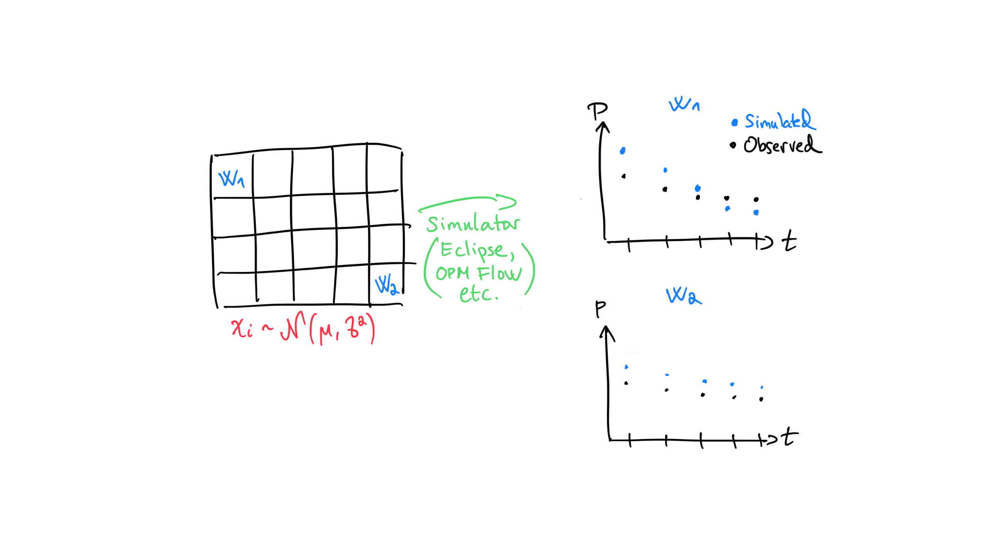

A straight-forward method of trying to answer the main question posed above is this:

1. Make a guess on what the rock properties are in each grid-cell
2. Run a fluid simulator like Eclipse using this guess
3. Manually check the simulated results and see how well they fit data from real world sensors

If the simulated values are close to the observed ones, we can be somewhat confident that our guess was good.
On the other hand, if the simulated values do not match the observed values, we can make a different guess and repeat the process.
We can keep on doing this until we find a set of parameter values that give us a sufficiently good match and call it a day.
We can then use these parameters to make predictions, do well-planning, etc.

It's worth spending some time understanding this figure and introducing some terminology.
Recall that :math:`w_1` and :math:`w_2` represent wells and :math:`x_i` represents the rock properties at grid-cell :math:`i`.
The notation :math:`x_i \sim \mathcal{N}(\mu, \sigma^2)` means that the rock property in every grid-cell :math:`i` is normally distributed with mean :math:`\mu` and variance :math:`\sigma^2`.
It is typically the reservoir engineer that chooses which statistical distribution to use.
Different parameters may warrant different distributions (porosity and permeability are usually modelled using different distributions),
but I chose a normal distribution because it is the most famous.

The process sketched here is quite general and ``Simulator`` can be lots of things, but in the context of reservoir management it is usually Eclipse or OPM Flow.
More generally, it can consist of multiple steps and not just the simulator, in which case we can call it a **forward model**.
More on this later.

Understanding the scatter plots is important.
There are two scatter plots, one for each well, both showing how the pressure (:math:`P`) evolves over time.
The blue dots are simulated values and are generated by the simulator.
Another often used term for simulated values is **responses**.
The observed values, or observations, are from real-world pressure sensors.
Observed values are sometimes called "historical values".
If responses are close to historical values, we say that we have a good match, hence the term **history matching**.

Manual history matching is a reasonable approach but can be prohibitively time-consuming as it is not obvious how to improve the guess of the parameters :math:`x_i` such that the history match improves.
Assisted history matching was developed in order to deal with this problem.

Assisted History Matching (AHM)
-------------------------------

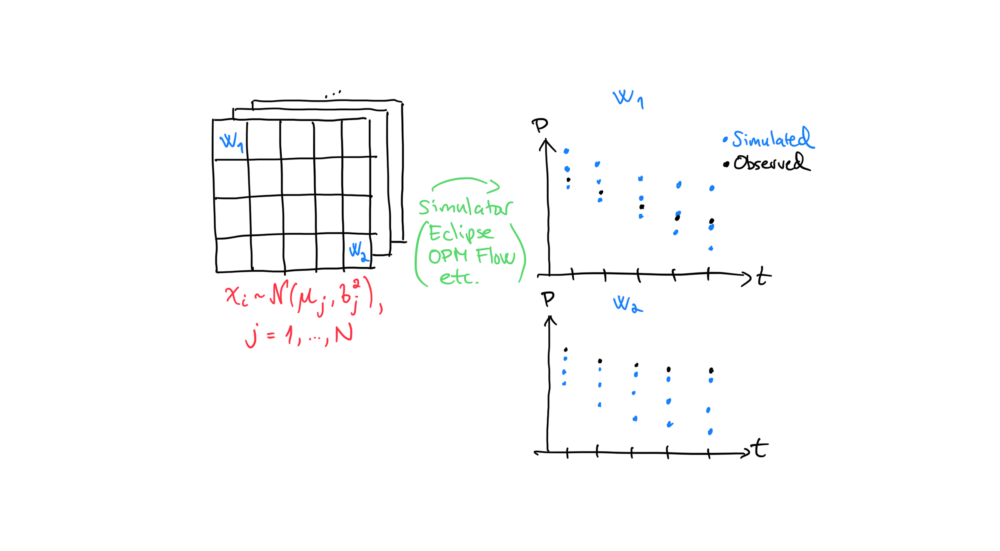

The process of manually guessing parameter values, running simulators and checking results can be automated.

We start by generating many alternative guesses for the parameters, illustrated by a stack of 2D grids in the figure.
This set of guesses is called an **ensemble** and each member of an ensemble is called a **realization**.
The number of realizations is the **ensemble size** and usually denoted by :math:`N`.
Note the change in notation between manual history matching and AHM:
:math:`x_{i,j} \sim \mathcal{N}(\mu, \sigma^2)`.
The additional index :math:`j` refers to the realization number: each realization :math:`j` is a different draw (sample) from the same prior distribution, giving its own value :math:`x_{i,j}` in each grid-cell :math:`i`.
Once the ensemble is ready, we run the simulator once for each realization.

The scatter plots illustrate the case where we ran 3 realizations.
At each time-step we then have 3 simulated values (blue dots) and one observed value (black dot).

At :math:`w_1` the simulated values span the observation: some are above and some are below.
This suggests little systematic bias at that well.
At :math:`w_2`, however, all simulated values are below the observation, which indicates a bias.

Large and systematic differences between simulated and observed values mean that the update algorithm must change the prior a lot to obtain a good match.
In history matching, we generally prefer the smallest change to the prior that still gives an acceptable data match, because the update does not guarantee that the posterior models are geologically plausible.
We don't want a model that fits the observations but that does not make geological sense.

For this reason it is better if geologists and reservoir engineers build a prior ensemble whose simulated responses already span the observations.
When the ensemble covers the observations in this way, we say it has good **coverage**.

At a high level, AHM combines these simulated values and observations to generate an updated ensemble of parameters that better explains the data.

Before we dig deeper, we need to briefly talk about uncertainty.

Uncertainty
~~~~~~~~~~~

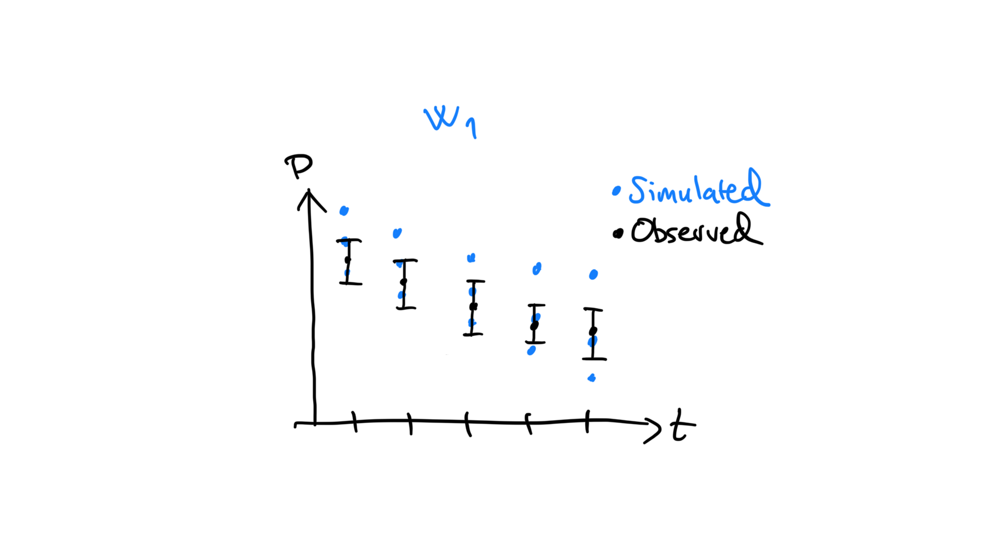

So far we have only discussed the uncertainty in the parameter values.
When we say that :math:`x_i \sim \mathcal{N}(\mu, \sigma^2)`, what we are really saying is that we are uncertain what the value of :math:`x_i` is, but that we think it is normally distributed around some mean and with some variance.

Observed values are also uncertain since they are measured using real sensors which are not perfect.
In order to do AHM, this uncertainty or error needs to be specified for every observed value or **observation**.
We visualize this uncertainty using error bars, shown in the figure as vertical black lines starting and ending with shorter horizontal lines.

Updating
~~~~~~~~

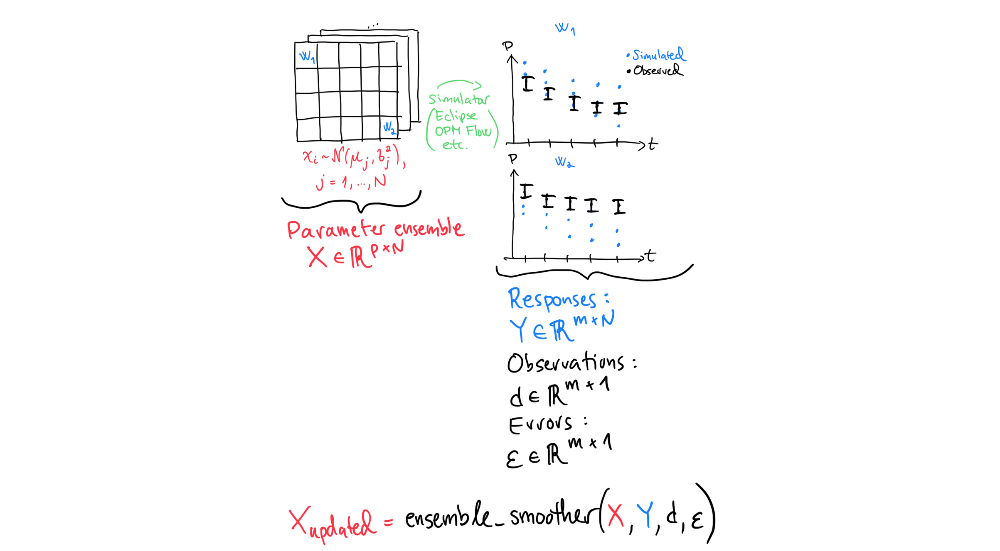

Here's what we have done so far:

1. Generated an ensemble of parameter guesses by sampling from the normal distribution
2. Ran Eclipse to get responses
3. Specified observations with errors

That's all we need to do an **update**.
From a programmers perspective, an update is just a function we run to get a new ensemble of parameter guesses.
These new parameter estimates are hopefully better guesses than the ones we started with.

Let's introduce some math notation.

:math:`\mathbf{X} \in \mathbb{R}^{p \times N}` is a common way of defining a matrix :math:`\mathbf{X}` that consists of real numbers (think floats),
and that has :math:`p` rows (number of parameters) and :math:`N` columns (number of realizations or samples).

:math:`\mathbf{Y} \in \mathbb{R}^{m \times N}` specifies a response matrix :math:`\mathbf{Y}` with :math:`m` rows and :math:`N` columns.
The number of responses must equal the number of observations.

Note that both :math:`\mathbf{d}` (observations) and :math:`\mathbf{\epsilon}` (observation errors) have :math:`m` rows but only 1 column.
In order for the dimensions of matrices to match, we need to somehow create a matrix with :math:`N` columns from the single column of observations :math:`\mathbf{d}`.
The resulting :math:`m` by :math:`N` matrix :math:`\mathbf{D}` is called **perturbed observations**, and we'll have more to say about it later.
For now, we'll just assume the update function knows how to deal with this.

We can now pass these as inputs to the function ``ensemble_smoother`` to generate a new ensemble :math:`\mathbf{X}_{updated}`:

.. math::

   \mathbf{X}_{updated} = ensemble\_smoother(\mathbf{X}, \mathbf{Y}, \mathbf{d}, \mathbf{\epsilon})

It is quite common to call the input to ``ensemble_smoother`` :math:`\mathbf{X}` the **prior**, and the output :math:`\mathbf{X}_{updated}` the **posterior**.
The terms prior and posterior are commonly used in Bayesian statistics, from which ensemble smoother equations draw their theoretical foundation.

With the knowledge you have gained so far, you are ready to make use of the ``iterative_ensemble_smoother`` Python package to do history matching!
This is the same code that ``ert`` uses.

The API is slightly different from the ``ensemble_smoother`` function shown above.
Instead, the package exposes a class called ``ESMDA`` with a method called ``assimilate``.

You instantiate ``ESMDA`` with a :math:`m` by 1 array ``observations`` and a :math:`m` by 1 array ``covariance``.
In our math notation, ``observations`` corresponds to :math:`\mathbf{d}` and ``covariance`` corresponds to :math:`\mathbf{\epsilon}`.

``ESMDA`` stands for Ensemble Smoother Multiple Data Assimilation.
For now, it is enough to know that setting ``alpha=1`` makes ``ESMDA`` perform a single Ensemble Smoother (``ES``) update.
Once the class is instantiated, we pass :math:`\mathbf{X}` and :math:`\mathbf{Y}` to ``assimilate`` to get the posterior :math:`\mathbf{X}_{updated}`.

.. code-block:: python

   from iterative_ensemble_smoother.esmda import ESMDA

   smoother = ESMDA(covariance, observations, alpha=1)
   X_updated = smoother.assimilate(X, Y)

Some natural questions to ask are:

- How do the updated parameters differ from the prior?
- Has the data match improved?

Results of updating
~~~~~~~~~~~~~~~~~~~

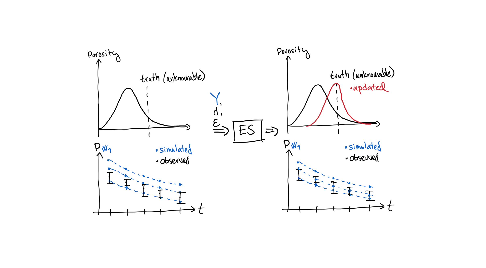

Let's think about the update somewhat more concretely by focusing on a single parameter from a single grid-cell; grid-cell :math:`x_2` and porosity.

The upper-left figure shows the distribution of porosity at grid-cell :math:`x_2` and its true value.
The true value is in practice unknowable unless we run synthetic experiments, but we are in theory-land here so everything is possible.

The lower-left figure shows that before updating, the simulated (blue) values cover the observed (black) values and have a rather large spread or variance.
After updating, we get the situation shown in the upper and lower right figures.

If the update was successful, we should get a distribution of porosity with an expected value (mean) that is closer to the (unknowable truth).
It should also have a smaller variance which means that the uncertainty is lower or that we are more confident.

The lower-right figure shows that the simulated values after updating still cover the observed values but are less spread.

While we are still not completely ready to tackle the ensemble smoother equation, it's useful to present it now and then gradually introduce the remaining concepts needed for a full understanding.

Ensemble Smoother Equation
~~~~~~~~~~~~~~~~~~~~~~~~~~

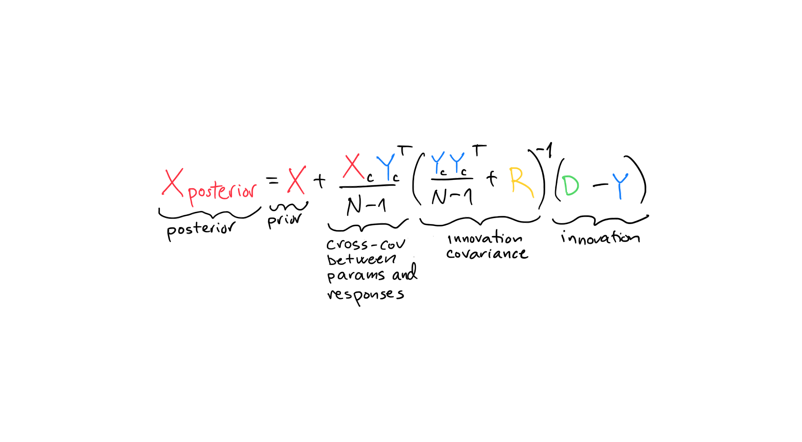

This is one formulation of the ensemble smoother equation.
I like this version because each term has a fairly clear interpretation, and unpacking it piece by piece helps build intuition.
It still takes some effort, so we'll take it slowly.

This equation can be derived from Bayes' Theorem.
At a high level, Bayes' Theorem tells us how to update our prior beliefs about the parameters when we observe data.
In our case, the data are observations from real-world sensors, and the simulator provides synthetic responses that we compare those observations against.

In more mathy words:
Bayes' Theorem says that the posterior probability of the parameters given the data is proportional to the prior probability of the parameters multiplied by the likelihood.
The likelihood tells us how probable the observed data are for a given choice of parameters.
That is a mouthful, and don't worry if it does not make complete sense.
You do not have to be able to derive the equation to build an intuitive understanding of it.

For an outline of a derivation of the ensemble smoother equation, see the :ref:`Appendix <appendix_ensemble_smoother_derivation>`.

Parameter matrix
~~~~~~~~~~~~~~~~

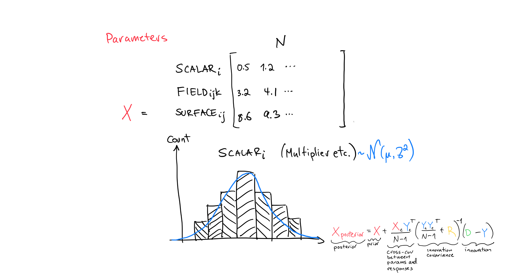

The parameter matrix has shape (number of parameters x number of realizations).
That is, it has one row for every parameter (can be in the millions) and one column for every realization (usually in the hundreds).

There are 3 types of parameters; **scalars (1D)**, **surfaces (2D)** and **fields (3D)**.

Field,- and surface parameters refer to properties that vary spatially throughout the reservoir while scalars do not vary with position.

+---------+---------------------------------------------------------------------------------------+----------------------------------------------------+
| Type    | Description                                                                           | Example                                            |
+=========+=======================================================================================+====================================================+
| Scalar  | A single 1D value for the entire reservoir or model; does not vary spatially.         | Average porosity                                   |
+---------+---------------------------------------------------------------------------------------+----------------------------------------------------+
| Surface | A 2D map that represents a property at a surface; value varies in x and y but not z.  | Depth from reservoir top to ocean floor            |
+---------+---------------------------------------------------------------------------------------+----------------------------------------------------+
| Field   | A 3D property that varies in space; each grid cell or location has a specific value.  | Porosity or permeability at each grid cell         |
+---------+---------------------------------------------------------------------------------------+----------------------------------------------------+

One column of the parameter matrix can contain all the different types of parameters.
We flatten fields and surfaces into a 1D vector to fit them into that column.
The parameter matrix can end up being too big to keep in computer memory, so we do some tricks when implementing it in production code.
Specifically, in ``ert``, we update one parameter group at a time, where a **parameter group** is one surface, one field or one scalar.

For example, we update porosity, write the results to disk, then update permeability, write to disk, etc.
The figure shows a histogram of one row of the parameter matrix that contains a scalar parameter.

Response matrix
~~~~~~~~~~~~~~~

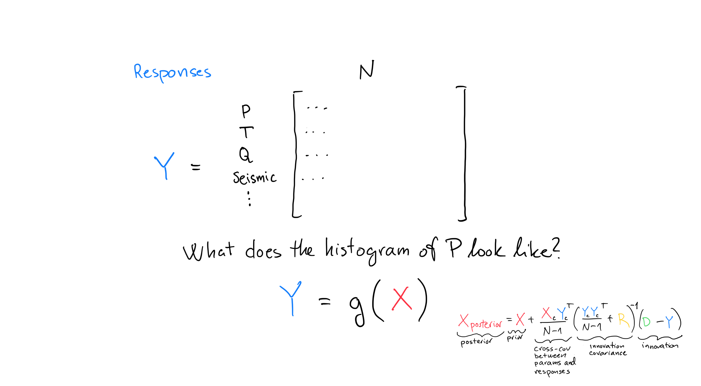

The response matrix :math:`\mathbf{Y}` has shape (number of observations / responses x number of realizations).
Every row is a response like pressure, temperature, flow rates, seismic measurements etc.
In a typical history matching project, the response matrix typically has hundreds or thousands of rows.

The response matrix :math:`\mathbf{Y}` is the result of running a simulator like Eclipse with the parameter matrix as input.
In math notation this is :math:`\mathbf{Y} = g(\mathbf{X})` where :math:`g(.)` is a function that can represent a simulator like Eclipse.
In practice, the function :math:`g(.)` can encompass more than just Eclipse.
It can contain various kinds of pre-processing etc., but let's just think of it as some fluid flow simulator.

Remember that the parameter matrix has multiple columns, where each column represents a realization.
In practice, we run each realization in parallel.
That is, we run one flow simulation per realization.
Fluid flow simulations can be quite computationally expensive, so we run in parallel to save time.

An interesting question to think about is what the histogram of :math:`\mathbf{y} = g(\mathbf{x})` would look like if :math:`\mathbf{x}` is normally distributed.
Note that I'm using small :math:`\mathbf{y}` and :math:`\mathbf{x}` here to indicate that we are running a single realization.

Will :math:`\mathbf{y}` also be normally distributed?

Turns out that the answer depends on what :math:`g(.)` is like.
If it's linear then :math:`\mathbf{y}` will also be normally distributed.
If it's non-linear, it can be anything really depending on :math:`g`.

A bit hand-wavy perhaps, but worth noting that it's easier to get a good history match if :math:`g` is linear than if it's not.
This has to do with some underlying assumptions behind the ensemble smoother equations, but let's leave that aside for now.

Cross-Covariance between Parameters and Responses
~~~~~~~~~~~~~~~~~~~~~~~~~~~~~~~~~~~~~~~~~~~~~~~~~

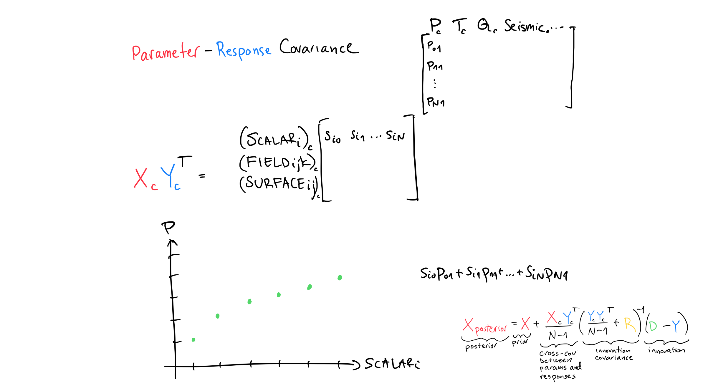

The cross-covariance between parameters and responses, :math:`\frac{\mathbf{X}_c \mathbf{Y}_c^T}{N-1}` takes some getting use to so let's go slow.

The suffix :math:`c` stands for *centered* which means that the mean of every row (parameter or response) has been subtracted.

The :math:`T` in :math:`\mathbf{Y}_c^T` stands for *transpose* and it just means that we flip the rows and columns of :math:`\mathbf{Y}`.
The transpose is needed to align the shapes of the matrices such that it is possible to do a matrix multiplication.

Now that we have centered the matrices, and we know what transpose does, we can apply the definition of a sample cross-covariance,

.. math::

   \frac{\mathbf{X}_c \mathbf{Y}_c^T}{N-1}

Note that it is a matrix of shape :math:`(p, m)`, or number of parameters by number of observations.

The element :math:`(i, j)` is a measure of how much parameter :math:`i` affects the response :math:`j` and is measured by the dot-product between centered parameters and responses.
A dot-product between some scalar :math:`(SCALAR_i)_c` and pressure :math:`P_c` is shown in the figure as

.. math::

   \mathbf{s_i}\mathbf{p}^T = s_{i0}p_{01} + s_{i1}p_{11} + \dots + s_{iN}p_{N1}.

The bottom-left figure illustrates that the dot-product will be larger than 0 when the scalar and pressure are related, i.e., when they covary.
That is, if the scalar tends to be big when the pressure is big, the dot-product will be larger than 0.

The bottom-rigth figure shows what would happen if the scalar and pressure are not related.
When the scalar is big, the pressure might be big or small.
Given enough samples, the dot-product will be zero.
Note that we might get a non-zero dot-product just by chance if we don't have enough samples.
It is a well known problem in statistics that sample cross-covariances are noisy when estimated with few samples and lots of parameters.
That is, when the ensemble size :math:`N` is small relative to the number of parameters, the sample cross-covariance is not a particularly trustworthy measure of the relation between parameters and responses.
Lots of parameters with few samples lead to what are often referred to as **spurious correlations** which we'll consider in more detail later.

Intuitively, if a parameter has no effect on a response, that response should not be used to update this parameter.
On the other hand, if a parameter is highly related to a response, we want the response to be used in the update of this parameter.

The denominator :math:`N-1` is called Bessel's correction and it makes the sample cross-covariance an unbiased estimator, a detail we don't need to consider any further.

So, we can say that the strength of the update is proportional to the cross-covariance between parameters and responses, other things being equal.

Response Covariance
~~~~~~~~~~~~~~~~~~~

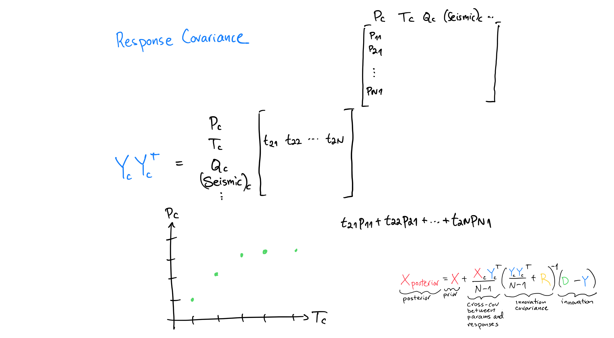

Similar to the cross-covariance between parameters and responses but here we instead calculate the covariance between all responses.

Note that :math:`\mathbf{Y}_c\mathbf{Y}_c^T` is being inverted in the equation as it is inside of :math:`()^{-1}` together with :math:`\mathbf{R}`.
A wrong but perhaps useful way to think about inversion is like division.
Just as dividing by a large number gives a small result, a larger response covariance
:math:`\mathbf{\Sigma}_{yy} = \frac{\mathbf{Y}_c\mathbf{Y}_c^T}{N-1}` tends to weaken the update if the cross-covariance
:math:`\mathbf{\Sigma}_{xy}` and the innovation are kept fixed, because it appears inside
:math:`(\mathbf{\Sigma}_{yy} + \mathbf{R})^{-1}`.
In practice, forecast uncertainty and cross-covariance often grow together, so don't take the "inverse is like division" analogy too far.

So if many responses covary the update will be weaker than if they all were independent.
This makes sense if you think in terms on information.
A bunch of independent responses contain more information than the same bunch but where the responses covary.
There's redundancy in correlated data.

Can you think of an example where two responses covary perfectly, or are perfectly correlated?

One example is two temperature sensors that measure the same thing.

We don't want to act as if we have two independent sources of information.
A high correlation here dampens this effect so that we don't update too strongly.

Observation Error Covariance
~~~~~~~~~~~~~~~~~~~~~~~~~~~~

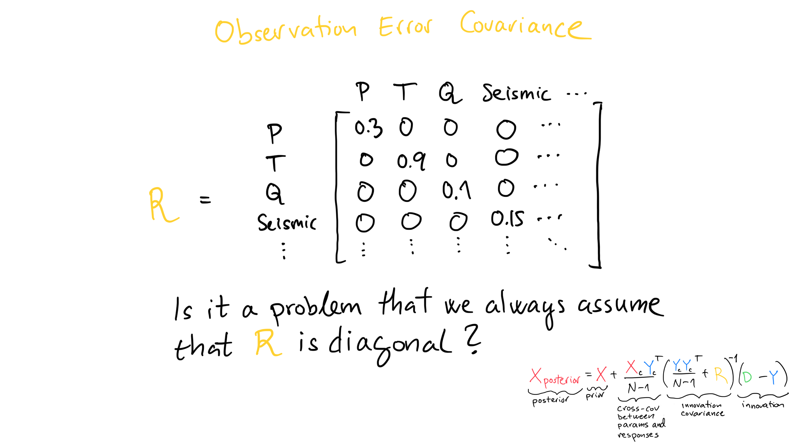

I've always found this one difficult to understand and therefore also difficult to teach.

In contrast to the response covariance which is calculated using values produced by simulators, the observation error covariance consists of values the users themselves specify.
For each observation, the users must specify how much they trust the measurement.

Ideally, they should also specify how correlated the errors are, but this is almost impossible to do in practice, so we assume all errors to be independent.
Assuming all errors to be independent means that the matrix diagonal, i.e., there are only non-zero numbers on the diagonal.
This is a somewhat reasonable assumption to make for production data, but not for seismic data for somewhat complicated reasons.

So, :math:`\mathbf{R}` is smaller than it should be which means that the update is stronger than it should be.
If we think of matrix inversion as division that is.

A trick used to alleviate some of the problems with this assumption is called variance inflation which multiplies each diagonal element of :math:`\mathbf{R}` with a number larger than 1.
There are many ways these factors can be calculated and we'll talk about it a bit more later.

Can you think of an example of a measurement where errors are correlated?

One example is two pressure sensors at the same physical location that are both affected by high ambient temperatures.

Perturbed Observations
~~~~~~~~~~~~~~~~~~~~~~

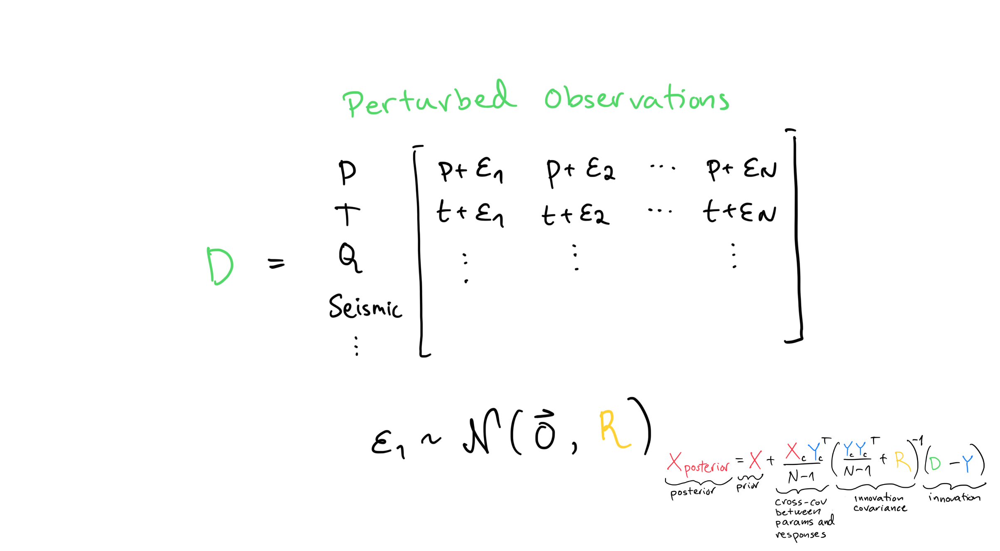

Perturbing the observations is a statistical trick invented by a guy called Burgers to fix a bug in Evensen's original formulation of the ensemble kalman filter.

The initial formulation by Evensen re-used the vector :math:`\mathbf{d}` multiple times when calculating the innovation :math:`\mathbf{d}-\mathbf{Y}`.
Intuitively that makes sense, at least to me, but it turns out to be statistically wrong in that it leads to a posterior variance that's too low.
A too low posterior variance means that we are more confident than we should be.

The fix introduced by Burgers perturbs :math:`\mathbf{d}` by a small :math:`\epsilon \sim \mathcal{N}(\mathbf{0}, \mathbf{R})` to create the matrix :math:`\mathbf{D}`.
This fixes the bug and we don't really have to think about it that much more.

Innovation
~~~~~~~~~~

The difference between the observations and responses is in the Kalman Filter literature called the ``innovation`` and we'll use the same term here.

Recall that both :math:`\mathbf{D}` and :math:`\mathbf{Y}` have :math:`N` columns because we have run :math:`N` simulations to generate the response matrix.
Also recall that :math:`\mathbf{D}` has :math:`N` columns because we have perturbed the observation vector :math:`\mathbf{d}` to stop the posterior variance being reduced more than it should.

Looking at the equation, if the innovation is large, the update strength will be large as well, other things being equal.

In other words, the strength of the update is proportional to the innovation.

If the prior parameters yield responses that perfectly match observations, the innovation will vanish and the posterior will equal the prior.

Innovation Covariance
~~~~~~~~~~~~~~~~~~~~~

Finally, let's discuss the **innovation covariance**:

.. math::

   \left( \frac{\mathbf{Y}_c \mathbf{Y}_c^T}{N - 1} + \mathbf{R} \right)^{-1}

* If :math:`\frac{\mathbf{Y}_c \mathbf{Y}_c^T}{N - 1}` is large it means there's high forecast uncertainty and we should trust observations more.
* If :math:`\frac{\mathbf{Y}_c \mathbf{Y}_c^T}{N - 1}` is small it means there's low forecast uncertainty and we should trust forecast more.

So, the update strength is proportional to the cross-covariance between parameters and responses, inverse proportional to the innovation covariance and proportional to the innovation.

Spurious correlations
~~~~~~~~~~~~~~~~~~~~~

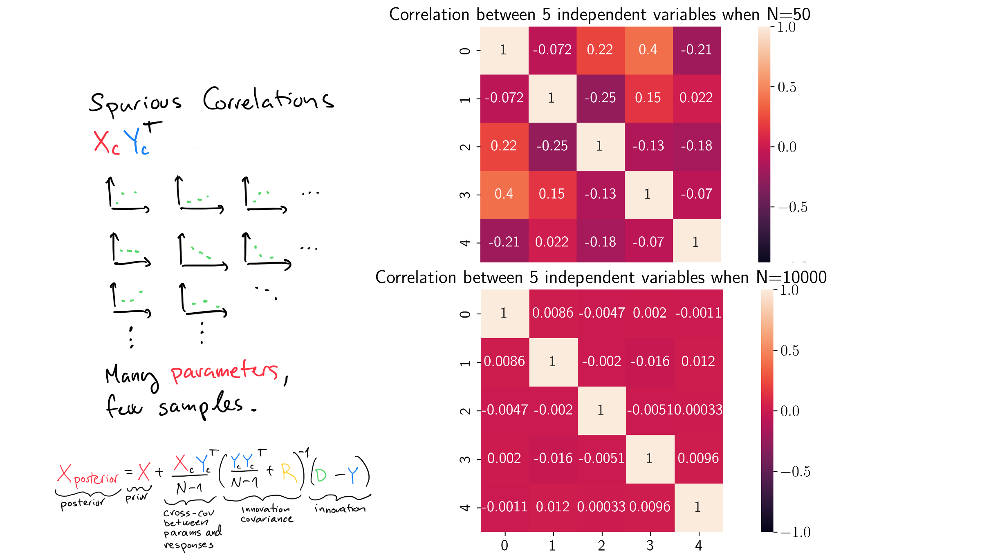

Assume we have 5 independent, standard normal variables.
In math notation, this is :math:`\mathbf{X} \sim \mathcal{N}(\mathbf{0}, \mathbf{I})`.
:math:`\mathbf{0}` is a vector with 5 elements where each element is zero.
This means that each variable has a zero mean.
:math:`\mathbf{I}` is a 5x5 identity matrix.
Element :math:`(i, j)` of :math:`\mathbf{I}` specifies the covariance between variable :math:`i` and variable :math:`j`.
Since identity matrices have ones on the diagonal and zeros elsewhere, using it as the covariance matrix of a normal distributions means that the variables are independent.

The top-right figure shows what happens if we draw 50 samples from :math:`\mathbf{X} \sim \mathcal{N}(\mathbf{0}, \mathbf{I})` and calculate the correlation matrix.
Drawing 50 samples from :math:`\mathbf{X} \sim \mathcal{N}(\mathbf{0}, \mathbf{I})` gives a matrix :math:`\mathbf{X}` with 50 columns and 5 rows.
The correlation matrix calculated from :math:`\mathbf{X}` is a 5x5 matrix.
Element :math:`(i, j)` of the correlation matrix is the correlation between variable :math:`i` and variable :math:`j`.

Now, since we designed this synthetic experiment such that every variable is independent, we expect all off-diagonal elements to be zero.
However, we see from the top-right figure that the off-diagonal elements are not zero.
In fact, some of them are quite high.
For example, element :math:`(0, 3)` is 0.4.
This is a spurious correlation!
We designed the experiment such that the correlation between variable 0 and variable 3 is exactly 0.0, but here we are getting a sample correlation of 0.4.
This happens because we are only drawing 50 samples.
We need many more samples to be able to accurately calculate sample correlations.

The bottom right figure shows what happens if we increase the number of samples to 10000.
All the off diagonal elements now go towards zero.
With 5 variables, we need thousands of samples to get a correlation matrix where the effects of spurious correlations are small.
In history matching, we may have millions of parameters and hundreds of samples / realizations.
This is worth pondering.

But why is this a problem really?
Well, if your algorithm uses covariances or correlations calculated using a limited number of samples, spurious correlations will make the result less accurate.
Since the ensemble smoother algorithms heavily depend on covariances, we need ways to deal with spurious correlations.

One method to reduce the effects of spurious correlations is called Adaptive Localization.

Adaptive Localization
~~~~~~~~~~~~~~~~~~~~~

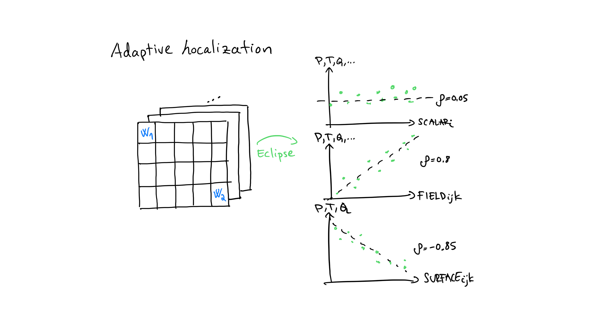

Adaptive Localization is a heuristic attempt to reduce the effects of spurious correlations.

The algorithm is as follows:

For every parameter:

- Calculate the correlation between the parameter and every response.
- If the correlation between the parameter and a response is "low", set it to 0.0. That response is then ignored when updating that specific parameter.

The upper right scatter plot has ``SCALAR_i`` on the x-axis and ``P, T, Q, ...`` on the y-axis.
``SCALAR_i`` indicates an arbitrary scalar parameter, and ``P, T, Q, ...`` indicates an arbitrary response (pressure, temperature, rate, etc.).
Each green dot is one realization, plotted as the pair (parameter value, simulated response).
Here the points form a diffuse cloud with no clear trend, which indicates little to no correlation between the parameter and the response.
In other words, changing ``SCALAR_i`` does not produce a systematic change in the response.
The correlation coefficient is therefore small, :math:`\rho=0.05`.
With adaptive localization, this correlation is treated as insignificant and the corresponding response is effectively ignored when updating ``SCALAR_i``.

The middle scatter plot has ``FIELD_ijk`` on the x-axis and ``P, T, Q, ...`` on the y-axis.
``FIELD_ijk`` refers to a single grid cell at location ``(i, j, k)``.
As before, each green dot corresponds to one realization, plotted as (parameter value, simulated response).
Here the points show a clear trend: as ``FIELD_ijk`` changes, the response changes in a systematic way.
This indicates a strong correlation, :math:`\rho=0.8`.
Adaptive localization will therefore allow this response to contribute to the update of ``FIELD_ijk``.

Remember that adaptive localization computes correlations between *every* parameter and *every* response.
Since a field can have millions of cells, this can be computationally expensive.

The bottom-right plot shows a similar relationship, but with a negative correlation.
Here we consider surface parameters, ``SURFACE_ij``, instead of field parameters.

Deciding on when a correlation is high enough or significant is tricky.
In ``ert``, we say that a correlation is considered significant if it is above :math:`\frac{3}{\sqrt{N}}`.
This threshold relies on assumptions that rarely hold in practice, but it is perhaps better than doing nothing.

What would happen if we apply this threshold to the correlation matrix we calculated using 50 samples from :math:`\mathbf{X} \sim \mathcal{N}(\mathbf{0}, \mathbf{I})`?
Since :math:`\frac{3}{\sqrt{50}} = 0.42`, adaptive localization would set all off-diagonal elements to 0.0 which is what we want.
The method sets all elements under the threshold to 0.0.
Since the highest off-diagonal element in our example is 0.4, all off-diagonal elements would be set to zero.
This is not guaranteed in general: a different random draw might produce an off-diagonal element above 0.42.

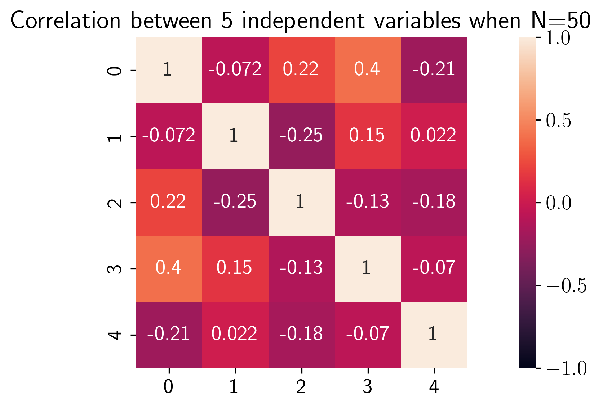

Here are some statistical details that can be safely skipped:

The threshold can be derived by starting with two random variables that are independent and bivariate normal.
In this case, it can be shown that the threshold gets rid of 99.7 percent of spurious correlations.
In reality though, we might have millions of parameters so this assumption does not hold at all, and neither does the result of removing 99.7 percent of spurious correlations.

To summarize, Adaptive Localization can reduce the effects of spurious correlations, but it is a heuristic method with known weaknesses.
The main weaknesses are that:

- Large spurious correlations can survive thresholding and still drive updates.
- Real but weak correlations may be removed.
- Hard thresholding (clamping weak correlations to zero) can produce spatially noisy updates. This can sometimes be mitigated by smoothing.

That said, adaptive localization has some practical benefits.
It is relatively easy to understand, and it can be enabled with minimal configuration.
In practice, the only tunable input is the correlation threshold.

Distance based localization
~~~~~~~~~~~~~~~~~~~~~~~~~~~

.. figure:: images/intro_distance_based_localization.png

Distance based localization is another way of dealing with spurious correlations, and it is considered the industry standard for doing so.
The above figure shows the by now familiar 2D reservoir with wells :math:`w_1` and :math:`w_2`.
We draw a circle around each well with radius :math:`r`, and call this radius the **radius of influence**.
The idea behind distance based localization is that only parameters within a well's radius of influence will be updated by observations from that well.
It gets a bit more tricky when we have data not associated to wells such as seismic, but let's ignore that here.

The algorithm goes like this:

For every parameter:

- Calculate the distance between the parameter and every well.
- Only use responses from wells that are less than :math:`r` away.

One way to think of the difference between distance based,- and adaptive localization is that adaptive localization uses correlations to decide which parameters to update,
while distance based localization uses Euclidean distance to decide which parameters to update.

Deciding on the radius of influence is more art than science, but there exist reasonable rules of thumb.
Distance based localization produces updated parameters that suffer less from spurious correlations and that the geologist think look more realistic than those achieved using adaptive localization.
It's more tedious to set-up however, since coordinates for all observations and wells are needed.

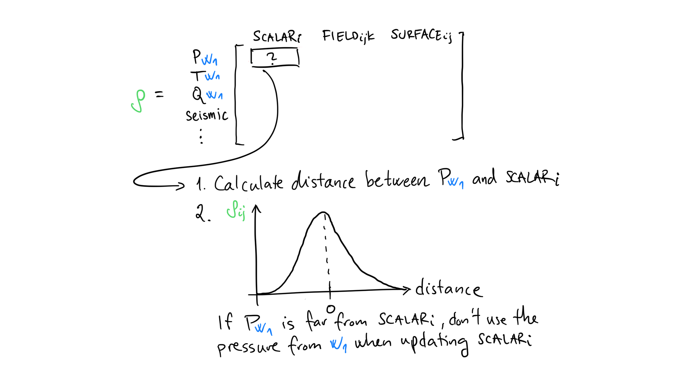

iterative_ensemble_smoother
---------------------------

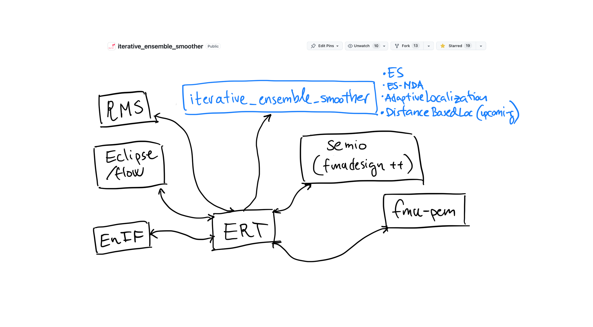

The actual implementation of the ensemble smoother algorithm that ``ert`` uses is in the open source ``iterative_ensemble_smoother`` Python package: https://github.com/equinor/iterative_ensemble_smoother

``ert`` uses ``ES-MDA`` by default, which stands for Ensemble Smoother - Multiple Data Assimilation.
It turns out that, since :math:`g(.)` is non-linear, it is helpful to run multiple iterations of the ensemble smoother.
Similar to how it is useful to run multiple iterations of Newton's method when trying to find the minima of a function.
It's OK if you don't know what I mean by this.

The following figure is a graphical representation of ES-MDA that you'll find in the literature.
The y-axis indicates either a simulation / forecast, or an update.
The x-axis is time, starting from 0.
Every simulation starts from time 0, which is before any wells were drilled.

We start off by running the forward model, or simulation from time 0 to the current time.
This is represented by the top horizontal, black line in the figure.

At certain points along this line we have measurements from real world sensors.
We want to compare real world data with simulated data, so we write the simulated data to disk at points where we have real world data.
This is all handled by ``ert``.

We are ready to do an update step after the first simulation run has completed.
Doing an update step means running the ensemble smoother equation.
There's a trick to ES-MDA though.
Before each update step, it scales the observation errors by a factor :math:`\sqrt{\alpha_1}` that is larger than 1.
This weakens the update.
The idea is that multiple small updates are better than a single large update.

After the first update step has completed, we are ready to do another simulation step.
Again, we run from time 0 until today and write data to disk along the way.
Before running the second update step, we again scale the observation errors.

After the second update has completed, we run the final simulation step and are done.

``ert`` runs 3 steps by default.
The limiting factor is computation as running the simulation step can take days for large models.

Note that ES is just a single step of ES-MDA with the scaling factor set to 1.0.

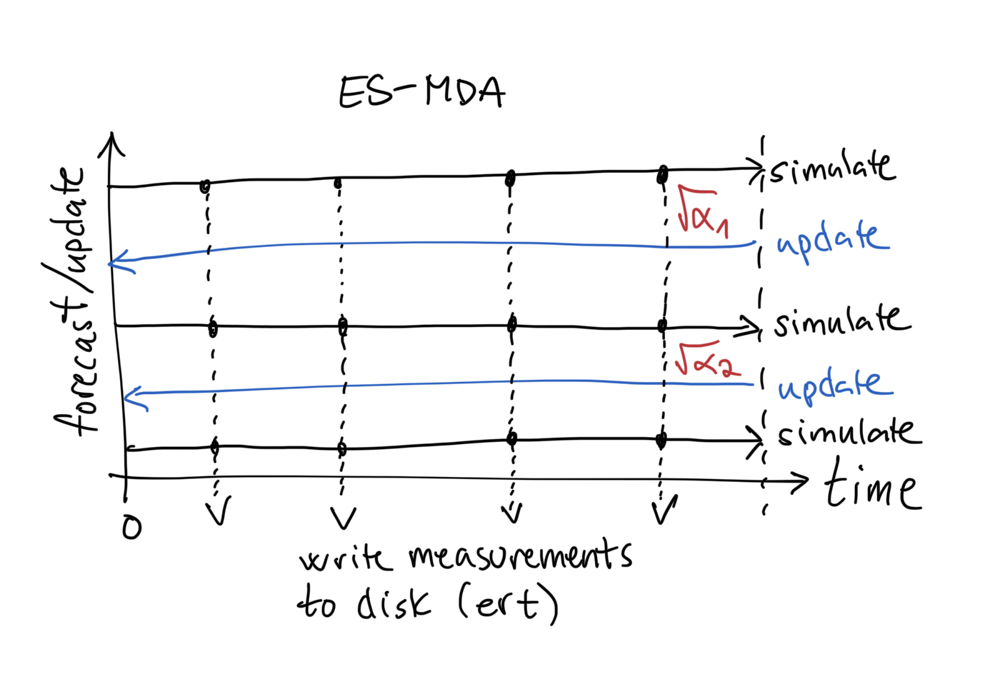

Historically, the algorithms were part of ``ert`` and written in ``C``.
We first rewrote them to ``C++`` using the ``Eigen`` linear algebra library and eventually to Python using ``numpy``.
Funnily, the ``numpy`` implementation turned out much faster due to our lacking skills in writing good ``Eigen`` code.

.. _appendix_ensemble_smoother_derivation:

Appendix: Derivation of the ensemble smoother equation
-------------------------------------------------------

The ES equation is the Kalman (Gaussian) update written in ensemble form. The usual assumptions are:

- **Gaussian prior:** the prior is represented by an ensemble (using sample mean/covariances).
- **Additive, unbiased Gaussian observation noise:** :math:`\mathbf{d} = g(\mathbf{x}) + \boldsymbol{\epsilon}`, with :math:`\boldsymbol{\epsilon} \sim \mathcal{N}(\mathbf{0}, \mathbf{R})` (often :math:`\mathbf{R}` is taken diagonal).
   This is what makes the likelihood a clean, centered quadratic in the residual with known covariance :math:`\mathbf{R}`.
- **Linear or locally linearizable forward map:** :math:`g(\mathbf{x}) = \mathbf{H}\mathbf{x}` (or a linearization around the ensemble).
   If :math:`g` is truly linear, the update is exact for the linear-Gaussian case; “locally linearizable” means we treat a nonlinear simulator as approximately linear over the ensemble spread.
- **Sample covariance approximation:** :math:`\mathbf{\Sigma_{xy}}` and :math:`\mathbf{\Sigma_{yy}}` are estimated from a finite ensemble (hence sampling noise/spurious correlations).

**Problem setup:**

Define the relationship between the parameters :math:`\mathbf{x}` and responses :math:`\mathbf{y}` through :math:`g`:

.. math::
   \mathbf{y} = g(\mathbf{x})

The actual observations :math:`\mathbf{d}` are contaminated by additive noise :math:`\mathbf{\epsilon}`:

.. math::
   \mathbf{d} = \mathbf{y} + \mathbf{\epsilon}

Apply Bayes' Theorem:

.. math::
   f(\mathbf{x}\mid\mathbf{d}) \propto f(\mathbf{x})f(\mathbf{d}\mid g(\mathbf{x}))

**Assume Gaussian Prior:**

Assume :math:`\mathbf{x}` to be Gaussian with mean :math:`\mathbf{x}_f` and covariance matrix :math:`\mathbf{\Sigma}_{xx}`:

.. math::
   f(\mathbf{x}) \sim \exp\left(-\frac{1}{2}(\mathbf{x}-\mathbf{x}_f)^T \mathbf{\Sigma}_{xx}^{-1} (\mathbf{x}-\mathbf{x}_f)\right)

**Assume Gaussian Likelihood:**

Assume the observation errors are Gaussian with covariance matrix :math:`\mathbf{R}`:

.. math::

   \mathbf{\epsilon} \sim \mathcal{N}(\mathbf{0}, \mathbf{R})

Since :math:`\mathbf{d} = g(\mathbf{x}) + \mathbf{\epsilon}`, the conditional distribution is

.. math::

   \mathbf{d}\mid \mathbf{x} \sim \mathcal{N}(g(\mathbf{x}), \mathbf{R})

and the likelihood can be written as

.. math::

   f(\mathbf{d}\mid \mathbf{x}) \propto \exp\left(-\frac{1}{2}(\mathbf{d}-g(\mathbf{x}))^T \mathbf{R}^{-1} (\mathbf{d}-g(\mathbf{x}))\right)

To obtain the standard closed-form Kalman update, we additionally assume that the observation operator is linear:

.. math::

   g(\mathbf{x}) = \mathbf{H}\mathbf{x}

In that case the likelihood becomes

.. math::

   f(\mathbf{d}\mid \mathbf{x}) \propto \exp\left(-\frac{1}{2}(\mathbf{H}\mathbf{x}-\mathbf{d})^T \mathbf{R}^{-1} (\mathbf{H}\mathbf{x}-\mathbf{d})\right)

**Cost function:**

Define the cost function :math:`J(\mathbf{x})` as the negative-log of the posterior PDF:

.. math::
   J(\mathbf{x}) = \frac{1}{2}(\mathbf{x}-\mathbf{x}_f)^T \mathbf{\Sigma}_{xx}^{-1} (\mathbf{x}-\mathbf{x}_f) + \frac{1}{2}(\mathbf{H}\mathbf{x}-\mathbf{d})^T \mathbf{R}^{-1} (\mathbf{H}\mathbf{x}-\mathbf{d})

Find the state :math:`\mathbf{x}` that minimizes the cost function by setting the gradient with respect to :math:`\mathbf{x}` to zero:

.. math::
   \nabla J(\mathbf{x}) = \mathbf{\Sigma}_{xx}^{-1}(\mathbf{x}-\mathbf{x}_f) + \mathbf{H}^T \mathbf{R}^{-1}(\mathbf{H}\mathbf{x}-\mathbf{d}) = 0

Solving the equation above for :math:`\mathbf{x}` gives the standard Kalman Filter update equation:

.. math::

   \mathbf{x} = \mathbf{x}_f + \left(\mathbf{\Sigma}_{xx}^{-1} + \mathbf{H}^T \mathbf{R}^{-1} \mathbf{H}\right)^{-1} \mathbf{H}^T \mathbf{R}^{-1} (\mathbf{d} - \mathbf{H}\mathbf{x}_f)

**Woodbury:**

Use the Woodbury matrix identity to rewrite the update to avoid computing the inverse of the high-dimensional background covariance matrix :math:`\mathbf{\Sigma}_{xx}^{-1}`.
Expressing the result using sample covariances from an ensemble leads to the Ensemble Smoother equation.

.. math::

   \mathbf{X}_a = \mathbf{X}_f + \mathbf{\Sigma}_{xy} (\mathbf{\Sigma}_{yy} + \mathbf{R})^{-1} (\mathbf{D} - \mathbf{Y})
