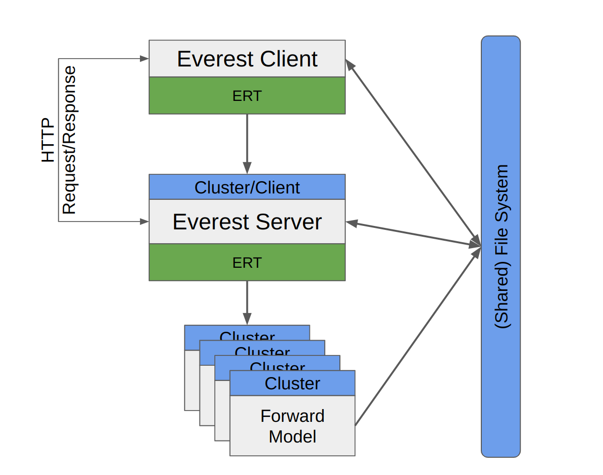
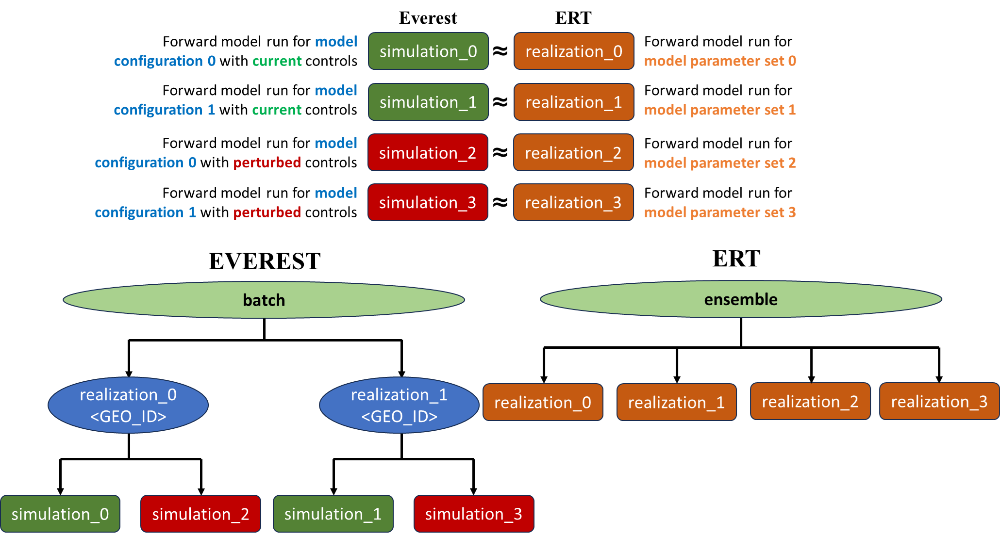
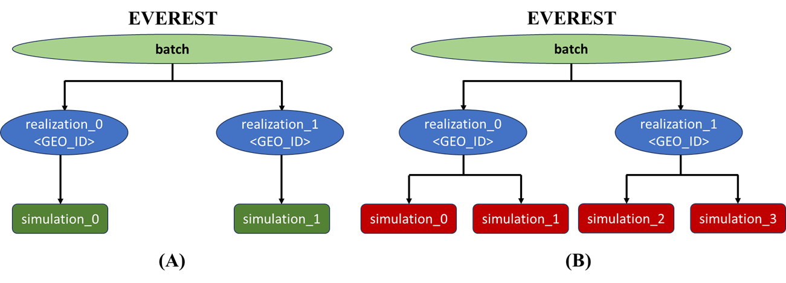

.. _cha_development:

***********
Development
***********

In this section Everest development decisions are documented.

Architecture
============

The everest application is split into two components, a server component and a
client component.

    Everest architecture

Every time an optimization instance is ran by a user, the client component of the
application spawns an instance of the server component, which is started either on a
cluster node using LSF (when the `queue_system` is defined to be *lsf*) or on the
client's machine (when the `queue_system` is defined to be *local*).

Communication between the two components is done via an HTTP API.

Server HTTP API
===============
The Everest server component supports the following HTTP requests API. The Everest
server component was designed as an internal component that will be available as
long as the optimization process is running.

.. list-table:: Server HTTP API
   :widths: 25 25 75
   :header-rows: 1

   * - Method
     - Endpoint
     - Description
   * - GET
     - '/'
     - Check server is online
   * - GET
     - '/sim_progress'
     - Simulation progress information
   * - GET
     - '/opt_progress'
     - Optimization progress information
   * - POST
     - '/stop'
     - Signal everest optimization run termination. It will be called by the client when the optimization needs to be terminated in the middle of the run

EVEREST vs. ERT data models
===========================
EVEREST uses ERT for running an experiment, but instead of submitting an `ensemble` (ERT) to the queue we submit
a `batch` in EVEREST. `Batches` are in principle very similar to `ensembles`, ERT queue system doesn't treat them differently,
but they have some hierarchical differences in terms of the meaning behind the data.
ERT history matches `realizations` (i.e., `model parameters`) to data, hence an `ensemble` contains a number of `realizations`.
EVEREST optimizes a set of `controls` and assumes static (i.e., unchanging) `realizations`.
In terms of collecting the results of forward model runs, there is a distinction between `unperturbed controls`
(i.e., current `objective function` value) and `perturbed controls` (i.e., required to calculate the `gradient`).
Furthermore, when performing robust optimization (i.e., multiple static `realizations`) a `batch` contains a
certain number of `realizations` (denoted by `<GEO_ID>`) and each `realization` contains a number of `simulations`
(i.e., forward model runs). These `simulations` are forward model runs for either `unperturbed controls` and/or
`perturbed controls`. This is the key differences between the hierarchical data model of EVEREST and ERT (Fig 3).

    Difference between `ensemble` in ERT and `batch` in EVEREST.

    Different meaning of `realization` and `simulation`.

As is evident from the image above, in terms of execution in the queue `realization` (ERT) and `simulation` (EVEREST) are synonymous.
This means that ERT queue system is agnostic about the meaning of each run only when the data is collected back in EVEREST (`GEN_DATA`) is meaning
of each run attributed.
The mapping from data models in EVEREST and ERT is done in the `ropt` library, it maps from `realization` (ERT) to `<GEO_ID>` and `pertubation` (EVEREST) and vice versa.
`Batches` in EVEREST can contain several different configurations depending on the algorithm used. Gradient-based algorithms can have a single function
evaluation (`unperturbed controls`) per `<GEO_ID>`, a set of `perturbed controls` per `<GEO_ID>` to evaluate the gradient, or both.
Derivative-free methods can have several function evaluations per `<GEO_ID>` and no `perturbed controls`.
**NOTE**: the optimizer may decide that some `<GEO_ID>`s are not needed, these are then skipped and the mapping from `ropt`
should reflect this (i.e., less `<GEO_ID>`s in the batch results than expected).

Another thing to note is that continuity for `realizations` between `ensemble` exists; however, this is not the case for `simulations` in `batches`.
A `batch` can contain several different configurations (Fig 5) and `simulation 0` for `<GEO_ID> = 0` can be either `unperturbed`
or `perturbed controls`. `<GEO_ID>` is continuous from one `batch` to the next since they are not changing at all over the course of the optimization.

    Three other possible configurations of EVEREST `batches` in the context of gradient-based (i.e., `optpp_q_newton`)
    and gradient-free (i.e., **WHICH ONE DO WE SUPPORT?**) optimization algorithms.
