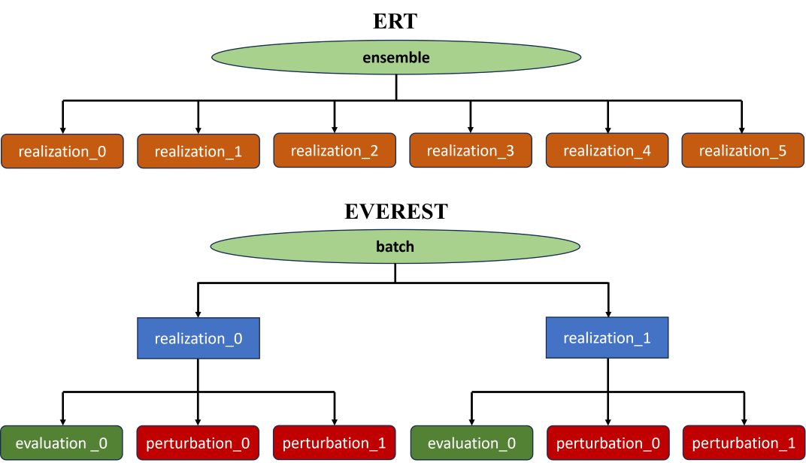
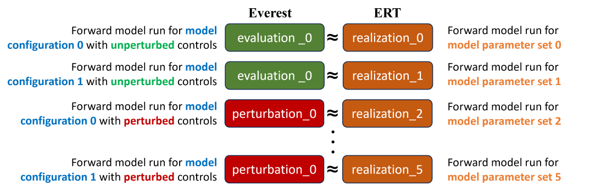
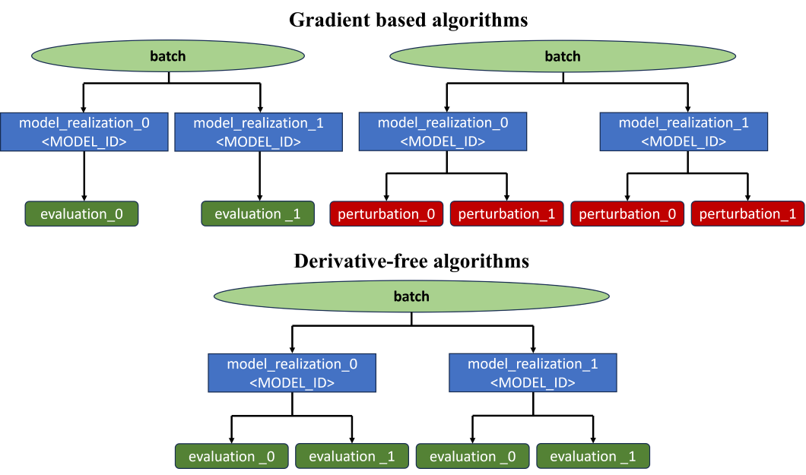

.. _cha_development:

***********
Development
***********

In this section EVEREST development decisions are documented.

Architecture
============

The EVEREST application is split into two components, a server component and a
client component.

.. figure:: images/architecture_design.png
    :align: center
    :width: 700px
    :alt: EVEREST architecture

    EVEREST architecture

Every time an optimization instance is ran by a user, the client component of the
application spawns an instance of the server component, which is started either on a
cluster node using LSF (when the `queue_system` is defined to be *lsf*) or on the
client's machine (when the `queue_system` is defined to be *local*).

Communication between the two components is done via an HTTP API.

Server HTTP API
===============
The EVEREST server component supports the following HTTP requests API. The EVEREST
server component was designed as an internal component that will be available as
long as the optimization process is running.

.. list-table:: Server HTTP API
   :widths: 25 25 75
   :header-rows: 1

   * - Method
     - Endpoint
     - Description
   * - GET
     - '/'
     - Check server is online
   * - GET
     - '/sim_progress'
     - Simulation progress information
   * - GET
     - '/opt_progress'
     - Optimization progress information
   * - POST
     - '/stop'
     - Signal EVEREST optimization run termination. It will be called by the client when the optimization needs to be terminated in the middle of the run

EVEREST vs. ERT data models
===========================
EVEREST uses ERT for running an `experiment`. An `experiment` contains several
`batches`, which are implemented by ERT `ensembles`. A `batch` contains inputs &
computed outputs for several model realizations, each of which may contain
multiple `simulations` that correspond to either function evaluations, or to
perturbations. Each of these correspond to a single forward model evaluation
implemented as an ERT `realization`. EVEREST `controls` are mapped to ERT
`parameters` and serve as input to each forward model evaluation. ERT generates
`responses` for each forward model evaluation in the `batch`. ERT writes these
`responses` to storage in the `simulation_results` folder (per `batch` and per
`realization`). These `responses` are mapped to `objectives` and `constraints`
in EVEREST and forwarded to `ropt` (i.e., the optimizer). To summarize, every
forward model evaluation for a single set of inputs/parameters (`controls`) and
generated outputs/responses (`objectives` / `constraints`) constitutes an ERT
`realization` (a `simulation` in EVEREST).

In EVEREST, there is a distinction between function `evaluations` and
`perturbations`. The former are requested directly by the optimizer during
optimization, while the latter are used to calculate the gradients, which are
also needed by the optimizer. (see also :ref:`opt-process-label`). Furthermore,
when performing robust optimization a `batch` contains multiple
`model_realizations` (denoted by `<MODEL_ID>`). A `model_realization` is a set
of `static` variables (i.e., not changing during the optimization) which affect
the response of the underlying optimized model (NOTE: `model_realization` is not
the same as an ERT `realization`; see also :ref:`robust-optimization-label`).
Each `model_realization` can contain several `simulations` (i.e., forward model
runs). This is the key difference between the hierarchical data model of EVEREST
and ERT (Fig 3).

NOTE: `<MODEL_ID>` (or `<REALIZATION_ID>` due to legacy reasons) is
inserted (and substituted) in the `run_path` for each `model_realization`.

    Difference between `ensemble` in ERT and `batch` in EVEREST.

    Different meaning of `realization` and `simulation`.

The mapping from data models in EVEREST to ERT is done in EVEREST, meaning `realization` (ERT) to `<MODEL_ID>` and `pertubation`-number (EVEREST).
`Batches` in EVEREST can contain several different configurations depending on the algorithm used. Gradient-based algorithms can have a single function
evaluation (`unperturbed controls`) per `<MODEL_ID>`, a set of `perturbed controls` per `<MODEL_ID>` to evaluate the gradient, or both.
Derivative-free methods can have several function evaluations per `<MODEL_ID>` and no `perturbed controls`.
**NOTE:** the optimizer may decide that some `<MODEL_ID>` are not needed, these are then skipped and the output from `ropt`
will reflect this (i.e., less `<MODEL_ID>`s in the `batch` results than expected).

    Three other possible configurations of EVEREST `batches` in the context of gradient-based
    and gradient-free optimization algorithms.
