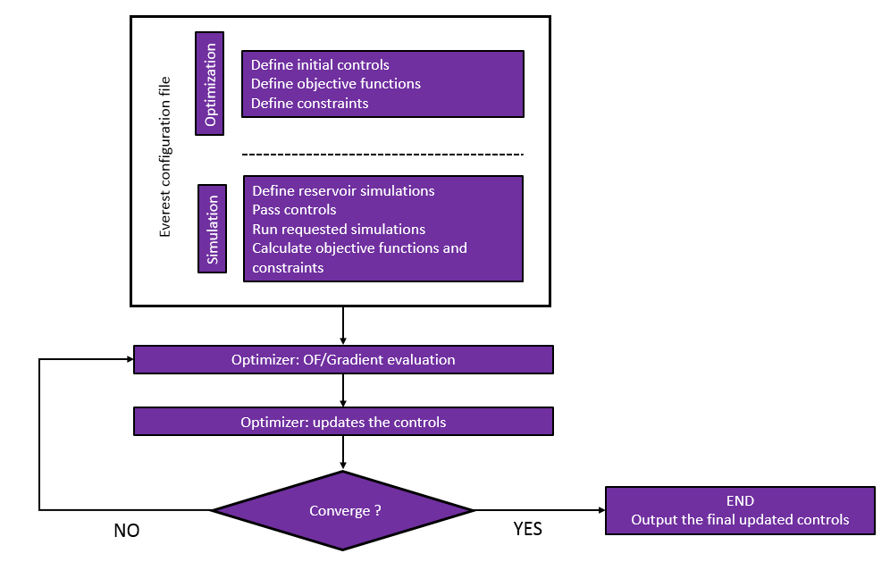

.. _cha_introduction:

************
Introduction
************

Background and motivation
=========================

Everest is a tool, which uses ensembles of models to deliver a robust optimization.

While the result of a data assimilation process is an ensemble of models, the result of
the robust optimization process is one optimal strategy, for example for well order or
drainage strategy. With this optimized strategy we can, e.g., maximize net present value
(NPV) with respect to the geological uncertainty in the models. Note that Everest is a
generic tool that can be applied to other optimization problems (also outside the domain
of Oil & Gas).

Everest
=======

The objectives (what to optimize) can, for example, be the Net Present Value (NPV), the
recovery factor, or carbon emissions. The controls (what to adjust in order to optimize
the objective) can, for example, be the drilling order of the wells and production and/or
injection rates (drainage strategy). Additionally, constraints on these controls can be
handled both within Everest and/or in flow simulator.

The primary goal of the Everest tool is to find an "optimal" strategy by utilizing an
ensemble of reservoir models (e.g., an ensemble of geologically-consistent models). This
will help make robust decisions about drilling schedule or drainage strategy in an
efficient and assisted manner.

To this end, an optimization problem is formulated and solved by the
*Ensemble Optimization* (EnOpt) method described here: :ref:`en-opt-label`.

A single configuration file is required to define controls, constraints, objective
functions, and other items related to gradient estimation for optimization. This file
should also include items related to simulations themselves, such as manipulating schedule
files according to the controls and calculating the values of objective functions and
constraints.

Everest will, then, generate new set of controls as a result of the simulated results,
e.g., ensemble objective function values. The flow chart below provides a detailed
description of the elements involved in running an optimization experiment.

Considerations regarding the usage of Everest
-----------------------------------------------

Everest can assist the decision makers when there are many outcomes or decisions that need
to be made. If the decision and outcome are limited or easy, then Everest may not be
needed as one can evaluate the outcomes with a heuristic approach. However, it is unlikely
that one can easily find few outcomes or real optimized, robust strategies using a
“manual” approach when uncertainty is involved. In the following sections we will discuss
the use of Everest in different cases and some of the "ifs and buts" associated with the
application of the tool.

The power of the Everest tool is to assist in optimizing strategies while capturing the
underlying reservoir uncertainty, which is modelled by an ensemble of realizations. A
crucial factor for the success of the optimization is to have good enough model quality
and the uncertainty well represented - i.e., to span the current understanding or
knowledge of the reservoir uncertainty. Moreover, the greater the reservoir complexity,
the more important it is to have many model realizations in the ensemble, i.e., to span
the actual reservoir uncertainty. The alternative might lead to a situation where the
strategy is not representative. The essential takeaway is that Everest's results depend
on — but does not improve a model's quality or uncertainty representation.

When doing experiments that involve tuning specific parameters, it is advisable to begin
with a coarse-grained approach when adjusting control variables. Initially, one might
consider modifying the parameters at long intervals, such as every several years or at key
points in the process timeline. This sets a foundational structure for the optimization
without overwhelming the algorithm with too many variables.

In general, the following elements should be reflected upon when consider applying Everest
for decision support and decision making:

* the need for, or value of, robustness of optimization results;

* the value of time saving from using the tool (heuristic approach versus assisted optimization);

* the quality of the underlying reservoir models and uncertainty span;

* the need for a tool in order to handle reservoir complexity or uncertainty in decision making.

Everest workflow
----------------

The figure shows the Everest workflow. The workflow starts with defining the initial
controls (e.g., drilling order), objective function (e.g., NPV), constraints (e.g., upper
injection rate) and related information, such as optimization algorithm, perturbation
magnitude, and ensemble realizations used in optimization. Based on this information,
Everest will run simulations in order to evaluate either objective function or gradient
with respect to the current control variables. Also, it prepares the input files for the
simulator, such as the schedule file.

Normally, different schedule files will be generated for different control values. For
example, in case the drilling order is the control, with different drilling orders the
well open dates can be totally different, which leads to different schedule files. Once
all necessary simulator files are set up, the ensemble of simulations will be run. Based
on the simulation results, Everest will calculate the objective function value (e.g. NPV)
or constraint values. Everest will then update the controls based on the selected
optimization algorithm and run a new experiment until the convergence criteria is
satisfied.
