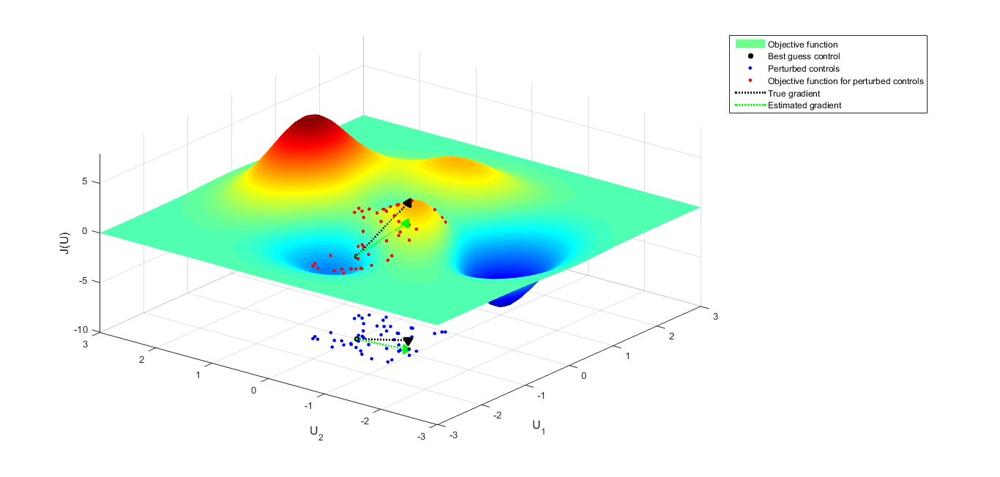
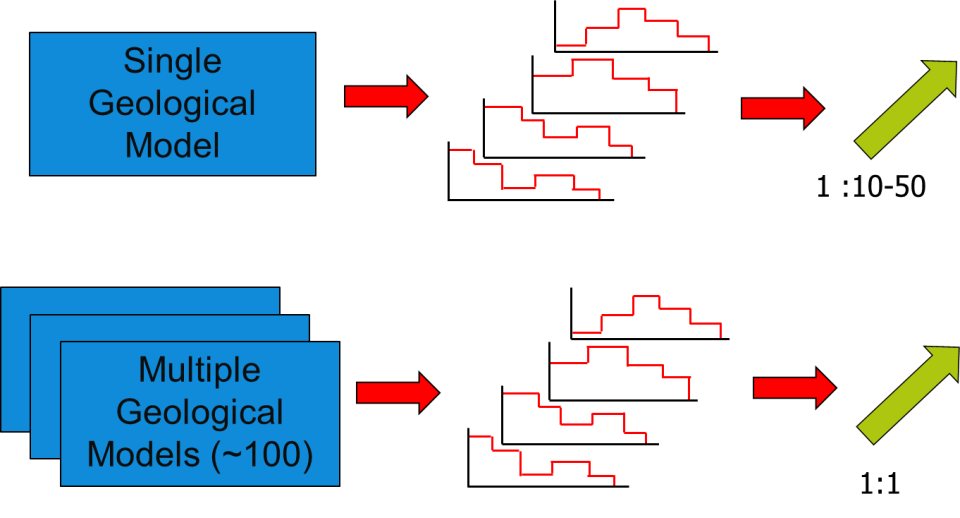

.. _cha_theory:

******
Theory
******

Optimization
============

Have you being recently tasked with some aspect of field development or operational planning? If so, you have maybe come across the following problem. Imagine you have been tasked with designing the drilling schedule for three potential wells, two producers *Well-A* and *Well-B*, and an injector *Well-C*. The complexity being you can only drill one well at a time.
Thus the question is "What is the optimal order to drill these three potential wells?". The answer naturally depends on:

* the properties of the reservoir,
* the life cycle production duration
* the location and potential of the wells,
* the cost of the individual wells,
* the platform capacity,
* and so on and so forth.

Other factors often have to be considered. Does the reservoir have pressure support from an aquifer, thus eliminating the need for an injector? Or could the reservoir be underpressued thus the urgent need for an injector?  Or are the reserves in connection with producer *Well-B* too low to be profitable?
For this simple example of 3 wells the number of possibilities and scenarios to be considered is equal to 3 factorial, i.e. 6 different combinations. Thus it is possible to "manually" test these 6 different drilling combinations in order to find the best possible solution. However what if you are tasked with planning 6 potential wells. This would entail 6 factorial (i.e. 720) combinations of the drilling order to be tested. Can this task of testing 720 different possible combinations be performed manually? What if you have to plan 10 wells or more? As the number of wells increase the potential number of possible combinations increases exponentially.
Finding or obtaining the optimal order for the wells to be drilled is a tedious task. Solutions to such problems can be obtained using computationally efficient optimization techniques. So what is Optimization and these Optimization techniques?

.. _opt-process-label:

The optimization process
------------------------
**Optimization** is the process of finding the best possible solution for a particular problem. For petroleum/reservoir engineering, such problems would primarily imply

* Can I improve the ultimate oil recovery from the reservoir being produced? or
* Can I produce a certain more efficiently/economically? or
* Can I improve the sweep efficiency of my reservoir? or
* How much water/chemicals should I inject to improve the oil/gas recovery factor? or
* How many wells should I drill to efficiently produce the reservoir being developed?

This list can be endless and tailored to various different applications and problems for different reservoirs. Additionally many more such questions such well design, operating constraints, value of information etc. can be framed into an optimization problem.
To optimize ( i.e. find the best possible solution) a certain problem, there must be "something" that a user can manipulate/change in order to achieve a better solution. This "something" that can be changed or manipulated is known as **controls**. Within the context of  petroleum/reservoir engineering, controls can be defined as

* Production and injection rates - the rates of production and injection (well-by-well or by group/field scale).
* Well location - optimization of the well location and path
* Well drilling priority - the order of which the wells are drilled (*Well-A* first, then *Well-B*)
* Well drilling timing - the timing of which the wells are drilled (*Well-A* is drilled as soon as a drilling rig is available)

Having defined the controls we aim to optimize, we must define a function to be optimized. Such a function is known as an **objective function**. In general many different types of objectives can be considered by a user for different problems encountered. The most widely used objective functions for petroleum engineering applications are:

* Economic Objectives: Net Present Value (NPV)
* Production Objectives: Recovery factor, Sweep Efficiency
* Risk Objectives: Uncertainty based risk measures

Thus optimization is the process which aims to find an *optimal* set of controls which will provide the *best possible* objective function value for the problem being optimized. Optimization process can either be manual or automated. Manual optimization is time consuming and prone to human bias and errors. Automated optimization on the other hand is quicker and less prone to human bias and errors. However the results from automated optimization workflows need to be analysed through human intervention. EVEREST focuses on state-of-the-art automated workflows for performing optimizations, with the goal of achieving solutions of significant practical value, using computationally efficient techniques.

.. _en-opt-label:

Ensemble optimization (EnOpt)
-----------------------------

There are numerous methods for model-based optimization for petroleum/reservoir engineering objectives.
These methods can be classified into two general classes, *derivative-based* and *derivative free* techniques.
Derivative/Gradient-based methods have been shown to be computationally more efficient than derivative free methods and thus have been used in this EVEREST toolbox.
Among the gradient-based methods the adjoint approach (see :ref:`Jansen 2011 <jansen2011>` for an overview), provides the most accurate gradient and is computationally very efficient.
However the adjoint approach has the disadvantage that it requires access to the simulation code to be implemented.

:ref:`Chen 2008 <chen2008>` and :ref:`Chen et al. 2009 <chen2009>` introduced the ensemble-based optimization method (EnOpt), an approximate gradient-based method which is computationally less attractive than the adjoint method but does not require simulator access and has proven to achieve good results.
A detailed mathematical description of the Ensemble Optimization method can be found in, amongst others, :ref:`Fonseca 2015 <fonseca2015>` and :ref:`Chen et al. 2009 <chen2009>`

The following is a diagrammatic representation of the EnOpt method. Imagine a two control problem as displayed in :numref:`fig_enopt_objfunc`, where the controls are called ``u1`` and ``u2``.

.. _fig_enopt_objfunc:

    The ensemble-based optimization method (EnOpt).

To approximate the gradient the following steps are taken:

#. A user must choose an initial assignment of the controls. For instance in :numref:`fig_enopt_objfunc` the point ``(u1 = -1, u2 = 0)`` has been chosen.
#. Around this initial choice of ``u1`` and ``u2``, EVEREST will generate a set of normally (Gaussian) distributed perturbed controls which can be seen as blue dots in :numref:`fig_enopt_objfunc`.
#. Then, the objective function value for each of these blue dots will be evaluated. These are represented as the red dots.
#. Now we have all the information required to approximate the gradient of the objective function. An estimate of the gradient at the initial point is determined by computing the linear regression through the red dots (green line).
#. We use a simple line-search algorithm to take a step along the gradient direction and to find an "updated" set of controls.
#. The entire process is repeated till convergence is observed (i.e. little/no change in the objective function).

The theoretical justifications for the use of a linear regression as an approximation to the gradient can be found in many text books on numerical optimization such as :ref:`Nocedal and Wright 2009 <nocedal2009>`.

Intuitively it is fairly simple to visualize that the number of perturbed controls generated (i.e. blue dots) can have a significant impact on the quality of the approximate gradient.
Also the methodology to create the blue dots can also significantly impact the gradient quality.
Detailed investigations into the importance of both these features can be found in :ref:`Fonseca 2015 <fonseca2015>`.
Note that a larger number of blue dots will increase the quality of the gradient, but the computational complexity will also increase.
Traditionally many studies have used 10-50 perturbed controls during the optimization process to estimate the gradient.
These studies have used a single model realization (i.e. a single geological representation) of the reservoir which may not always be an accurate representation of the real reservoir system.

.. _robust-optimization-label:

Robust Optimization: Stochastic Simplex Gradients (StoSAG)
==========================================================
In reality, geological and reservoir modeling process is fraught with uncertainties since a reservoir is modeled using uncertain interpretations based on uncertain data sources such as seismic, well logs etc.
Thus to achieve optimization solutions which have practical value it is imperative to account for uncertainty within the optimization framework.
One way of representing the uncertainty present is to generate multiple realization models, or an ensemble of models.
Instead of a single reservoir model, we might have tens to hundreds of potential reservoir models.
Together they represent the uncertainty in your models and you no longer have a base case and a P10/P90.
Thus now the question is how can we use EnOpt for optimization which incorporates geological uncertainty.
The section above details diagrammatically how a gradient can be approximated for a single model realization.
Intuitively if multiple model realizations were to be used one could think of using a similar method as when using a single model realization.
In the case of a single model realization (as illustrated in figure below) to estimate the gradient we use 10-50 perturbed control samples which is a user dependent choice.
Thus the ratio between model realizations and control samples is ``1:10-50``.
If we were to follow the same procedure for Robust Optimization i.e. optimization over an ensemble of geological realizations we would need to find a gradient for each model realization.
These individual gradients would then need to be averaged to estimate the approximate *robust ensemble gradient*.
The drawback of such an approach is the computational complexity involved in estimating the robust ensemble gradient.
Imagine you have ``10`` model (geological) realization to be optimized.
Assume you have chosen to use ``25`` perturbed samples to evaluate the gradient for each realization.
This would entail ``10 * 25 = 250`` reservoir simulations to estimate a single gradient.
For large field scale models this would be computationally expensive.

Chen 2008 suggested a computationally efficient technique to estimate the robust ensemble gradient.
Chen 2008 based on some assumptions suggested the use of 1 perturbed control sample for each model realization.
Thus now the total number of simulations to estimate the robust ensemble gradient would be only 10, since each model realization has been coupled with only 1 perturbed control sample.
This method is computationally attractive and can be applied to large scale optimization problems.
:ref:`Fonseca et al. 2016 <fonseca2016>` showed that the assumptions introduced by Chen 2008 were not theoretically valid.
They also introduced a theoretically robust version of the formulation introduced by Chen 2008.
The new formulation, called **Stochastic Simplex Gradients (StoSAG)** introduced, retains the computational attractive feature of Chen 2008, i.e. the use of 1 perturbed control sample for each model realization.
EVEREST supports the StoSAG formulation for estimating the gradient in robust optimization problems.

Multi-objective optimization (MOO)
===================================

Most real-world design and planning problems must also satisfy multiple objectives. Very often these objectives are in conflict with each other, which means that one objective must be decreased to increase the other objective. In such cases it is not trivial to find solutions which satisfy different objectives. When the problem includes two or more performance indicators, EVEREST employs the widely used weighted sum method to balance the objective functions. This approach aims to optimize a weighted objective function that combines multiple objectives in a single function according to:

.. math::

	J = w*J_{I} + (1-w)*J_{II}

where J :subscript:`I` and J :subscript:`II` are the two objective functions considered and w is the weighting factor between both of objectives. Note that this can be extended to cases with more objectives by introducing more importance weights, which are recommended to be chosen as fraction values (i.e., 0 ≤ w ≤ 1) adding up to 1.

References
==========

.. _chen2008:

Chen, Y. (2008). Efficient ensemble based reservoir management (Doctoral dissertation, University of Oklahoma).

.. _chen2009:

Chen, Yan, Oliver, Dean S., and Dongxiao Zhang. (2009). "Efficient Ensemble-Based Closed-Loop Production Optimization." SPE J. 14: 634–645. doi: https://doi.org/10.2118/112873-PA

.. _nocedal2009:

Nocedal, J. and Wright, S. J. (2006). "Trust-region methods" in Numerical Optimization, New York, NY, USA:Springer, pp. 66-98, doi: https://doi.org/10.1007/978-0-387-40065-5

.. _jansen2011:

Jannsen, J. D. (2011) "Adjoint-based optimization of multi-phase flow through porous media - A review", Computers & Fluids, Volume 46, Issue 1, doi: https://doi.org/10.1016/j.compfluid.2010.09.039

.. _fonseca2015:

Fonseca, R. M. (2015) "A Modified Gradient Formulation for Ensemble Optimization under Geological Uncertainty" (Doctoral dissertation, Technische Universiteit Delft) http://www.publications.pvandenhof.nl/Paperfiles/Fonseca_PhD_Thesis_2015.pdf

.. _fonseca2016:

Fonseca, R. M., Chen, B., Jansen, J. D., Reynolds, A., (2016) "A Stochastic Simplex Approximate Gradient (StoSAG) for optimization under uncertainty", Numerical Methods in Engineering, Volume 109, Issue 13, pp. 1756-1776 doi: https://doi.org/10.1002/nme.5342
