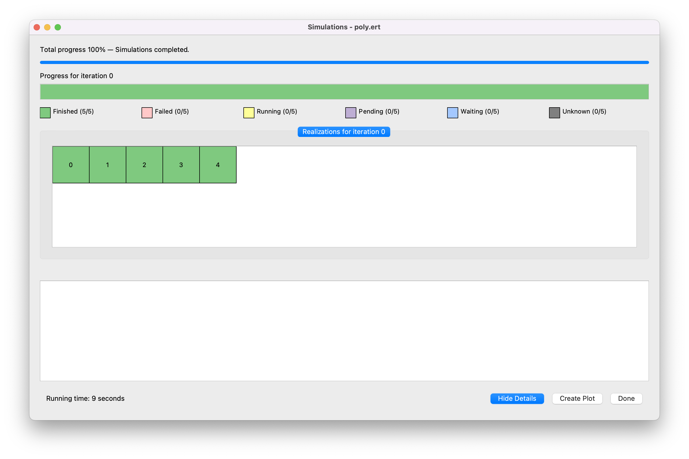
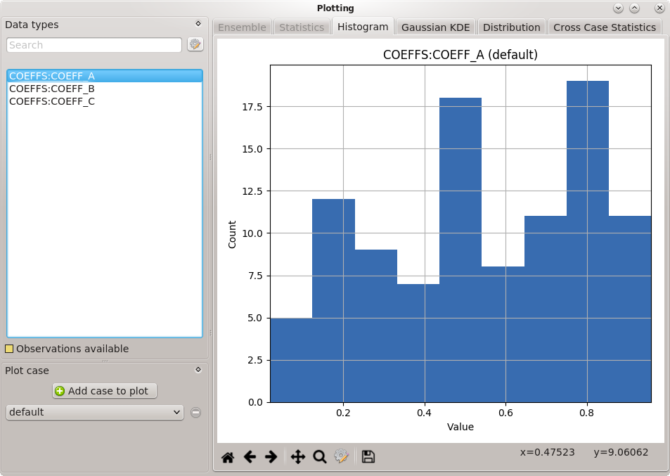
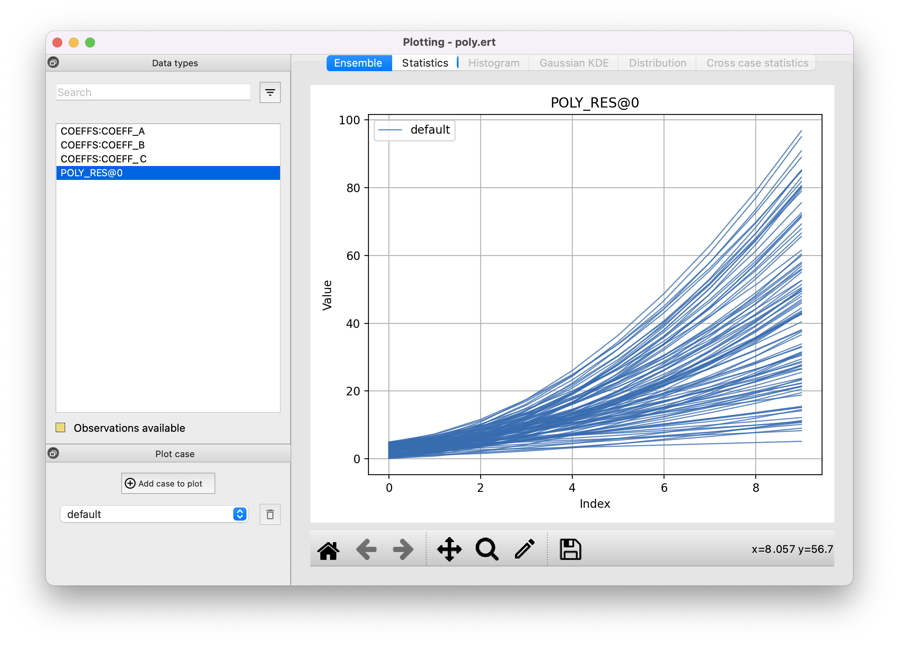
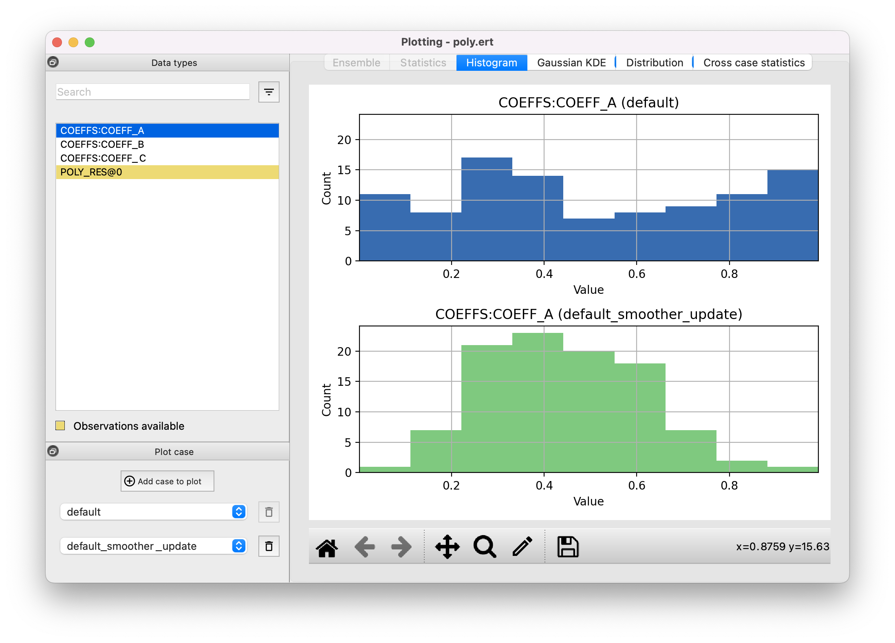
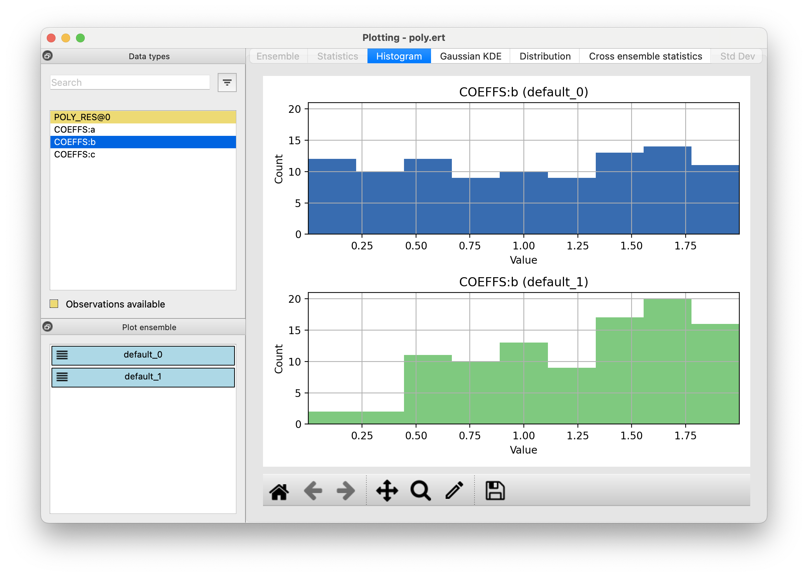
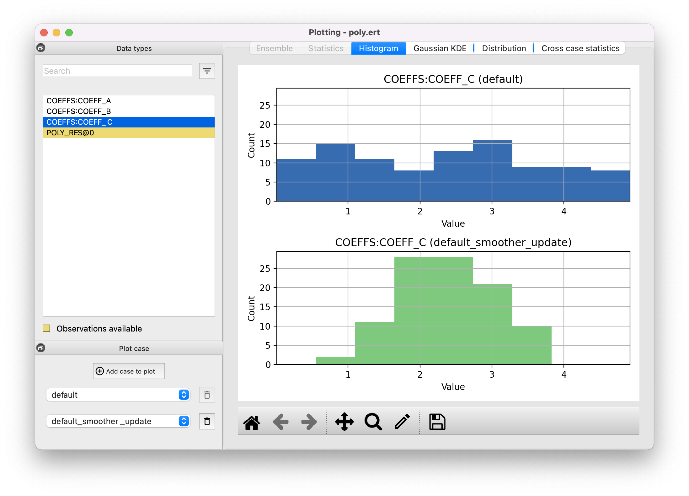

Configuration guide
===================
This guide will introduce you to the basic concepts of ERT by demonstrating
a project setup that uses a simple polynomial as the :ref:`forward model <forward_model_chapter>`.

Minimal Configuration 
---------------------
We first create a minimal configuration and run an experiment that 
doesn't execute any computations, but only generates the necessary folders and files.

1. **Create a Folder**: 
    Start by creating a folder named ``poly_example``.
    This folder will contain all required files for our example.

Create a Configuration File 
***************************
Running ERT requires a dedicated configuration file, typically with the extension `.ert`.

1. **Create the File**: Within the ``poly_example`` folder, create a file named ``poly.ert`` with the following content:

   .. literalinclude:: minimal/poly.ert

:ref:`NUM_REALIZATIONS <num_realizations>` specifies how many simulations you want to run.

Launch the User Interface
*************************
1. **Run ERT**: Launch the GUI with the command:

   .. code-block:: shell

      ert gui poly.ert

   The main ERT user interface window will pop up, as shown below:

   .. image:: minimal/ert.png

The Main Elements Relevant to This Guide Are:
*********************************************

* **Simulation Mode**: Displays available algorithms. Only a limited set is available at this stage, as we have not fully configured ERT yet.
* **Runpath**: A configurable path determining where each realization of the experiment will be executed. The placeholders ``<IENS>`` and ``<ITER>`` will be replaced by the number of the realization and the number of iterations, respectively.
* **Configuration Summary**: Initially empty, but will display what has been configured once you've set up your experiment.
* **Run Experiment**: Initiates an experiment with the current configuration and selected simulation mode.

Run an Empty Experiment
***********************

To execute an empty experiment, follow these steps:

1. **Select Simulation Mode**: Choose "Ensemble Experiment" as the Simulation mode.
2. **Start the Experiment**: Click the "Run Experiment" button.

A new window named "Experiment" will appear, displaying the status of the experiment.
You can view the status of each running realization by pressing "Show Details."

* **Realizations Limitation**: As the experiment runs, you may notice that not all the realizations are running simultaneously.
  This is due to an upper limit on how many realizations can run concurrently, a constraint determined by the queue system.
  We will configure this at a later stage.

Once all the realizations are complete, close all ERT windows.

Inspect the results
*******************

After running the experiment, two new folders, ``simulations`` and ``storage``, should appear in the project folder. 

* ``storage`` contains ERT's internal data, which should remain untouched.
* ``simulations`` is generated based on the :ref:`RUNPATH <runpath>` configuration and contains the realizations of your experiment.

In the ``simulations`` folder, you'll find folders for each realization, labeled ``realization-0``, ``realization-1``, etc., containing the files and data for each run:

.. code-block:: text

    simulations
    ├── realization-0
    │   └── iter-0
    │       ├── OK
    │       ├── STATUS
    │       ├── jobs.json
    │       ├── logs
    │       │   └── job-runner-log-2023-08-08T1027.txt
    │       └── status.json
    ├── realization-1
    │   └── iter-0
    │       ├── OK
    │       ├── STATUS
    │       ├── jobs.json
    │       ├── logs
    │       │   └── job-runner-log-2023-08-08T1027.txt
    │       └── status.json

    etc.

* **OK**: Indicates success. If there's an error, an ``ERROR`` file will be created instead.
* **STATUS**: A legacy status file.
* **jobs.json**: Defines the jobs to run.
* **logs/**: Log files useful for debugging
* **status.json**: Used to communicate the status to ERT.

Do not modify these files, either manually or through your experiments' jobs.

Adding a Forward Model
----------------------
As mentioned, this example experiment will use a simple polynomial evaluation as the forward
model. In real-world scenarios, this would typically involve executing a physics simulator, 
such as Eclipse, Flow, pyWake, etc.

To get started, the forward model will be implemented as a simple Python script named
``poly_eval.py``.
Initially, we'll create a basic script to ensure that it can be executed.
As we progress, both the script and the configuration file will be expanded to showcase fundamental features of ERT.

Changing the Default Runpath
****************************
The minimal configuration utilized the default :ref:`RUNPATH <runpath>`, 
causing the realization to execute within the directory structure ``simulations/realization-<IENS>/iter-<ITER>``. 

You can alter this default location by modifying the runpath in the ``poly.ert`` file.
Simply add the following line to specify a new location:

.. code-block:: shell

    RUNPATH poly_out/realization-<IENS>/iter-<ITER>

This line instructs ERT to run the realizations in the specified path,
giving you more control over the organization of your experiment's outputs.

.. _create_script:

Creating a Script to Define the Forward Model
*********************************************
The forward model for our example will be defined in a Python script named ``poly_eval.py``. 
The script will evaluate a polynomial with fixed coefficients at specific points, writing the results to a file.

1. **Create the Script**: Within your project folder, create a file named ``poly_eval.py`` with the following content:

.. include:: with_simple_script/poly_eval.py
    :code:

This script performs the following actions:

- **Define Coefficients**: A dictionary is used to store the coefficients of the polynomial with keys ``a``, ``b``, and ``c``.
- **Evaluate the Polynomial**: The polynomial is evaluated at fixed points ranging from 0 to 9.
- **Write Results**: After evaluation, the script writes the results to a file named ``poly_0.out``.

Marking the Script as Executable
********************************
The ``poly_eval.py`` script must be marked as executable to allow it to be invoked by other programs.

1. **Run the Command**: Execute the following command to mark the script as executable:

   .. code-block:: shell

      chmod +x poly_eval.py

   This command changes the permissions of the file, allowing it to be executed like a program.
   Once you have run this command, the script can be run directly from the terminal or used within ERT as needed.

Adding a Job to the Forward Model
*********************************
To add a job to the forward model, you need to define the job in a separate file and then reference it in your configuration.
Here's how to do it:

1. **Define the Job**: Create a file named ``POLY_EVAL`` with the following content to specify the executable:

.. include:: with_simple_script/POLY_EVAL
    :code:

2. **Reference the Job in Configuration**: Open your configuration file and add these lines:

.. code-block:: shell

    INSTALL_JOB poly_eval POLY_EVAL
    FORWARD_MODEL poly_eval

The :ref:`INSTALL_JOB <install_job>` line informs ERT about the job names ``poly_eval``
and the file containing details of how to execute the job.
The :ref:`FORWARD_MODEL <forward_model>` line instructs ERT to include the job as part of the forward model.

3. **Complete Configuration**: Your final configuration file should now look like this:

.. include:: with_simple_script/poly.ert
    :code:

For more details on configuring your own jobs, see the corresponding section on :ref:`configure_own_jobs`.

By following these steps, you have added a job to the forward model, allowing ERT to execute the ``poly_eval.py`` script as part of the forward model.

Running with the New Job
************************
With the new job added, follow these steps to run ERT and observe the results:

1. **Delete Old Output Files**: To clear any previous results, execute the following command:

.. code-block:: shell

    rm -r simulations

2. **Start ERT**: Launch ERT by running:

.. code-block:: shell

    ert gui poly.ert

.. image:: with_simple_script/ert.png

You will notice the updated configuration summary, including the newly defined job and the customized runpath.

3. **Run the Experiment**: Execute the ensemble experiment as before. Once it's complete, close all ERT windows.

4. **Inspect the Output**: In your project folder, you'll find a new directory ``poly_out``, corresponding to the ``RUNPATH`` configuration. This will contain folders for each realization, and within those, a new level of folders named ``iter-0``, containing the simulation results. You will find new files such as:

   - ``poly_eval.stderr.0``: Information the ``poly_eval.py`` script writes to the standard error stream.
   - ``poly_eval.stdout.0``: Information the ``poly_eval.py`` script writes to the standard output stream.
   - ``poly_0.out``: The file where the script writes results.

5. **Examine the Results**: You can view the contents of ``poly_0.out`` in each runpath. For example:

   .. code-block:: shell

      cat poly_out/realization-0/iter-0/poly_0.out

   You should see the following in all the files:

   .. code-block:: text

      3
      6
      11
      18
      27
      38
      51
      66
      83
      102

At this stage, each realization contains identical results, as they all evaluate the same model.
In the following section, you'll learn how to use ERT to automatically vary parameters across realizations, leading to different results.

Creating Parameters
-------------------
To sample different parameters across realizations in ERT, 
you'll need to define the prior distribution for each parameter. 
Furthermore, you'll detail how ERT can identify and inject these parameters into 
each simulation run via a templating mechanism. 

Adding Prior Distributions
**************************
Create a file named ``coeff_priors`` and add the following content:

.. include:: with_results/coeff_priors
    :code:

Each line of this file defines a parameter:

- The first part is the name of the parameter (e.g., ``COEFF_A``).
- The second part defines the type of distribution from which to sample the parameter. 
  In this case, we're using a uniform distribution (``UNIFORM``).
- The remaining parts describe the distribution's specific characteristics. 
  For a uniform distribution, these are the lower and upper bounds. 
  Different distributions will require different arguments.

Adding a template
*****************
Now, let's create a template that ERT can use to insert the sampled parameters. 
Create a file called ``coeff.tmpl`` and add the following:

.. include:: with_results/coeff.tmpl
    :code:

In this template, the placeholders, denoted by angle brackets (``<`` and ``>``), 
will be substituted with the parameter values sampled from the distributions defined in the ``coeff_priors`` file. 

Configuring the parameter set and and corresponding template
************************************************************
Now, you need to add the following line to the ``poly.ert`` config file:

.. code-block:: shell

    GEN_KW COEFFS coeff.tmpl coeffs.json coeff_priors

This line uses the :ref:`GEN_KW <gen_kw>` keyword, which instructs ERT to generate parameters according to specified distributions.
The four required arguments for :ref:`GEN_KW <gen_kw>` are:

 1. **COEFFS**: The name assigned to the parameter set, serving as an identifier.
 2. **coeff.tmpl**: The template file you previously created, containing placeholders that correspond to the parameters.
 3. **coeffs.json**: The name of the output file where the populated template will be written. 
 4. **coeff_priors**: The name of the file containing the defined priors.

Reading Parameters in the Simulation Script
*******************************************
The simulation script must be modified to read the ``coeffs.json`` file, which is where ERT writes the sampled parameters.
Update ``poly_eval.py`` to the following:

.. literalinclude:: with_results/poly_eval.py

Reading Simulation Results a.k.a Responses
******************************************
To enable ERT to read the simulation results, you'll need to use the :ref:`GEN_DATA <gen_data>` keyword.

1. **Adding the GEN_DATA Line**: Edit the ``poly.ert`` file to include the following line:

.. code-block:: shell

    GEN_DATA POLY_RES RESULT_FILE:poly_%d.out REPORT_STEPS:0 INPUT_FORMAT:ASCII

2. **Understanding the Arguments**:

- **POLY_RES**: Name of this result set.
- **RESULT_FILE:poly_%d.out**: Path to the file with the simulation results. 
  The ``%d`` is always ``0``, but must be specified. (a requirement from earlier ERT versions).
- **``REPORT_STEPS:0``**: Generally set to 0.
- **``INPUT_FORMAT:ASCII``**: Specifies that the file is a text file (`ASCII` stands for "American Standard Code for Information Interchange").

Increasing the number of realizations
*************************************
Let's increase the number of realizations to obtain a larger sample size.

1. **Increase the Number of Realizations**: Set the ``NUM_REALIZATIONS`` value to ``100`` to instruct ERT to run 100 simulations. 

2. **Configure Parallel Execution**: To make the experiment run faster, you can specify the number of simultaneous simulations that the system can execute. 
   Use the :ref:`queue option <queue_option>` ``MAX_RUNNING`` for the ``LOCAL`` queue and set it to ``50``:

.. code-block:: shell

    QUEUE_SYSTEM LOCAL
    QUEUE_OPTION LOCAL MAX_RUNNING 50

This configuration allows 50 simulations to run concurrently, speeding up the overall process.

The updated config file, ``poly.ert``, should now look like this:

.. include:: with_results/poly.ert
    :code:

Running with Sampled Parameters
*******************************
Before proceeding with the next run, delete the ``storage`` and ``poly_out`` folders from the last run.
This ensures that you'll only see the new data in your results.

1. **Launch ERT**: Open ERT again and observe that the "Config Summary" now includes the name of the parameter set you've defined.

2. **Start the Experiment**: Choose "Ensemble Experiment" in the "Simulation mode" and initiate the simulation.

3. **Create Plot**: Once the simulations are complete, you have the option to press the "Create Plot" button either in the progress window or in the main window. 
   This action will open the "Plotting" window.

4. **View Distributions**: In the "Plotting" window, you can now observe the distributions of the three different parameters you created: ``COEFFS:COEFF_A``, ``COEFFS:COEFF_B``, and ``COEFFS:COEFF_C``.
   These names are formatted with the parameter set name first, followed by a colon, and then the specific parameter name.

You should see something similar to this:

5. **View Responses**: Click on ``POLY_RES`` to view responses.

Play around and look at the different plots.

Inspecting the Parameters and Results
*************************************
The sampled parameters and resulting simulation data can be inspected within each runpath.

1. **Inspecting the Parameters**: You should find the instantiated parameter template files named ``coeffs.json`` in each runpath. 
   To look at a specific realization, you might run a command such as:

.. code-block:: shell

    cat poly_out/realization-4/iter-0/coeffs.json

This should return something similar to:

.. code-block:: json

    {
        "a": 0.830303,
        "b": 1.69181,
        "c": 0.114524
    }

2. **Inspecting the Results**: Moving to the results, each simulation has generated a unique file named ``poly_0.out`` reflecting the varying outcomes. 
   A typical output from a realization might look like:

.. code-block:: shell

    cat poly_out/realization-0/iter-0/poly_0.out

.. code-block:: none

    2.23622
    4.288035
    6.83408
    9.874355
    13.40886
    17.437595
    21.96056
    26.977755
    32.48918
    38.494835

3. **Next Steps**: Having inspected both the parameters and results, you have built an understanding of how sampling works in ERT.
   In the next section, we will see how to describe the results to ERT, and how to specify some observations that we wish ERT to optimise towards.

Adding observations
-------------------
The simple polynomial in our example serves as a model of a real-world process, 
representing our best current understanding of how this process behaves. 
The accuracy of this model hinges on how well a polynomial mirrors reality and how precise the parameters `a`, `b`, and `c` are. 
In this section, we'll leverage ERT to enhance the parameter estimates using real-world observations.

Observations File
*****************
We have polynomial observations measured at the points 0, 2, 4, 6, and 8. 
These indices align with the x values of the polynomial evaluation, although this alignment is coincidental. 
The indices indicate how the observations in the file correspond to the result indices. 

1. **Create the Observations File**: Create a file named ``poly_obs_data.txt`` in the projects folders with:

.. literalinclude:: with_observations/poly_obs_data.txt

Each line holds an observation, where the first number is the observed value, and the second number is the uncertainty.

Defining the Observation Configurations
***************************************
We make ERT aware of observations using the :ref:`OBS_CONFIG <obs_config>` keyword,
which refers to a file where the :ref:`GENERAL_OBSERVATION <general_observation>` keyword is used to define observations.

1. **Create the Observations Configuration File**: Create a file named ``observations`` in the project folder with:

   .. literalinclude:: with_observations/observations

   Here, :ref:`GENERAL_OBSERVATION <general_observation>` initiates a set of observations and pairs them with simulation results through key-value pairs:

   - **DATA**: Relates the observation to a result set.
   - **INDEX_LIST**: Since we have 10 values in our results file but only 5 observations, this list tells ERT the corresponding results. 
     If the lengths are equal, omit this.
   - **RESTART**: Legacy value, must match ``REPORT_STEPS`` from the ``GEN_DATA`` line.
   - **OBS_FILE**: Specifies the file containing the observations.

2. **Update the Config File**: Add the observation file to the config file:

   .. code-block:: none

       OBS_CONFIG observations

   This line informs ERT about the description of an observation set in the ``observations`` file.

Simulation and Analysis
***********************
With the final configuration:

.. literalinclude:: with_observations/poly_final.ert

Launch ERT, choose the "Ensemble Smoother" and hit "Run Experiment". 

As simulations run, you'll notice the updated parameters yield results that better align with observations.

In the "Plotting window", the ``POLY_RES`` plot will now display a yellow background, denoting attached observations
Black dots and lines represent observed values and uncertainties, respectively.
Different iterations can be viewed by selecting "default" and "default_smoother_update."

.. image:: with_observations/plot_obs.png

Evaluating the Updated Parameters
*********************************
Examine the improved estimates for `a`, `b`, and `c`. 
Though not perfect, they're better than the initial guesses. ERT's updating algorithms have reduced uncertainty:

Conclusion
**********
You've now learned the fundamentals of ERT configuration, using real-world observations to enhance parameter estimates.
