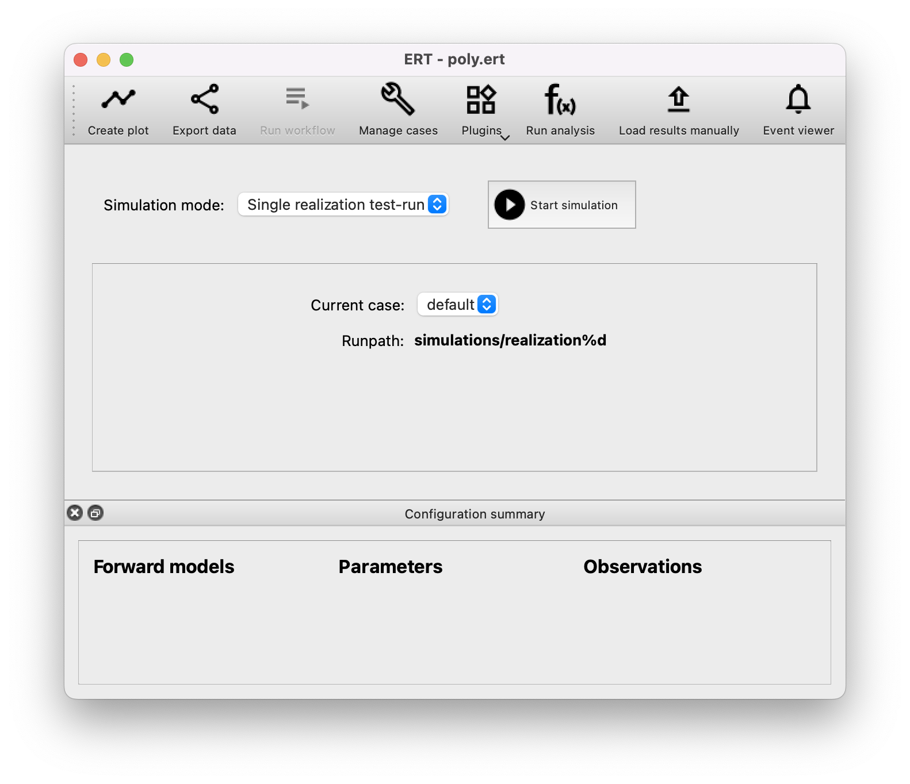

Configuration guide
===================
ERT runs a set of simulations with a prior set of parameters sampled from
distributions. Everything involved in running a particular simulation is called
a realization. A set of realizations is called an ensemble. The results of all
the realizations in one ensemble are given to an optimization algorithm. The
algorithm then uses a set of observations to tune the parameters. Using the
updated parameters for the next ensemble run will give results that fit better
with the set of observations.

To understand the basics of how to configure and use ERT, we will walk through
how to set up a project that uses a polynomial evaluation as the
:ref:`forward model <forward_model_chapter>`.

Minimal config
--------------
To test that our setup is working, we will create the minimal configuration we
need to launch the GUI and run an empty experiment that
does nothing. First create a folder with the name ``poly_example``.

Create a config
***************
Then create a file ``poly.ert`` inside the folder with the following content:

    .. literalinclude:: minimal/poly.ert

:ref:`JOBNAME <jobname>`
    Specifies the name for each simulation. If not defined it will default to
    ``<CONFIG_FILE>-<IENS>``
:ref:`NUM_REALIZATIONS <num_realizations>`
    We have to specify how many simulations we want to run.
:ref:`QUEUE_SYSTEM <QUEUE_SYSTEM>`
    Finally, we must specify where each simulation is to run, which is handled
    by the queue system. ``LOCAL`` means that everything will run on you local
    computer. See :ref:`QUEUE_SYSTEM <QUEUE_SYSTEM>` for other options.

Launch the user interface
*************************

Navigate to this folder on your command line and run ERT::

    ert gui poly.ert

You will see a warning because we haven't configured any observations yet. This
is expected, so click OK. You will see the main ERT user interface window.

The elements relevant to this guide are:

* Simulation mode: List of available algorithms. Only a limited set is available since we are not done configuring ERT.
* Runpath: Configurable path where each realization of the experiment will be executed. The `%d` will be replaced by the number of the realization.
* Configuration summary: Empty by default, but will show us what has been configured.
* Start simulation: Start an experiment with the current configuration and simulation mode.

Run an empty experiment
***********************
To run an empty experiment, select "Ensemble Experiment" as the Simulation
mode. Then press the "Start Simulation" button. You get a dialog asking if you
want to start with the "default" case. That is fine, so press "Yes". The
experiment will run, but since we haven't configured a forward model, only an
empty experiment is executed.

A new window will appear called "Simulations". Here you can see the status of
the experiment. If you press "Show Details", you can see the status of each running
realization.

.. image:: minimal/simulations.png

As it's running you can see that not all the realizations are running at the
same time. There is an upper limit to how many realizations can run at the same
time, which is decided by the queue. You will probably have 2 running at a
time.
We will configure this at a later stage. When all the realizations are done,
close all the ERT windows.

Inspect the results
*******************
Now in the project folder there should be two new folders, ``simulations`` and
``storage``. Storage is ERT's internal data, and should not be touched. The
``simulations`` folder is created based on the :ref:`RUNPATH <runpath>` configuration. If you
open this folder you will see one folder for each realization, labeled
``realization0``, ``realization1``, etc. Inside each of these folders is where
each realization has run. If you look inside, you will see a few files that ERT
uses to keep track of the jobs.

jobs.json
    defines the jobs to run
OK
    indicates success. On error an ``ERROR`` file is created instead.
STATUS
    legacy status file
status.json
    used to communicate status to ERT.

You should not touch these files, either manually, or as part of the jobs your
experiments define.

Adding a Forward Model and Runpath
----------------------------------
The example project will use a simple polynomial evaluation as the forward
model. In real experiments this would usually be running a simulator, like
Eclipse, instead. The forward model is implemented as a simple python script
``poly_eval.py``. We will start with a simple script just to check that we can
run it. Later we will expand on it and the configuration file to introduce some
fundamental features of ERT.

Add a Runpath
*************
In the minimal config, we used the default :ref:`RUNPATH <runpath>` which ran
the realization in ``simulations/realization%d``. This is not sufficient for
running the algorithms of ERT. When running the algorithms of ERT, we must
usually run the Ensemble several times, and the runpath needs to reflect this.
We need to have each iteration run in a different folder, so that they won't
step on each others toes. Add to the config (``poly.ert``) file the following
line::

    RUNPATH poly_out/realization-<IENS>/iter-<ITER>

The second ``%d`` in the runpath is replaced by the iteration number of the
algorithm. This is needed since the algorithm may run several iterations during
the experiment.

.. _create_script:

Create script
*************
In a file ``poly_eval.py`` put the following:

    .. include:: with_simple_script/poly_eval.py
        :code:

For now, this script evaluates a polynomial with fixed coefficients. The
coefficients are stored in a dictionary with keys a, b and c. Later we will see
how to have these values injected by ERT. The script evaluates at fixed points
from 0 to 9. After evaluation, the script writes the results to a file called
``poly_0.out``.

Mark the script as executable
*****************************
You have to mark the file as executable. In the terminal you can do this by
running the following command::

    chmod +x poly_eval.py

Add a Job Definition and add it to the Simulation jobs
******************************************************
The definition of a job is written in a separate file. In our case we only need
to specify the executable name. Create a file called ``POLY_EVAL`` with the
following content:

    .. include:: with_simple_script/POLY_EVAL
        :code:

Now we must refer to this job definition in the configuration. Add the lines::

    INSTALL_JOB poly_eval POLY_EVAL
    SIMULATION_JOB poly_eval

The :ref:`INSTALL_JOB <install_job>` line tells ERT the name of the job
``poly_eval``, and then the file containing details of how to run the job. The
:ref:`SIMULATION_JOB <simulation_job>` line tells ERT to run the job as part of
the simulation run.

Now the config file should look like this:

    .. include:: with_simple_script/poly.ert
        :code:

see :ref:`configure_own_jobs`

Running with the new Job
************************
Before we run again delete the old output files by running the command::

    rm -r simulations

Start ERT by again running ``ert gui poly.ert``.

    .. image:: with_simple_script/ert.png

You can see in the configuration summary view that there is now a forward model. And
you can also see that the runpath has changed from the default to what we
specified in the config. Now run the ensemble experiment again like you did
earlier. After it has finished, close all ERT windows.

In you project folder you should now see a new folder called ``poly_out`` as
you defined in the ``RUNPATH`` configuration. Inside the folder you will see
folders named ``realization-0``, ``realization-1``, and so on, for each realization. Inside
these folders you will see a new level of folders named ``iter-0``, where the
realization simulation has run. Inside this folder, you will see some new files
in addition to those you saw before.

poly_eval.stderr.0
    information that the ``poly_eval.py`` script writes to the standard error
    stream
poly_eval.stdout.0
    information that the ``poly_eval.py`` scrips writes to the standard output
    stream
poly_0.out
    the file that the script writes the results to. This is specific to the
    script, and not created by ERT, and different files will be written by
    different jobs.

If you look at the ``poly_0.out`` file in each of the runpaths (e.g. run
``cat poly_out/realization-0/iter-0/poly_0.out``), you should see the following in all
the files::

    3
    6
    11
    18
    27
    38
    51
    66
    83
    102

It is of course not very useful that all the realization simulations evaluate
the same model. In the next step we will use ERT to automatically sample
parameters for the realizations (i.e. coefficients for the polynomials), and
read them in the ``poly_eval.py`` script.

Creating parameters
-------------------
In order to set up parameters in ERT, we need to create a file with description
of the distribution of the parameters. These are called the priors. Then we
specify where ERT can find this file, and how to instantiate it into each
simulation runpath via a templating mechanism. The templating mechanism lets you
specify a file in the format you desire, in which ERT will put the parameters
by replacing certain placeholders with the actual parameters sampled from the
distributions.

Adding prior distributions
**************************
To define the prior distributions, create a file ``coeff_priors`` with the
following content:

    .. include:: with_parameters/coeff_priors
        :code:

Each parameter is specified on a separate line. The first part of a line is
the name of the parameter. Following this is the type of distribution we want
to sample the parameter from. Here we choose a uniform distribution. Following
the distribution type, are the arguments describing the distribution. In the
case of ``UNIFORM`` there are two parameters denoting the lower and upper bound
of the distribution. Other distributions have different arguments.

Adding a template
*****************
Then we create a template into which the samples from the distributions will be
put. Create a file called ``coeff.tmpl`` and add the following:

    .. include:: with_parameters/coeff.tmpl
        :code:

The text within angle brackets (``<`` and ``>``), will be replaced by the
samples from the corresponding distribution from the ``coeff_priors`` file. The
result will be put in a file with a name we specify in the configuration.

Configuring the parameter set and and corresponding template
************************************************************
Now, put the line ``GEN_KW COEFFS coeff.tmpl coeffs.json coeff_priors`` into
the config file ``poly.ert``.

The :ref:`GEN_KW <gen_kw>` keyword tells ERT to generate parameters from a
distribution. After the keyword there are four arguments, specifying how to
do this.

 1. ``COEFFS``: The first argument is the name you wish to give to the parameter set.
 2. ``coeff.tmpl``: The second argument is the name of the template file with placeholder names of the parameters.
 3. ``coeffs.json``: The third argument is the name of the file into which the result of the template replacement will be written in each simulation runpath before the simulation jobs run.
 4. ``coeff_priors``: The fourth and final argument specifies where the parameter distributions are specified.

Reading parameters in simulation script
***************************************
We need to change the simulation script so that it reads the ``coeffs.json``
file that ERT writes the sampled parameters in to. Change the script
``poly_eval.py`` to the following:

    .. literalinclude:: with_parameters/poly_eval.py

Increasing the number of realizations
*************************************
Let us also increase the number of realizations now, so that we get a larger
sample size, and thus have more data to inspect in the graphical user
interface.

Increase the ``NUM_REALIZATIONS`` value to ``100``, which tells ERT how many simulations to run.
We can also specify that we want to run more simultaneous
simulations, so it will run faster. This is configured in the queue system by
specifying a :ref:`queue option <queue_option>` ``MAX_RUNNING`` for the
``LOCAL`` queue, like this: ``QUEUE_OPTION LOCAL MAX_RUNNING 50``.

After adding these two lines and changing the number of realizations, the
config should look like this:

    .. include:: with_parameters/poly.ert
        :code:

Running with sampled parameters
*******************************
Now you should delete the ``storage`` and ``poly_out`` folders from last run,
so we know we are getting only new data.

Launch ERT again. Notice that the config summary now specifies the name of the
parameter set we defined. Then select Ensemble Experiment in the simulation
mode, and start the simulation.

When the simulations are done, you can now press the "Create Plot" button in
the progress window or in the main window, and the Plotting window should open.
Here you can now see the distributions of the three different parameters we
created. They are named ``COEFFS:COEFF_A``, ``COEFFS:COEFF_B`` and
``COEFFS:COEFF_C``, with the parameter set name first, then a colon and then
the name of the specific parameter.

You should see something similar to this:

    .. image:: with_parameters/plots.png

Play around and look at the different plots.

Inspecting the parameters and results
*************************************

Inside each of the runpaths you should now be able to find the instantiated
parameter template files ``coeffs.json``. Looking at them (e.g. with
``cat poly_out/realization-4/iter-0/coeffs.json``) you should see something like
this::

    {
        "a": 0.830303,
        "b": 1.69181,
        "c": 0.114524
    }

If you now look at the generated file ``poly_0.out`` in the runpaths you should
also see that each simulation has yielded different results. Here is one
possible output from running ``cat poly_out/realization-0/iter-0/poly_0.out``::

    2.23622
    4.288035
    6.83408
    9.874355
    13.40886
    17.437595
    21.96056
    26.977755
    32.48918
    38.494835

In the next section, we will see how to describe the results to ERT, and how to
specify some observations that we wish ERT to optimise towards.

Reading simulation results
--------------------------
We have to tell ERT where to find the results of our simulations. For general
data like we have in this example, we use the :ref:`GEN_DATA <gen_data>`
keyword. Add this line to the ``poly.ert`` file::

    GEN_DATA POLY_RES RESULT_FILE:poly_%d.out REPORT_STEPS:0 INPUT_FORMAT:ASCII

The arguments of ``GEN_DATA``:

POLY_RES
    Name of this result set.
RESULT_FILE:poly_%d.out
    File with results of simulation. The ``%d`` is always ``0``, but needs to
    be specified. (it was used in earlier ERT versions)
REPORT_STEPS:0
    Tied to time map, for most cases this will be 0
INPUT_FORMAT:ASCII
    Specifies that the file is a normal text file (`ASCII` stands for "American
    Standard Code for Information Interchange")

The config file should now look like this:

    .. literalinclude :: with_results/poly.ert

If you now run the ensemble experiment again, and then open the plot view, you
should see a new plot available called ``POLY_RES``:

    .. image :: with_results/poly_plot.png

Adding observations
-------------------
To use the update algorithms of ERT, we need to have some observations to
compare with the results, so that ERT can tune the parameters to make the
models better fit the observed data.

The observations need to relate to some results of the simulation, so that the
algorithms can compare them. We have some observations from the polynomial that
were measured at the points 0, 2, 4, 6 and 8. The indices here happen to align
with the x values of the polynomial evaluation, but this is incidental. The
indices say where the observations in the file match the result indices. Put
the following observations in the file ``poly_obs_data.txt``:

    .. literalinclude:: with_observations/poly_obs_data.txt

There is one observation per line, with the first number
signifying the observed value, and the second number signifying the uncertainty.

We make ERT aware of observations using the :ref:`OBS_CONFIG <obs_config>` keyword,
which refers to a file where the ``GENERAL_OBSERVATION`` keyword is used to define observations.

First, make a file called ``observations`` in the project folder
with the following content:

    .. literalinclude:: with_observations/observations

The ``GENERAL_OBSERVATION`` introduces a set of observations, and specifies how
to relate them to simulation results. It is followed by a name of the observation
set, then a list of key-value pairs specifying the details.

DATA
    Specifies which result set to relate the observation to.
INDEX_LIST
    In our results file we have 10 values, while we only have 5 observation.
    This list tells ERT which of the results we have observations for. If they
    are the same length, you can omit this.
RESTART
    Legacy, must simply be the same as ``REPORT_STEPS`` from the ``GEN_DATA``
    line.
OBS_FILE
    The file in which the observations can be found.

After creating the observations file we need to add it to the config file with
these lines::

    OBS_CONFIG observations
    TIME_MAP time_map

The :ref:`OBS_CONFIG <obs_config>` line simply tells ERT that there is a
description of an observation set in the file ``observations``. The
:ref:`TIME_MAP <time_map>` is legacy, and not used anymore, but it is still
required to create a `time_map` file (e.g. containing 2006-06-01) when
we have an observation set.

The final config file should look like this:

.. literalinclude :: with_observations/poly_final.ert

If you now launch ERT you will be able to choose different simulation
modes. Choose Ensemble Smoother, and start the simulations. When it is
running you will see that when the first set of realizations is done, a new tab
is created, where another set of realizations is visualized. This new set runs
with the updated parameters that the algorithm creates, which should give new
results that better fit with the observations.

If you open the Plotting window when the simulations are done, you will see the
POLY_RES plot is shown with a yellow background, because it now has
observations attached. When showing the POLY_RES plot, you will see the
observations we specified, visualized as black dots representing the observed
values, and black lines extending up and down, representing the uncertainty.
You can also view plots belonging to the different iterations of the ensemble.
To do this click "Add case to plot", and select "default" as the first plot,
and "default_smoother_update" as the second. They will be shown in different
colours. You should now see the updated values are fitting better to the
observations, as in the picture below:

.. image:: with_observations/plot_obs.png

It is also instructive to look at the updated estimates of the parameters
`a`, `b` and `c`.
Recall that we defined uniform priors and note how ERT's updating algorithms reduce
the uncertainty of each parameter:

.. image:: with_observations/coeff_a.png

.. image:: with_observations/coeff_b.png

.. image:: with_observations/coeff_c.png

The updated parameters are not perfect, but they are better than the priors.
In order to improve the new parameter-estimates, we would need more data.

Now you know the basics ERT configuration. There are many more details in the
rest of the documentation which you can refer to when you need.
