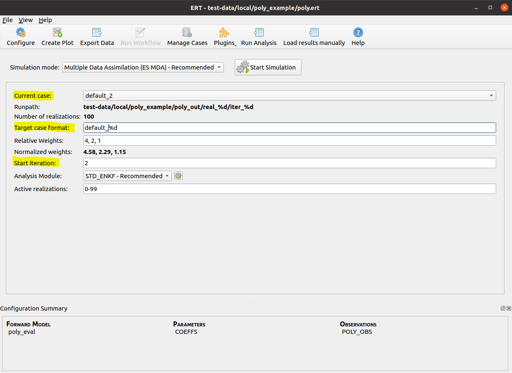

Graphical user interface
========================

Restarting ES-MDA
-----------------
It is possible to restart ES-MDA runs from an intermediate iteration.

After selecting the ES-MDA algorithm, check the `Restart run` check box. This
will enable the prior ensemble and start iteration fields. The prior ensemble
must be an ensemble where simulation has been performed and the data has been
loaded, for example by running an `ensemble experiment`. Start iteration is the
next iteration that will be performed. Setting this to 1 means that the `Prior ensemble`
will be set to iteration 0, and be used as the prior in the first update step,
and by default, 3 additional steps will be performed. If for example the ES-MDA failed
during simulation after iteration 2 for reasons unrelated to the parameterization,
restart from `<case_name>_1` and set the starting iteration to `2`. This will rerun
the analysis from iteration 2 and then run the simulations, before proceeding to iteration
`3`.

Note that when restarting, the `PRE_FIRST_UPDATE` only be run if the starting iteration
is `1`. This means that any workflows that for example manipulate observations will have
run manually before doing the restart.

