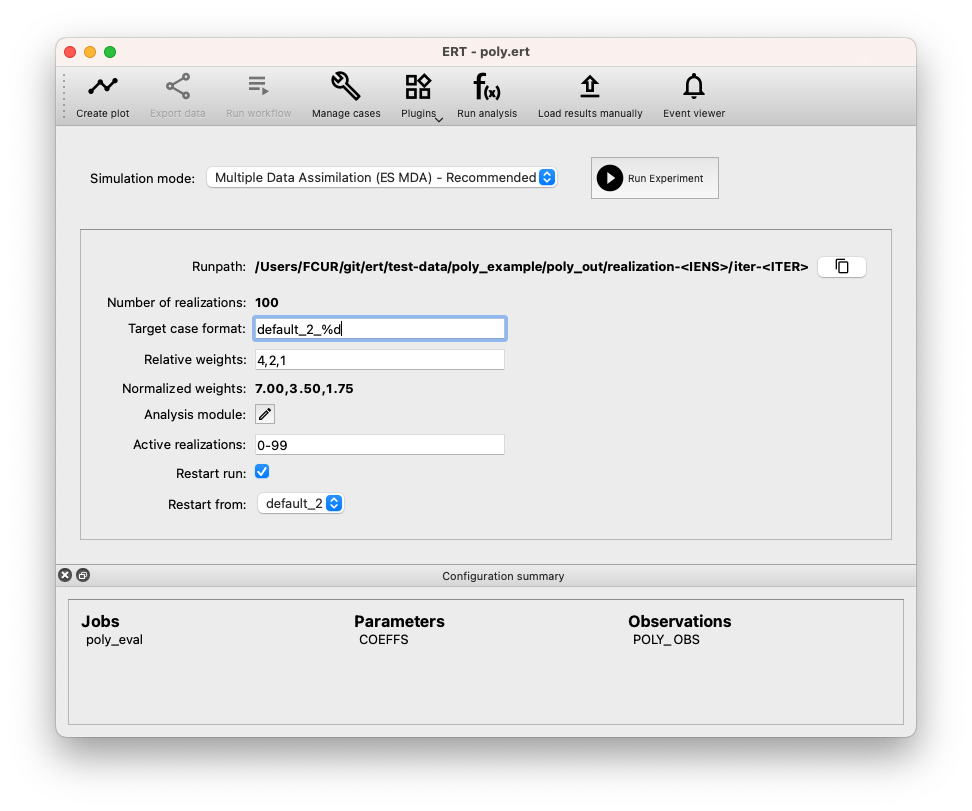

Restarting ES-MDA
-----------------
Imagine you are conducting an experiment consisting of three iterations of ES-MDA,
with each iteration potentially taking hours or even days.
For the purposes of this example, assume that the "Relative weights" are set to ``4, 2, 1``.

As part of running this experiment, ERT creates four ensembles, which by default are named ``default_0``, ``default_1`` and ``default_2``, ``default_3``.
It is possible that too many realizations fail during the model evaluation in ``default_3``, leaving no responses to analyse.
Various factors, for example license server issues or compute cluster downtime, can lead to such failures.
One solution is to restart from ``default_2`` which is straightforward in ERT.

**Steps to Restart from `default_2`:**

1. Check the "Restart run" checkbox.
2. Use the "Restart from" drop-down list to select the ensemble you wish to restart from.
    In this example, you'll pick ``default_2``.
3. Click "Run Experiment".
    This creates a new ensemble which by default is called ``default_2_3``.
    This ensemble will use the relative weight ``1``,
    consistent with the last value specified in the "Relative weights" sequence: ``4, 2, 1``.

**Note:**

- When initiating a restart, the ``PRE_FIRST_UPDATE`` (see :ref:`HOOK_WORKFLOW <hook_workflow>`) will only execute if "Restart from" is set to ``default_0``.
  This means that any workflows that for example manipulate observations, will have run manually before doing the restart.

