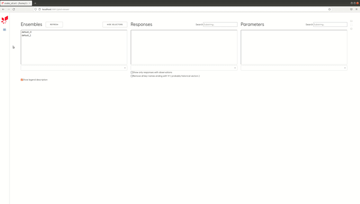
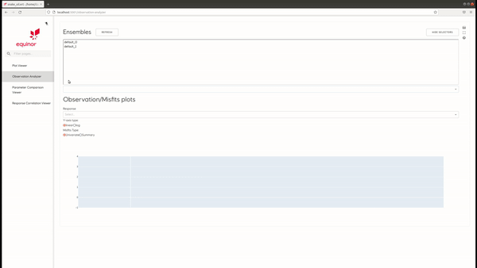
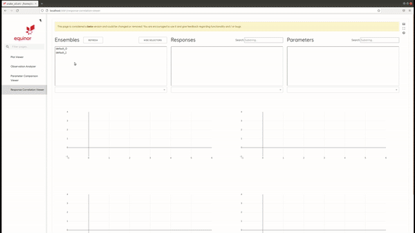

Webviz-ert
==========

Introduction
------------

Webviz-ert is an alternative visualisation tool in ERT.
Our main goal is to provide our users with a more rich interface with the common, yet
simple visualisations needed. Advanced users / needs would still be pointed in the
direction of ResInsight or equivalent.

Feedback regarding stability, bugs and features is very much appreciated.

How-to
------

With a komodo release sourced, webviz-ert is currently launched from the terminal.

.. code-block:: bash

   cd /<path>/<to>/<ert-project>
   ert vis <ert-config-file>

Expect approx 60-90 seconds of initialization-time before firefox is launched and
webviz-ert is up and running. 

To end the session just close firefox and `Ctrl+C` in the terminal.

.. image:: start_up.gif

Views
-----

Currently webviz-ert consists of 4 different pages available from the left menu.
In all the pages, the user is provided with the option to select ensembles (one or more)
based on which the corresponding plugin will populate its response and / or
parameter list boxes.

Plot viewer
~~~~~~~~~~~

We can select both responses (simulation results) and parameters, given
in the selected ensemble(s). Each selection opens a stand-alone plot.
In case of responses, the data is shown as a function plot, where x-axis represents time
and y-axis represents function values. We can choose to render either all
realizations (Function Plot) or as a statistical curves (Statistics), via the
provided radio button. When showing all realizations individual realizations can
be turned off / on by clicking on the corresponding realization id on the right hand side.
When multiple ensembles are selected each plot will be overlayed on top of
each other transparently, where each ensemble gets its own color.

Observation analyzer
~~~~~~~~~~~~~~~~~~~~

We can choose a single response key, for which the computed misfits are visualized.
One can choose to show misfits grouped by time (Univeriate) as boxplots showing misfits
statistics per a single time point or to render misfits as a histogram aggregating misfits
over the entire temporal axes. When multiple ensembles are selected each graph will
be overlayed on top of each other transparently, where each ensemble gets its own color.

Parameter comparison viewer
~~~~~~~~~~~~~~~~~~~~~~~~~~~

Every selected parameter is visualized in the parallel coordinates plot, where each
vertical axis represents a single parameter. Multiple ensembles are
distinguished by different colors.

.. image:: parameter_comparison.gif

Response correlation viewer
~~~~~~~~~~~~~~~~~~~~~~~~~~~

We can select both responses (simulation results) and parameters, where the goal of
the correlation viewer is to visualize how big is the influence of the selected set
of parameters on the selected set of responses. Or in other words, it describes how
the response behaves if there is some change in a parameter. One can choose from
two correlation methods: spearman and pearson. Once we select at least one response
and one parameter, we are provided with the following 4 sub-views:
1) Response overview, which visualizes the currently selected response.  By clicking
along the time axis we can select a new index / timestep (a dashed black line)
for correlation analysis.
2) Scatterplot depicting the selected response against the selected parameter.
It is accompanied by distribution plots for both selections.
3) Heatmap based representation of correlation within interval (-1, 1) across all
selected responses and parameters. Each response has its own column, where each
row represents one of the selected parameters. We can select the currently active
response and parameter by clicking directly on a heatmap.
4) Correlation BarChart for the single selected response (from heatmap) and
all selected parameters in a descending order according to the correlation.

