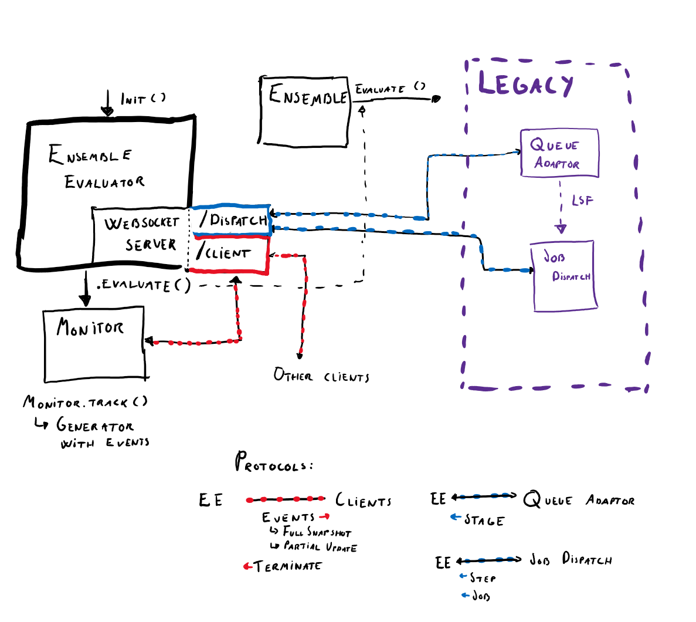

Ensemble Evaluator
==================

.. DANGER::
   The new ensemble evaluator is experimental!
   The new evaluator will offer the user an expressive,
   high-level and declarative configuration system in YAML, as
   well as evaluating ensembles in a concurrent, cloud-ready
   and distributed way.

Introduction
------------

This issue is to document the approach moving forward to create a first ensemble evaluator. The concrete steps should probably be manifested within other issues, while this one is to serve as a common ground for the strategy moving forward. The initial version of this strategy is based on the discussions in `#1023 <https://github.com/equinor/ert/issues/1023>`_.

**Responsibility of the Ensemble Evaluator**
The Ensemble Evaluator is to create a clean interface for evaluating ensembles. From a consumer perspective it will encapsulate the data transfer protocol into the forward model steps, between steps of the forward model, loading of responses, enable monitoring the evaluation of the ensemble and the interaction with the queuing system.

Furthermore, the interaction with the Ensemble Evaluator will be completely separated into two phases. The first being a **building phase** where the execution environment, forward model, ensemble variables and resources will be configured. The second being the **evaluation phase** that allows for evaluating the ensemble, monitor the evaluation and fetch the results afterwards. The hope is to leverage the observation that the building will be complex but isolated, while the evaluation API will be much smaller, but widely adopted in the codebase. Hence, we aim at landing a pretty good first version of the evaluation API, utilise that in the rest of the codebase and afterwards quickly iterate the building DSL in a process consisting of `user input -> yaml configuration -> DSL -> user input -> ...`.

Evaluation
----------

After an Ensemble Evaluator has been built, the ensemble (with its forward model and input data) together with the runtime environment is already fully defined. Hence, what remains is to allow for the possibility of evaluating the ensemble. An evaluation of an ensemble will result in an Ensemble Response (which is a list of Realization Responses); which for each realisation either contains the responses of the realisation or no (or possibly some) data. Where the later implies that the realisation failed. Due to the computationally heavy load of evaluating an ensemble, failing realisations must be a natural part of the evaluation language. Assuming a deterministic forward model this implies that a second evaluation should result in the same data for successful realisations, but possibly different realisations failing. This allows for a natural merge operation of two evaluations of the same ensemble where one then can combine the data from successful realisations into an ensemble response with possibly more successful realisation than the two ensembles individually. If the evaluation initiation allows for specifying a subset of the realisations to evaluate this gives a natural API for dealing with failing realisations and combining the two responses into a (hopefully) fully evaluated ensemble.

The above dictates the need for an `evaluate`-method that by default evaluates the entire ensemble, but that also allows for specifying a subset of the ensemble to evaluate. A good candidate could hence be:

.. code-block:: python

   monitor = evaluate(ensemble_filter=None)

Each call to evaluate should return a mechanism that can be used to monitor the evaluation and fetch the responses afterwards. Multiple suggestions involving callbacks were suggested in `#1023 <https://github.com/equinor/ert/issues/1023>`_. Lessons might also be learned from the `BatchEvaluator` / `BatchContext` implementation in libres: https://github.com/equinor/libres/blob/a77af8a89b11d495b0d5d0e55c66dff6e2074a57/python/res/simulator/batch_simulator.py#L10.

In addition to launching evaluations, monitoring them and fetching responses, it should also be possible to cancel an evaluation (either the entire evaluation or a subset of the realisations being evaluated). We need to design keeping in mind that:

- the order of the steps might not be possible to deduce up front.
- it makes sense to reevaluate from a failing step, instead of the entire realisation.
- input and output data might be large and hence the data interaction should be in the form of an abstract contract to ensure that an efficient and tailor made implementation can be used without this knowledge leaking into the evaluator.
- the logic of dealing with failing realizations should be moved closer to the core logic of ERT. Automatic restarts or restarts initiated by the user of failing realisations should both be facilitated by the Ensemble Evaluator, but the decision and interaction should be carried out outside the Ensemble Evaluator.

Building an evaluator
---------------------

Building an ensemble and evaluator depends on a rich class library where all the constituents are represented. Suggestions for designing an mDSL (miniature domain-specific language) was given in  `#1023 <https://github.com/equinor/ert/issues/1023>`_. There is consensus on moving in this direction, as it allows iteration over the building phase from a top-down point of view. Additionally, the mDSL need not interact with the class library directly—which in the early stages is volatile both in contracts and in implementation. This allows both the high level constituents (``Step``, ``Stage``, et. al,) to vary, as well as the implementation, thus limiting the impact on the mDSL consumers.

A user will not consume the mDSL directly, but rather through a YAML configuration. A translation layer between the config and the mDSL naturally allows the mDSL, the class library *and* config to vary. Principally, it also ensures that the config is merely a user-facing interface, far removed from the implementation. This frees the config to be more *human*, as opposed to a low-level instruction set as the configuration is today.

Building from classic ERT config
--------------------------------

Due to the responsibilities of the Ensemble Evaluator it would be natural to move
- the queue system,
- the code in EnKFMain that writes the runpath folders to disk, write the parameter-file and jobs.json
behind the Ensemble Evaluator abstraction.

Then, we could rewrite the monitoring code in the GUI and CLI to utilise the Ensemble Evaluator API and have for instance the ensemble experiment use the the Ensemble Evaluator and EnKFMain side by side. This could be resolved by making a Legacy Ensemble Evaluator with a slightly more imperative API then the Ensemble Evaluator during launch so that one could have the following flow:
- build the Legacy Ensemble Evaluator and have runpath being created together with parameters and jobs.json
- let EnKFMain do its additional stuff with ERT templating, ECLBASE etc (this interception would not be possible with an Ensemble Evaluator),
- poke the Legacy Ensemble Evaluator again to have it start the evaluation,
- monitor,
- poke EnKFMain to load old data types and put them in storage,
- due to initialisation from ResConfig there will not be any new data types and hence there is no need to process results from Legacy Ensemble Evaluator as there will not be any.

In this manner we can move the functionality we want to keep around, let the legacy bits remain in EnKFMain and still have a broader usage of the Ensemble Evaluator in the codebase.

Building from Yaml
------------------

To fuel #1013 the suggested approach is to use the mDSL above to build an Ensemble Evaluator based on an ERT-project, that uses the Ensemble Evaluator exclusively to evaluate an ensemble experiment populating the responses directly into the new storage™️. Hence, if ERT is started with an ERT project / yaml config we should aim at `EnKFMain` never being instantiated.

**Strategy tasks**

Steps
-----

1. Propose first iteration of evaluation API
2. (a) Hide current implementation behind evaluation API (Don't worry about the initialization of the Legacy EE)

   - Refactor run models to use EE
   - Connector simulation tracker to new simulation API (updates) -> This involves hiding the reading of status.json

2. (b) Gradually move important functionality from enkf_main over to Legacy EE (e.g. making parameters.json, runpath init, )
3. When the legacy EE is expressive enough we will create the new config and mDSL

Architecture
------------

   Sketch of communication for the Legacy Ensemble Evaluator

Cloudevents
-----------

Doing a quick survey, it seems that https://cloudevents.io/ is a good way to decouple distributed systems. They have also done a survey of `existing event formats <https://github.com/cloudevents/spec/blob/master/primer.md#existing-event-formats>`_, for reference.

It's protocol agnostic, the events are JSON and have the following required attributes:

- `id`
- `source`
- `specversion`
- `type`

Example:

.. code-block:: json

   {
      "specversion" : "1.x-wip",
      "type" : "com.github.pull_request.opened",
      "source" : "https://github.com/cloudevents/spec/pull",
      "subject" : "123",
      "id" : "A234-1234-1234",
      "time" : "2018-04-05T17:31:00Z",
      "comexampleextension1" : "value",
      "comexampleothervalue" : 5,
      "datacontenttype" : "text/xml",
      "data" : "<much wow=\"xml\"/>"
   }

There's a Python SDK https://github.com/cloudevents/sdk-python

Is well on its way of being blessed by the CNFC...

They provide a vocabulary with which we can talk about events https://github.com/cloudevents/spec/blob/master/spec.md#notations-and-terminology

## Ensemble Evaluator (TBD)

.. code-block::

   - EnsembleResponseEvent
      - data: map(…)
   - Event attributes:
      - id: UUID
      - source: /ert/ensemble_evaluator/<uuid>
