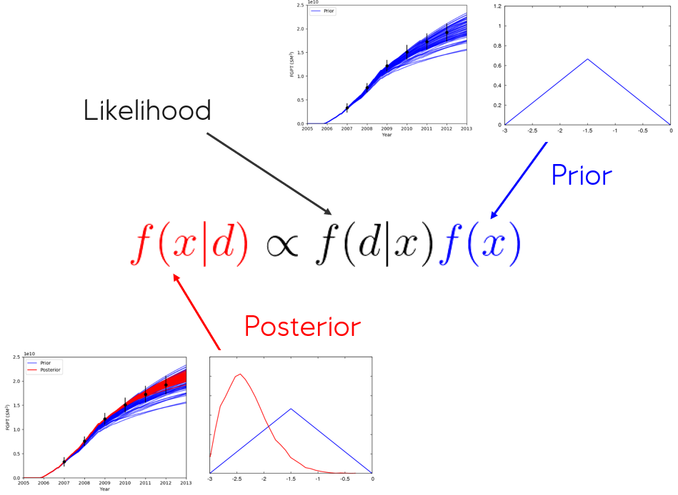

Introduction to ERT and Ensemble based methods
==============================================

The reservoir model for a green field is based on a range of subsurface input
such as seismic data, a geological concept, well logs, and fluid samples. Data 
from the subsurface are scarse and associated with significant uncertainty and 
the resulting reservoir model is obviously quite uncertain. Although uncertain 
- reservoir models are still the main tool we have when predicting future 
behavior and making decisions for a field.

When the field has been in production for some time one can use observed data 
sampled from the producing field to update the model. This process is commonly 
called *history matching* in the petroleum industry, in this manual we will use 
the term *model updating*. Before the model updating process can start you will 
need:

1. A reservoir model which has been *parameterized* with a parameter set :math:`\{x\}` 
   that can produce simulated response :math:`y`.

2. Observation data, :math:`d`, from the producing field.

From a superficial point of view, model updating goes like this:

1. Simulate the behavior of the field and assemble simulated data :math:`y`. 

2. Compare the simulated data :math:`y` with the observed data :math:`d`. 

3. Based on the misfit between :math:`y` and :math:`d` updated parameters 
   :math:`\{x'\}` are calculated.   

Model updating falls into the general category of *inverse problems* - i.e. we
know the results and want to determine the input parameters which reproduce
these results. In statistical literature the process is often called
*conditioning*. The algorithms available in ERT are all based on the Bayesian 
theorem:

.. math::

   f(x|d) \propto f(d|x)f(x),

where :math:`f(x|d)` is the posterior probability distribution ie the probability 
of :math:`x` given :math:`d`, :math:`f(x)` is the prior distribution, and 
:math:`f(d|x)` is called the likelihood ie the probability of observing :math:`d` 
assuming the reservoir is characterized by :math:`x`. Successful sampling of reservoir 
models from the posterior distribution will not only provide models with better 
history match (which in turn should provide better predictions), but also assess 
the associated uncertainty.

   Bayes theorem illustrated; a prior distribution in blue is conditioned to dynamic 
   production data to give the posterior distribution in red. Production profiles 
   associated with ensembels sampled from the prior and posterior distribution, 
   illustrate that the simulated responses of the posterior match the observed data 
   better and the associated uncertainty is reduced after conditioning.

Embrace the uncertainty
-----------------------

The main purpose of the model updating process is to reduce the uncertainty in
the description of the reservoir, however it is important to remember that the
goal is *not* to get rid of all the uncertainty and find one true answer. There
are two reasons for this:

1. The data used when conditioning the model is also uncertain. E.g.
   measurements of e.g. water cut and GOR is limited by the precision in the
   measurement apparatus and also the allocation procedures. For example for 4D
   seismic the uncertainty is large.

2. The model updating process will take place in the abstract space spanned by
   the parameters :math:`\{x\}` - unless you are working on a synthetic
   example the *real reservoir* is certainly not in this space.

So the goal is to update the parameters :math:`\{x\}` so that the
simulations agree with the observations on average, with a variability which is
of the same order of magnitude as the uncertainty in the observations. The
assumption is then that if this model is used for predictions it will be
unbiased and give a realistic estimate of the future uncertainty. This
illustrated in figure :numref:`ensemble`.

.. figure:: images/bpr.jpg
   :scale: 20%

   Ensemble plots before and after model updating, for one succesfull updating
   and one updating which has gone wrong.

All the plots show simulations pressure in a cell as a function of time, with
measurements. Plots (1) and (3) show simulations before the model updating (i.e.
the *prior*) and plots (2) and (4) show the plots after the update process (the
*posterior*). The dashed vertical line is meant to illustrate the change from
history to prediction.

The left case with plots (1) and (2) is a successful history matching project.
The simulations from the posterior distribution are centered around the observed
values and the spread - i.e. uncertainty - is of the same order of magnitude as
the observation uncertainty. From this case we can reasonably expect that
predictions will be unbiased with an reasonable estimate of the uncertainty.

For the right hand case shown in plots (3) and (4) the model updating has *not*
been successful and more work is required. Looking at the posterior solution we
see that the simulations are not centered around the observed values, when the
observed values from the historical period are not correctly reproduced there
is no reason to assume that the predictions will be correct either. Furthermore
we see that the uncertainty in the posterior case (4) is much smaller than the
uncertainty in the observations - this does not make sense; although our goal is
to reduce the uncertainty it should not be reduced significantly beyond the
uncertainty in the observations. The predictions from (4) will most probably be
biased and greatly underestimate the future uncertainty [#]_.

.. [#] : It should be emphasized that plots (3) and (4) show one simulated
         quantity from an assumed larger set of observations, in general there
         has been a different set of observations which has induced these large
         and unwanted updates.

Ensemble Kalman Filter - EnKF
-----------------------------

ERT was originally created to do model updating of
reservoir models with the EnKF algorithm. The experience from real world models
was that EnKF was not very suitable for reservoir applications, and ERT has
since changed to the Ensemble Smoother (ES) which can be said to be a simplified
version of the EnKF. But the characteristics of the EnKF algorithm still
influence many of the design decisions in ERT, it therefor makes sense to give a
short introduction to the Kalman Filter and EnKF.

The Kalman Filter
~~~~~~~~~~~~~~~~~

The Kalman Filter originates in electronics the 60's. The Kalman filter is
*widely* used, especially in applications where positioning is the goal - e.g.
the GPS system. The typical ingredients where the Kalman filter can be
interesting to try include:

1. We want to determine the final *state* of the system - this can typically the
   the position.

2. The starting position is uncertain.

3. There is an *equation of motion* - or *forward model* - which describes how
   the system evolves in time.

4. At fixed point in time we can *observe* the system, these observations are
   uncertain.

As a very simple application of the Kalman Filter, assume that we wish to
estimate the position of a boat as :math:`x(t)`; we know where the boat starts
(initial condition), we have an equation for how the boat moves with time and at
selected points in time :math:`t_k` we get *measurements* of the position. The
quantities of interest are:

:math:`x_k`: The estimated position at time :math:`t_k`.

:math:`\sigma_k`: The uncertainty in the position at time :math:`t_k`.
   

:math:`x_k^{\ast}`: The *estimated/forecasted* position at time :math:`t_k` -
   this is the position estimated from :math:`x_{k-1}` and :math:`g(x,t)`, but
   before the observed data :math:`d_k` is taken into account.

:math:`d_k`: The observed values which are used in the updating process, the
   :math:`d_k` values are measured with a process external to the model
   updating.

:math:`\sigma_d`: The uncertainty in the measurement :math:`d_k` - a reliable
      estimate of this uncertainty is essential for the algorithm to place
      "correct" weight on the measured values.

:math:`g(x,t)`: The equation of motion - *forward model* - which propagates :math:`x_{k-1} \to x_k^{\ast}` 

The purpose of the Kalman Filter is to determine an updated :math:`x_k` from
:math:`x_{k-1}` and :math:`d_k`. The updated :math:`x_k` is the value which
*minimizes the variance* :math:`\sigma_k`. The equations for updated position
and uncertainty are:

.. math::

   x_k = x_k^{\ast}\frac{\sigma_d^2}{\sigma_k^2 + \sigma_d^2} + x_d
   \frac{\sigma_k^2}{\sigma_k^2 + \sigma_d^2}

.. math::          

   \sigma_k^2 = \sigma_k^i{2\ast}\left(1 - \frac{\sigma_k^{2\ast}}{\sigma_d^2 + \sigma_k^{2\ast}}\right)

Looking at the equation for the position update we see that the analyzed
position :math:`x_k` is a weighted sum over the forecasted position
:math:`x_k^{\ast}` and measured position :math:`d_k` - where the weighting
depends on the relative weight of the uncertainties :math:`\sigma_k^{\ast}` and
:math:`\sigma_d`. For the updated uncertainty the key take away message is that
the updated uncertainty will always be smaller than the forecasted uncertainty:
:math:`\sigma_k < \sigma_k^{\ast}`.

Ensemble Smoothers
------------------
The fundamental Ensemble Kalman Filter updating equations can be derived 
for a linear model with normally distributed prior distribution. Assum that we 
have a deterministic forward model, :math:`g(x)`, so that the 
predicted response :math:`y` only depend on the model parameterized by the state 
vector :math:`x` 

.. math::

   y = g(x).

In the classical history matching setting, :math:`x` represents the uncertainty 
parameters, :math:`g(x)` the forward model, and :math:`y` the simulated responses 
corresponding to the observed data from our oil field, :math:`d`. From evaluating 
the model forward operator :math:`g(x)` of the uncertainty model parameters 
:math:`x \in \Re^n`, we determine a prediction :math:`y \in \Re^m`, which corresponds 
to the real measurements :math:`d \in \Re^m`. Here :math:`n` is the number of 
uncertainty parameters and :math:`m` is the number of observed measurements.

We introduce the mismatch :math:`e`
  
.. math::

   d = y + e.

We are interested in the posterior marginal distribution :math:`f(x|d)` which, according 
to Bayes theorem, can be expressed as  

.. math::

   f(x|d) \propto f(x)f(d|g(x)).

We introduce normal priors distributions

.. math::

   f(x) = \mathcal{N}(x^f,C_{xx}),

and assume that the data mismatch is normally distributed

.. math::

   f(d|g(x)=f(e)=\mathcal{N}(0,C_{dd}),

where :math:`x^f \in \Re^n` is the prior estimate of :math:`x` with covariance matrix 
:math:`C_{xx} \in \Re^{n \times n}`, and :math:`C_{dd} \in \Re^{m \times m}` is the 
error covariance for the measurements. We can then write the posterior distribution as

.. math::
   
   \begin{align}
   f(x|d) & \propto exp\{-\frac{1}{2}(x-x^f)^T C_{xx}^{-1}(x-x^f)\} \\
          & \times exp\{-\frac{1}{2}(g(x)-d)^T C_{dd}^{-1}(g(x)-d)\}.
   \end{align}

The smoother methods in ERT approximateley sample the posterior PDF through various routes. 
These are derived exploiting the fact that maximizing f(x|d) is equivalent to minimizing

.. math::
   
   \begin{align}
   \mathcal{J}(x) & = -\frac{1}{2}(x-x^f)^T C_{xx}^{-1}(x-x^f) \\
          & + \frac{1}{2}(g(x)-d)^T C_{dd}^{-1}(g(x)-d).
   \end{align}

Solving :math:`\frac{\delta\mathcal{J(x)}}{\delta x} = 0` assuming g(x) is linear so that

.. math::
   C_{xy} = GC_{xx},

where :math:`G = \nabla g(x)` yields

.. math::
   x = x^f + C_{xy}(C_{yy}^{f}+C_{dd})^{-1}(d_j-y_j^f).

This equation is often reformulated as:

.. math::
   \begin{align}
   x &= x^f + K(d_j-y_j^f),\\
   x &= x^f + K(d_j-Gx_j^f)
   \end{align}

where :math:`K` is called the Kalman gain. From this formulation we note that the update 
is a linear operation in :math:`x^f`. 

 
Ensemble Smoother (ES)
----------------------
The Ensemble Smoother algorithm approximately solves the minimization problem 
:math:`\nabla\mathcal{J}=0` assuming the forward model operator can be 
approximated by linear regression:

.. math::
   g(x_j) = x_j^f + G_j(x_j -x_j^f)

so that model sensitivities are replaced by a least square fit 

.. math::
   C_{yx} = G C_{xx}.

The probability distributions are represented by a collection of realizations, called an 
ensemble. Specifically, we introduce the prior ensemble

.. math::
   X = [x_1,\dots,x_n] = [x_i],

an :math:`n\times N` matrix sampled from the prior distribution. We also represent the data :math:`d` by an :math:`M\times N` matrix

.. math::
   D = [d_1,\dots,d_n] = [d_i],

so that the columns consist of the data vector plus a random vector from the normal distribution  

.. math::

   f(d|g(x)=f(e)=\mathcal{N}(0,C_{dd}).

Covariances :math:`\bar{C}_{xy}`, :math:`\bar{C}_{xx}`, and :math:`\bar{C}_{dd}` are 
estimated from the ensemble and the state vector is updated according to:

.. math::
   \begin{align}
   x_j^a &= x_j^f + \bar{C}_{xy}(\bar{C}_{xy}^{f}\bar{C}_{xx}^{-1}\bar{C}_{xy}+\bar{C}_{dd})^{-1}(d_j-y_j^f)\\
   X^a &= X^f + \bar{C}_{xy}(\bar{C}_{xy}^{f}\bar{C}_{xx}^{-1}\bar{C}_{xy}+\bar{C}_{dd})^{-1}(D-Y_f).
   \end{align}

The model responses are then solved indireclty by evaluating the forward model

.. math::
   y_j^a = g(x_j^a).

The pseudo algorithms for the ES:

1) Define :math:`D` by adding correalted noise according to :math:`C_{dd}`

2) Sample the prior ensemble, :math:`X_f`

3) Run the forward model :math:`Y_f = g(X_f)` to obtain the prior simulated respones

4) Calculate :math:`X_a` using equation above

5) Run the forward model :math:`Y_a = g(X_a)` to obtain the posterior simulated responses 

NBNBNBB 2
At this point we should probably provide an explanation of the available updating schemes (EnKF, SQRT, CV).   
I guess we present it as numerical schemes to estimate the Kalman gain. 

Ensemble Smoother - Multiple Data Assimilation (ES MDA)
-------------------------------------------------------
While the Ensemble smoother attempts to solve the minimization equation in one go, the 
ES MDA iterates by introducing the observations gradually. The posterior distribution 
can be rewritten:

.. math::
   \begin{align}
   f(x|d) & \propto f(d|g(x))f(x)\\
          & \propto f(d|y)^{\frac{1}{\alpha_N}} \dots f(d|y)^{\frac{1}{\alpha_2}}f(d|y)^{\frac{1}{\alpha_1}}f(x) \\
	  & f(d|y)^{(\sum_{i=1}^N \frac{1}{\alpha_i})}f(x)
   \end{align}

with :math:`\sum_{i=1}^N \frac{1}{\alpha_i} = 1`.

In plain English, the ES MDA consist of several consecutive smoother updates with inflated 
error bars. The ES MDA with one iteration is identical to the Ensemble smoother. 

Iterative Ensemble Smoother (IES RML)
-------------------------------------
The iterative ensemble smoother solves the minimization problem 
:math:`\nabla\mathcal{J}=0` using a steepest decent approach with gradient:

.. math::
   \nabla_x\mathcal{J} = \bar{C}_{xx}^{-1}(x_j -x_j^f) + \nabla_x g(x_j)\bar{C}_{dd}^{-1}(g(x_j)-d_j),

and Hessian:

.. math::
   \nabla_x\nabla_x\mathcal{J} = \bar{C}_{xx}^{-1} + \nabla_x g(x_j)\bar{C}_{dd}^{-1}(\nabla_x g(x_j)-d_j))^{T}.
 
The solution is then found by iteration:

.. math::
   \begin{align}
   x_j^{i+1} & = x_j^i - \gamma(\nabla\nabla\mathcal{J}_j)^{-1}\nabla\mathcal{J}_j^{i}\\
   y_j^{i+1} & = g(x_j^{i+1})
   \end{align}

Iterative Ensemble Smoother - Ensemble subspace version
-------------------------------------------------------

