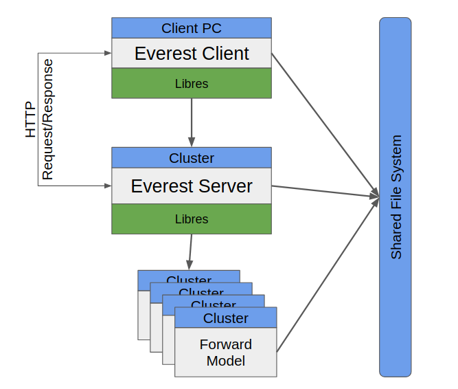

.. _cha_development:

***********
Development
***********

In this section Everest development decisions are documented.

Architecture
============

The everest application is split into two components, a server component and a
client component.

Every time an optimization instance is ran by a user, the client component of the
application spawns an instance of the server component, which is started either on a
cluster node using LSF (when the `queue_system` is defined to be *lsf*) or on the
client's machine (when the `queue_system` is defined to be *local*).

Communication between the two components is done via an HTTP API.

Server HTTP API
===============
The Everest server component supports the following HTTP requests API. The Everest
server component was designed as an internal component that will be available as
long as the optimization process is running.

.. list-table:: Server HTTP API
   :widths: 25 25 75
   :header-rows: 1

   * - Method
     - Endpoint
     - Description
   * - GET
     - '/'
     - Check server is online
   * - GET
     - '/sim_progress'
     - Simulation progress information
   * - GET
     - '/opt_progress'
     - Optimization progress information
   * - POST
     - '/stop'
     - Signal everest optimization run termination. It will be called by the client when the optimization needs to be terminated in the middle of the run
